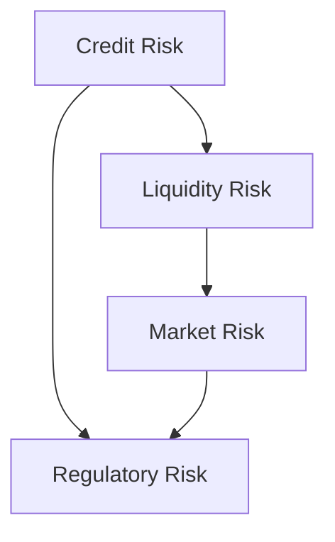
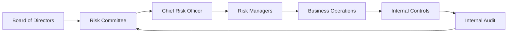
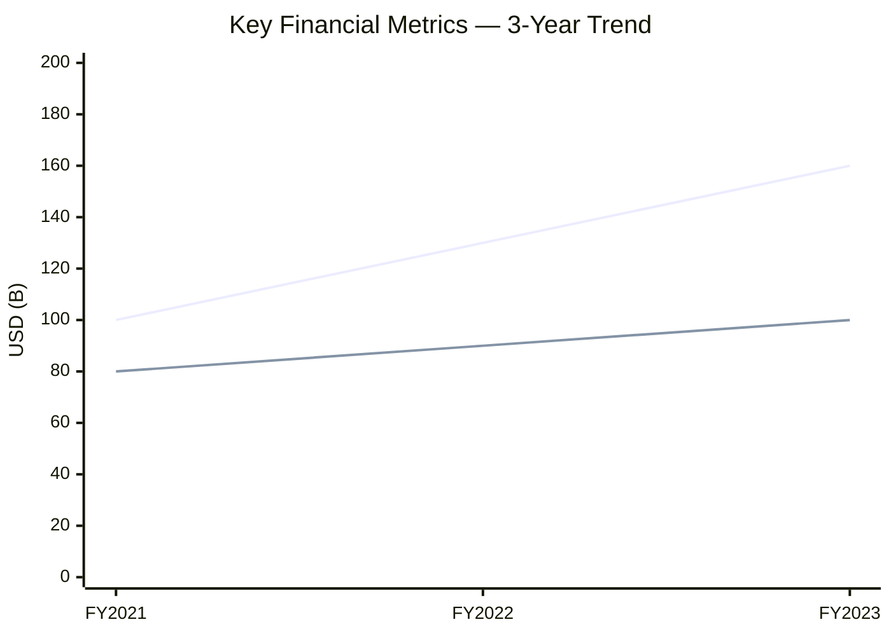
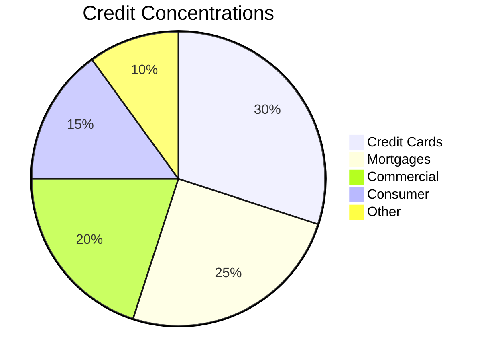

# Mermaid Diagram Templates for ERM Report

All diagrams use Mermaid syntax inside fenced code blocks with `mermaid` language tag.

## 1. Risk Cascade Graph (`riskMap`)

Use this for Stage 2 (cascade) analysis. Replace node labels with actual risk names.

## 2. Governance Risk Map Flowchart

Extend with actual committee titles from proxy governance text.

## 3. Financial Risk Trend (`xychart`)

Requires at least 2 data series (e.g., Revenue and Net Income).

## 4. Credit Exposure Pie Chart

Use `per_of_total` values from Credit Concentrations CSV.

## 5. Three Lines Model Governance Graph

Indicates the Three Lines of Defense model. Replace node labels with entity-specific titles.
