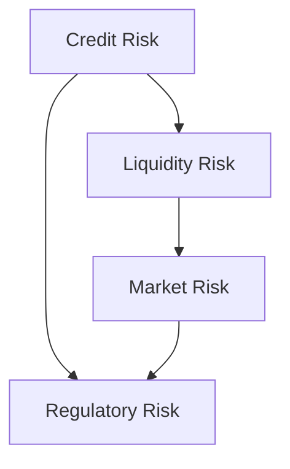
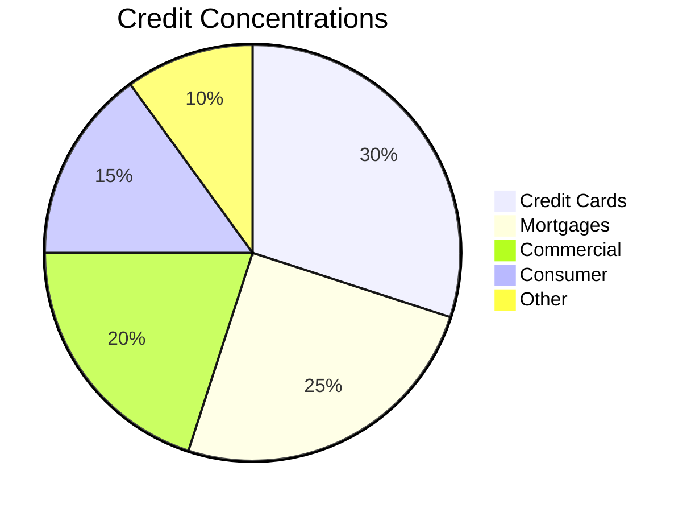
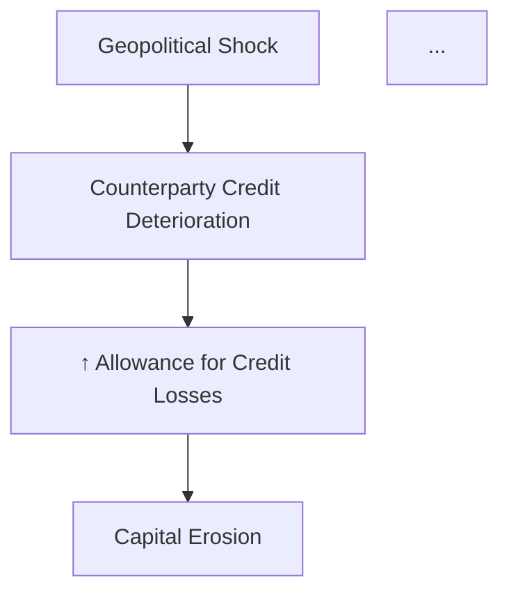

# Mermaid Diagram Templates for Inline Embedding

All diagrams use Mermaid syntax and must be embedded **directly inline** in `ERM_Report.md` using ` ```mermaid ` fenced code blocks. Do NOT write `.mermaid` artifact files. Each embedded diagram MUST be followed by a one-sentence plain text caption describing what it shows and citing the data source with `[^n]`.

## 1. Risk Cascade Graph



Replace node labels with actual risk names derived from the filing. Include at least 5 distinct risk nodes from the 10-K risk factors.

## 2. Governance Risk Map


Extend with actual committee titles from proxy governance text. Replace node labels with entity-specific titles.

## 3. Financial Risk Trend

```mermaid
xychart-beta
title "Key Financial Metrics - 3-Year Trend"
x-axis [FY2021, FY2022, FY2023]
y-axis "USD (B)"
0 --> 200
line [100, 130, 160]
line [80, 90, 100]
```

Requires at least 2 data series (e.g., Revenue and Net Income). Label axes with units.

## 4. Credit Exposure Pie Chart



Use `per_of_total` values from Credit Concentrations data. Show Top 5 only.

## 5. Three Lines Model Governance Graph


Indicates the Three Lines of Defense model. Replace node labels with entity-specific titles.

## Inline Report Example

```markdown
### Risk Cascade Diagram [^5]



*Caption: Risk cascade from geopolitical escalation through credit deterioration to capital erosion, grounded in the Firm's disclosed exposures.* [^5]
```

## Critical Rules
- Each diagram in the report MUST be wrapped in ` ```mermaid ` code fences with a one-sentence plain text caption below it
- Node labels must be derived from the filing — do not use generic labels like "Risk 1"
- The cascade graph must include at least 5 distinct risk nodes
- The pie chart must show Top 5 exposures only (group the rest as "Other")
- Data in diagrams must match the numbers in the accompanying tables/CSVs exactly
- Include a "Cascade Scenario" paragraph (plain text, not Mermaid) in the report body for the most significant 2 cascades describing the full causal chain
