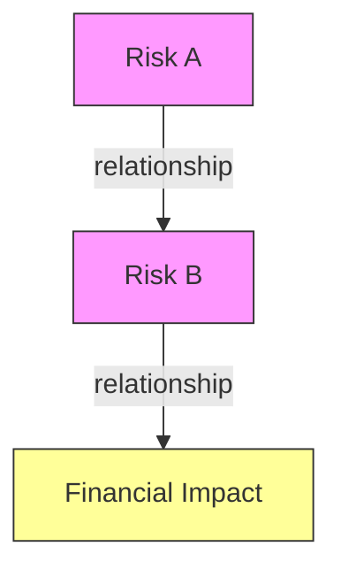
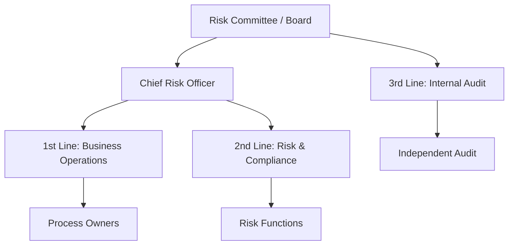
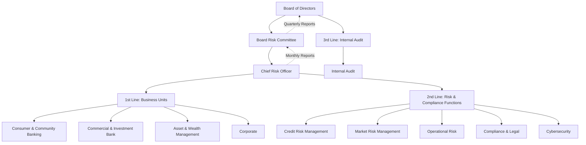
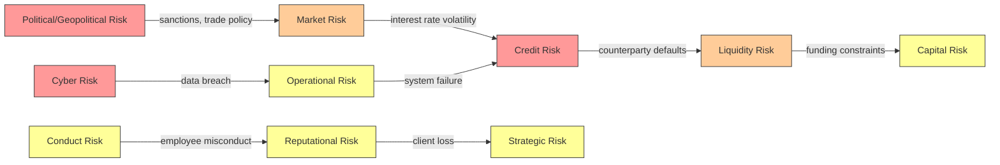
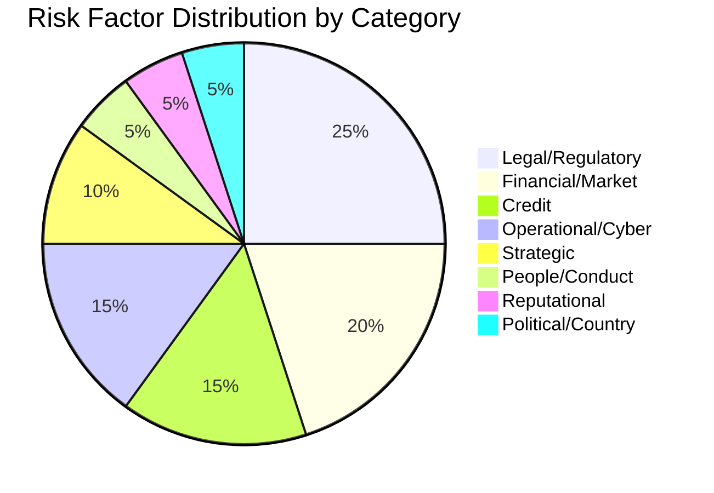

# Risk Research Protocol — Enterprise Risk Analysis via SEC Filings

This document defines the **structured procedure** for conducting risk research on publicly traded companies using SEC EDGAR filings and the EdgarTools MCP suite. Every session performing company risk analysis **must follow this protocol sequentially**.

---

## Table of Contents

1. [Core Principles](#1-core-principles)
2. [Tool Chain & Prerequisites](#2-tool-chain--prerequisites)
3. [Phase 1 — Company Identification & Context](#3-phase-1--company-identification--context)
4. [Phase 2 — Filing Retrieval & Parsing](#4-phase-2--filing-retrieval--parsing)
5. [Phase 3 — Risk Factor Extraction (Item 1A)](#5-phase-3--risk-factor-extraction-item-1a)
6. [Phase 4 — ERM Framework Identification](#6-phase-4--erm-framework-identification)
7. [Phase 5 — Risk Governance & Committee Structure](#7-phase-5--risk-governance--committee-structure)
8. [Phase 6 — Financial Risk Indicators](#8-phase-6--financial-risk-indicators)
9. [Phase 7 — Credit Risk Concentrations](#9-phase-7--credit-risk-concentrations)
10. [Phase 8 — Litigation & Contingency Risk](#10-phase-8--litigation--contingency-risk)
11. [Phase 9 — Cybersecurity & Operational Risk](#11-phase-9--cybersecurity--operational-risk)
12. [Phase 10 — Market Cap & External Context](#12-phase-10--market-cap--external-context)
13. [Phase 11 — Recent Risk Events & Macro Shocks](#13-phase-11--recent-risk-events--macro-shocks)
14. [Phase 12 — Interconnection Mapping](#14-phase-12--interconnection-mapping)
15. [Phase 13 — Output Formatting & Deliverables](#15-phase-13--output-formatting--deliverables)
16. [Reference Standards](#16-reference-standards)
17. [Prohibited Practices](#17-prohibited-practices)

---

## 1. Core Principles

| Principle | Definition | Enforcement |
|-----------|-----------|-------------|
| **Accuracy** | Every factual claim must trace to a specific filing section, note, or line item | No assertion without citation |
| **Verifiability** | A third party must be able to reproduce any finding using only public sources | Include accession numbers, page refs, note numbers |
| **No unwarranted judgment** | Quantitative scores, ratings, or likelihood assessments require an explicit formula and stated methodology | If no formula exists, present data only and mark as "requires assessment" |
| **Academic referencing** | Use numbered references [^n] in academic style; sources must be primary (SEC filings) unless secondary sources are necessary and cited | See [Section 16](#16-reference-standards) |
| **Transparency of limitations** | Clearly state what the filing does not disclose | Never fill gaps with assumptions |

---

## 2. Tool Chain & Prerequisites

### Required Tools
| Tool | Purpose | When to Use |
|------|---------|-------------|
| `edgartools_edgar_search` | Find company filings by form type | Phase 1–2 |
| `edgartools_edgar_company` | Company profile, subsidiaries, recent filings | Phase 1 |
| `edgartools_edgar_filing` | Parse a specific filing into data object | Phase 2 |
| `edgartools_edgar_read` | Extract text from specific filing sections | Phase 3, 5–9 |
| `edgartools_edgar_notes` | Drill into financial statement notes | Phase 6–9 |
| `edgartools_edgar_text_search` | Full-text search across all filings | Phase 4–5, 11 |
| `edgartools_edgar_trends` | Time-series financial data with growth rates | Phase 6 |
| `edgartools_edgar_ownership` | Insider trading and institutional holdings | Phase 10 (if relevant) |
| `edgartools_edgar_compare` | Peer comparison | Phase 6 (optional) |
| `edgartools_edgar_screen` | Screen companies by industry/exchange/state | Phase 1 (batch research) |
| `websearch` | Current events, macro shocks, market data | Phase 10–11 |

### Filing Priority Order
1. **10-K** (Annual Report) — primary source for risk analysis
2. **10-Q** (Quarterly) — for interim updates
3. **DEF 14A** (Proxy Statement) — for Risk Committee activity, meeting counts
4. **8-K** — for material risk events (cyber incidents, leadership changes, restatements)
5. **SC 13F** — for institutional ownership context

---

## 3. Phase 1 — Company Identification & Context

### Steps
```
1. edgartools_edgar_search(query="[company name or ticker]", form="10-K", search_type="filings", limit=3)
2. edgartools_edgar_company(identifier="[ticker/CIK]", include=["profile", "filings", "financials"])
3. Record: CIK, CIK number, industry (SIC), exchange, state of incorporation
```

### Required Outputs
| Field | Source | Example |
|-------|--------|---------|
| Legal Name | `edgar_company` → company | JPMORGAN CHASE & CO |
| CIK | `edgar_company` → cik | 0000019617 |
| SIC Code & Description | SEC reference data | 6022 — National Commercial Banks |
| Exchange | SEC reference data | NYSE |
| State of Incorporation | SEC reference data | Delaware |
| Market Cap | `websearch` or financial data provider | ~$680B (May 2026) |
| Employees | 10-K Item 1 or proxy | ~320,000 |

### Market Cap Research Method
```
websearch("[company ticker] market cap [current year]")
```
If no reliable figure found, state: *"Market cap not available via SEC filings; requires external data source."*

---

## 4. Phase 2 — Filing Retrieval & Parsing

### Steps
```
1. edgartools_edgar_search(identifier="[CIK]", form="10-K", search_type="filings", limit=3)
2. Record accession_number of latest 10-K
3. edgartools_edgar_filing(input="[accession_number]", detail="full")
4. Record: filing period, date filed, auditor, available sections
```

### Required Outputs
| Field | Source | Reference Format |
|-------|--------|-----------------|
| Accession Number | `edgar_filing` | `0001628280-26-008131` |
| Form Type | `edgar_filing` | 10-K |
| Period Covered | `edgar_filing` | FY2025 (Dec 31, 2025) |
| Date Filed | `edgar_filing` | 2026-02-13 |
| Auditor | `edgar_filing` | PricewaterhouseCoopers LLP |
| Total Assets | XBRL extraction | $4,424.9B |
| Stockholders' Equity | XBRL extraction | $362.4B |

---

## 5. Phase 3 — Risk Factor Extraction (Item 1A)

### Steps
```
1. edgartools_edgar_read(accession_number="[acc#]", sections=["risk_factors"])
2. If truncated (likely for large companies):
   a. edgartools_edgar_text_search(query="[specific risk topic]", identifier="[ticker]", forms=["10-K"], start_date="[filing date]")
   b. Use multiple targeted queries to reconstruct full risk factor text
3. Categorize each risk factor into ERM risk categories (see Section 15 mapping table)
```

### Risk Category Mapping

When extracting risk factors from Item 1A, map each disclosed risk to one of these standard ERM categories[^1]:

| ERM Category | Typical Item 1A Language |
|--------------|-------------------------|
| Strategic | "competition", "business strategies", "market disruption" |
| Financial | "interest rates", "credit spreads", "market conditions" |
| Credit | "counterparty", "default", "collateral", "concentration" |
| Liquidity | "funding", "liquidity", "credit ratings" |
| Capital | "regulatory capital", "distribute capital", "capital requirements" |
| Operational | "systems", "cyber", "technology", "employees", "vendors" |
| Compliance/Legal | "regulation", "enforcement", "litigation", "government investigations" |
| Reputational | "reputation", "public perception", "conflicts of interest" |
| People | "employees", "talent", "retention" |
| Political/Country | "geopolitical", "sanctions", "hostilities", "political developments" |
| Conduct | "misconduct", "fraud", "employee conduct" |
| Climate/ESG | "climate change", "environmental", "sustainability" |

### Required Outputs
| Field | Source | Reference Format |
|-------|--------|-----------------|
| Number of distinct risk factors | Item 1A count | "12 principal risk categories" |
| Full text summary of each | Item 1A verbatim + paraphrased | [^2] |
| Category mapping | ERM mapping table (above) | Per-factor |

---

## 6. Phase 4 — ERM Framework Identification

**This phase directly answers: "Does the company use COSO, ISO 31000, Basel, or another ERM framework?"**

### Steps
```
1. edgartools_edgar_read(accession_number="[acc#]", sections=["controls"])
   → Look for: "COSO", "Internal Control — Integrated Framework", "COSO 2013"
2. edgartools_edgar_text_search(query="risk management framework COSO ISO Basel enterprise risk", identifier="[ticker]", forms=["10-K"])
3. edgartools_edgar_text_search(query="risk appetite three lines of defense risk governance chief risk officer", identifier="[ticker]", forms=["10-K"])
4. edgartools_edgar_read(accession_number="[acc#]", sections=["business"])
   → Look for: "supervision and regulation", "risk management" sections
5. Check DEF 14A (proxy) for Risk Committee charter references:
   edgartools_edgar_search(identifier="[ticker]", form="DEF 14A", search_type="filings", limit=2)
   edgartools_edgar_read(accession_number="[proxy_acc#]", sections=["governance"])
```

### Framework Detection Checklist

| Framework | Search Term | Where to Look |
|-----------|-------------|---------------|
| **COSO IC 2013** | "COSO 2013", "Internal Control — Integrated Framework" | Item 9A (Controls) |
| **COSO ERM 2017** | "COSO ERM", "Enterprise Risk Management — Integrating with Strategy and Performance" | Item 1A, business description |
| **ISO 31000** | "ISO 31000", "risk management — guidelines" | Item 1A, business description |
| **ISO 31010** | "ISO 31010", "risk assessment techniques" | Item 1A (rare in 10-K) |
| **Basel III / IV** | "Basel III", "Basel IV", "CET1", "Tier 1 capital", "risk-weighted assets" | Item 7A, financials, regulatory capital notes |
| **NIST CSF** | "NIST Cybersecurity Framework", "NIST CSF" | Item 1A (cyber risk), Note 37 |
| **OCC Heightened Standards** | "Heightened Standards", "12 CFR Part 30 Appendix D" | Item 1 (business) |
| **Three Lines Model** | "three lines of defense", "three lines model" | Item 1A, governance sections |

### Required Outputs
| Field | Source | Reference Format |
|-------|--------|-----------------|
| IC Framework (COSO 2013 or other) | Item 9A | Quote or paraphrase with [^n] |
| ERM Framework (if any) | Item 1A, business, proxy | State if "not disclosed" |
| Regulatory Capital Framework | Financials, Note on capital | Basel III/IV details |
| Cybersecurity Framework | Note 37, Item 1A | NIST or internal |
| Governance Model | Proxy, Item 1 | Three Lines or equivalent |
| **If none found** | — | State: "No formal ERM framework publicly disclosed in 10-K; risk governance is driven primarily by regulatory requirements ([ref])." |

---

## 7. Phase 5 — Risk Governance & Committee Structure

### Steps
```
1. edgartools_edgar_search(identifier="[ticker]", form="DEF 14A", search_type="filings", limit=2)
2. edgartools_edgar_read(accession_number="[proxy_acc#]", sections=["governance", "compensation"])
   → Look for: "Risk Committee", "Board Risk Committee", "risk oversight"
3. edgartools_edgar_text_search(query="Risk Committee meetings held risk oversight board", identifier="[ticker]", forms=["DEF 14A"])
4. If proxy truncated, use websearch for补充: "[company] risk committee charter [year]"
```

### Required Outputs
| Field | Source | Reference Format |
|-------|--------|-----------------|
| Risk Committee exists? | Proxy (DEF 14A) | Yes / No / Partial (e.g., "Audit & Risk Committee") |
| Committee name | Proxy | "Board Risk Committee", "Audit & Risk Committee" |
| Number of meetings (fiscal year) | Proxy, Corporate Governance section | "X meetings held during [year]" |
| Committee chair | Proxy | Name and title |
| Chief Risk Officer | 10-K, proxy, websearch | Name, reporting line (to CEO? to Board?) |
| Three Lines Model adoption | Item 1A, proxy | Explicitly stated or inferred |

### If Committee Information Not Found
State: *"Risk Committee structure not disclosed in the 10-K or DEF 14A. The Company may delegate risk oversight to the Audit Committee. Requires review of full proxy statement or annual governance disclosure."*

---

## 8. Phase 6 — Financial Risk Indicators

### Principles
- **Extract, do not invent.** Only report metrics that are explicitly present in the filing.
- **Formula-driven.** If a derived metric is presented, show the formula.
- **Peer context.** Where possible, compare to industry benchmarks (use `edgartools_edgar_compare`).

### Steps
```
1. edgartools_edgar_read(accession_number="[acc#]", sections=["financials"])
   → Extract: Income Statement, Balance Sheet, Cash Flow
2. edgartools_edgar_trends(identifier="[ticker]", concepts=["revenue", "net_income", "total_assets", "equity"], periods=5)
3. edgartools_edgar_notes(identifier="[ticker]", topic="[specific topic]", form="10-K", detail="full")
   → Extract Note on Credit Losses (CECL/ASC 326), Liquidity, Capital
4. edgartools_edgar_compare(identifiers=["[ticker]", "[peer1]", "[peer2]"], metrics=["revenue", "net_income", "margins"])
   → Optional but recommended for peer context
```

### Standard Banking Risk Metrics Table

| Metric | Formula | Source in 10-K | Risk Category |
|--------|---------|----------------|---------------|
| Provision for Credit Losses (PCL) | — | Income Statement | Credit |
| PCL / Average Loans | PCL ÷ Avg Loans | Derived | Credit |
| Net Interest Margin (NIM) | NII ÷ Earning Assets | Derived | Market |
| CET1 Ratio | CET1 Capital ÷ RWA | Regulatory Capital, financials | Capital |
| Leverage Ratio | Tier 1 Capital ÷ Total Assets | Regulatory Capital | Capital |
| Non-Performing Loans / Total Loans | NPL ÷ Loans | Note on credit quality | Credit |
| Efficiency Ratio | Noninterest Exp ÷ Revenue | Derived | Operational |
| ROE | Net Income ÷ Equity | Derived | Performance |
| Technology Expense Growth | (Tech Exp_t − Tech Exp_t-1) ÷ Tech Exp_t-1 | Income Statement | Operational/Cyber |

### Required Outputs
| Field | Source | Reference Format |
|-------|--------|-----------------|
| Revenue (3-year trend) | Income Statement | [^3] |
| Net Income (3-year trend) | Income Statement | [^3] |
| Provision for Credit Losses | Income Statement | [^3] |
| Net Interest Income | Income Statement | [^3] |
| Total Noninterest Expense | Income Statement | [^3] |
| CET1 Ratio | Financials / Regulatory Capital note | [^4] |
| Leverage Ratio | Financials / Regulatory Capital note | [^4] |
| Total Credit Exposure | Note 4 (or equivalent) | [^5] |
| Efficiency Ratio | Derived | Show formula |
| ROE | Derived | Show formula |

---

## 9. Phase 7 — Credit Risk Concentrations

### Steps
```
1. edgartools_edgar_notes(identifier="[ticker]", topic="credit", form="10-K", detail="full")
   → Look for: Note on "Credit Risk Concentrations", "Credit Exposure", "Allowance for Credit Losses"
2. Extract concentration tables: by industry, geography, counterparty
3. Calculate concentration ratios: Top N sectors as % of total exposure
```

### Required Outputs
| Field | Source | Reference Format |
|-------|--------|-----------------|
| Total credit exposure (on + off balance sheet) | Note on credit concentrations | [^5] |
| Breakdown by sector/industry | Concentration table | [^5] |
| Top 5 concentrations by % | Derived from table | Show calculation |
| Year-over-year change in concentrations | Table comparison | [^5] |
| Collateral types and values | Note on collateral | [^5] |
| Apple Card transaction exposure (if applicable) | Footnote in concentration table | [^5] |

---

## 10. Phase 8 — Litigation & Contingency Risk

### Steps
```
1. edgartools_edgar_read(accession_number="[acc#]", sections=["legal"])
   → Item 3 — Legal Proceedings
2. edgartools_edgar_notes(identifier="[ticker]", topic="litigation", form="10-K", detail="full")
   → Note on Litigation, Contingencies, Commitments
3. edgartools_edgar_notes(identifier="[ticker]", topic="contingencies", form="10-K", detail="full")
```

### Required Outputs
| Field | Source | Reference Format |
|-------|--------|-----------------|
| Number of material proceedings | Note on Litigation | [^6] |
| Types of proceedings (class action, regulatory, etc.) | Note on Litigation | [^6] |
| Aggregate potential exposure (if quantified) | Note on Contingencies | [^6] |
| Loss contingencies accrued (ASC 450) | Financial Statements | [^6] |
| Range of reasonably possible losses | Note on Contingencies | [^6] |

---

## 11. Phase 9 — Cybersecurity & Operational Risk

### Steps
```
1. edgartools_edgar_notes(identifier="[ticker]", topic="cybersecurity", form="10-K", detail="full")
   → Note on Cybersecurity Risk Management and Strategy (Reg S-K Item 106)
2. edgartools_edgar_text_search(query="cyber incident data breach ransomware", identifier="[ticker]", forms=["10-K", "8-K"])
3. edgartools_edgar_read(accession_number="[acc#]", sections=["business"])
   → Look for: technology infrastructure, operational resilience
```

### Required Outputs
| Field | Source | Reference Format |
|-------|--------|-----------------|
| Cybersecurity governance structure | Note 37 / Item 1A | [^7] |
| Risk management process for cybersecurity | Note 37 | [^7] |
| Board oversight of cyber risk | Note 37 | [^7] |
| Material cyber incidents (if any) | Note 37, 8-K | [^7] |
| Technology expense (proxy for investment) | Income Statement | [^3] |
| Third-party/vendor risk management | Item 1A | [^2] |

---

## 12. Phase 10 — Market Cap & External Context

### Steps
```
1. websearch("[ticker] market cap [current year]")
2. websearch("[company] stock price [current date]")
3. edgartools_edgar_ownership(identifier="[CIK]", analysis_type="fund_portfolio", limit=10)
   → Top institutional holders for context
```

### Required Outputs
| Field | Source | Reference Format |
|-------|--------|-----------------|
| Market capitalization | Web search / financial data provider | [^8] |
| Stock price (current) | Web search | [^8] |
| Top 5 institutional holders | 13F via `edgar_ownership` | [^9] |
| 52-week price range | Web search | [^8] |
| Credit ratings (if available) | Web search or 10-K references | [^10] |

**Note:** Market cap is NOT available in SEC filings. Must use external sources and cite them.

---

## 13. Phase 11 — Recent Risk Events & Macro Shocks

### Steps
```
1. websearch("[company] risk impact [current year] [recent event]")
   → Example: "JPMorgan risk impact 2026 Iran US war"
   → Example: "JPMorgan provision credit losses 2026 macro"
2. websearch("[industry] risk outlook [current year] [macro event]")
3. edgartools_edgar_text_search(query="[macro event keyword]", identifier="[ticker]", forms=["8-K", "10-Q"], start_date="[recent date]")
4. edgartools_edgar_monitor(form="8-K", limit=20)
   → Check for material event filings
```

### Recent Macro Shock Checklist (2026)

| Event | Search Query | Expected Impact on Financials |
|-------|-------------|------------------------------|
| Iran-US Conflict (Mar 2026) | "[ticker] Iran war impact provision" | Elevated credit provisions, energy price pass-through, sanctions exposure |
| Interest Rate Volatility | "[ticker] interest rate risk 2026" | NIM compression/expansion, trading losses |
| Tariff/Trade War Escalation | "[ticker] tariff trade war 2026" | Supply chain disruption, sector concentration risk |
| AI Disruption | "[ticker] AI competition 2026" | Strategic risk, technology investment |
| Commercial Real Estate Stress | "[ticker] CRE exposure 2026" | Credit risk, real estate concentration |

### Required Outputs
| Field | Source | Reference Format |
|-------|--------|-----------------|
| Recent risk events identified | Web search, 8-K filings | [^11] |
| Financial impact (if quantified in filings) | 10-Q, 8-K, web search | [^11] |
| Management commentary on recent events | MD&A, 8-K earnings | [^11] |
| **If no impact found** | — | State: "No material impact from [event] identified in most recent SEC filings as of [date]." |

---

## 14. Phase 12 — Interconnection Mapping

### Principles
- Use Mermaid diagrams to visualize risk cascades
- Only map interconnections that are **explicitly supported** by filing disclosures or by logical financial linkage (e.g., credit risk → provision → earnings)
- Label each edge with the supporting reference

### Mermaid Diagram Template



### Required Outputs
| Field | Source | Reference Format |
|-------|--------|-----------------|
| Risk interconnection diagram | Derived from Phase 3–11 data | [^2], [^3], [^5] |
| Cascade scenarios | Logical derivation from disclosed risks | State: "Derived from disclosed risk factors" |
| Concentration risks | Phase 7 data | [^5] |

---

## 15. Phase 13 — Output Formatting & Deliverables

### Required Deliverables

| # | Deliverable | Format | Content |
|---|-------------|--------|---------|
| 1 | **Company Context Brief** | YAML or Markdown table | Phase 1 outputs |
| 2 | **Risk Factor Register** | Markdown table + CSV | Phase 3 outputs, mapped to ERM categories |
| 3 | **ERM Framework Assessment** | Narrative + table | Phase 4 outputs |
| 4 | **Risk Governance Map** | Mermaid diagram + table | Phase 5 outputs |
| 5 | **Financial Risk Indicators** | Markdown table + CSV | Phase 6 outputs with 3-year trend |
| 6 | **Credit Risk Profile** | Markdown table + CSV | Phase 7 outputs |
| 7 | **Litigation Exposure** | Narrative + table | Phase 8 outputs |
| 8 | **Cyber/Operational Risk** | Narrative + table | Phase 9 outputs |
| 9 | **Market Context** | Table | Phase 10 outputs |
| 10 | **Macro Shock Assessment** | Narrative + table | Phase 11 outputs |
| 11 | **Risk Interconnection Map** | Mermaid diagram | Phase 12 outputs |
| 12 | **Full Reference List** | Numbered list [^n] | All sources |

### CSV Output Format

All tabular data must be exportable to CSV. Use this format:

```csv
Category,Subcategory,Metric,Value,Unit,Source,Reference,Year
Credit,Concentration,Total Consumer Exposure,1871408,$M,Note 4,[^5],2025
Credit,Concentration,Total Wholesale Exposure,1544441,$M,Note 4,[^5],2025
Market,Interest,Net Interest Income,95443,$M,Income Statement,[^3],2025
```

### Mermaid Diagram Requirements

Use Mermaid for:
1. **Risk interconnection maps** — graph TD or graph LR
2. **Risk governance structure** — graph TD
3. **Cascade scenarios** — sequenceDiagram
4. **Risk heatmap visualization** — Use table format if Mermaid heatmap not supported



### Reference Numbering Convention

| Reference Type | Format | Example |
|---------------|--------|---------|
| 10-K Section | [^n] "Item X, 10-K, [Company], [Date]" | [^2] "Item 1A, 10-K, JPM, 2026-02-13" |
| Financial Note | [^n] "Note X, 10-K, [Company], [Date]" | [^5] "Note 4, 10-K, JPM, 2026-02-13" |
| Proxy Statement | [^n] "DEF 14A, [Company], [Date], [Section]" | [^12] "DEF 14A, JPM, 2026-02-13, Governance" |
| Web Source | [^n] "[Source Name], [URL], [Accessed Date]" | [^8] "Yahoo Finance, finance.yahoo.com, 2026-05-31" |
| EDGAR Search | [^n] "EDGAR Full-Text Search, query=[X], [Date]" | [^11] "EDGAR FTS, query='Iran war impact', 2026-05-31" |

---

## 16. Reference Standards

### Citation Style
- Follow a numbered reference system [^n] similar to Vancouver or IEEE style[^12]
- Every factual claim requires at least one citation
- Multiple claims from the same source use the same reference number
- Citations appear immediately after the claim they support
- Full reference list at end of document

### Source Hierarchy (Credibility Order)
1. **Primary: SEC Filings** (10-K, 10-Q, 8-K, DEF 14A) — highest credibility
2. **Primary: EDGAR XBRL Data** — structured financial data
3. **Secondary: Company Press Releases** (via 8-K) — management statements
4. **Secondary: Credit Rating Agency Reports** (if referenced in filing)
5. **Tertiary: Financial Data Providers** (Yahoo Finance, Bloomberg) — for market data not in filings
6. **Tertiary: News Sources** (for macro context) — must be credible (Reuters, Bloomberg, WSJ)

### What Requires a Citation
| Claim Type | Minimum Source |
|-----------|---------------|
| Financial figure | 10-K financial statement or note |
| Risk factor disclosure | Item 1A or specific note |
| Governance structure | Proxy statement or Item 1 |
| Market cap / stock price | Financial data provider (cite source + date) |
| Macro event impact | News source or 8-K filing |
| ERM framework usage | Item 9A, Item 1A, or proxy |

### What Does NOT Require a Citation
| Item | Reason |
|------|--------|
| Standard ERM framework definitions (COSO, ISO 31000) | Established knowledge |
| Mathematical formulas | Standard methodology |
| Mapping of standard risk categories | Analytical framework |

---

## 17. Prohibited Practices

| Prohibited | Reason |
|-----------|--------|
| **Inventing likelihood/impact scores** without an explicit formula and stated methodology | Violates accuracy principle |
| **Filling disclosure gaps** with assumptions or "likely" statements | Violates transparency principle |
| **Using unattributed financial figures** | Violates reference standard |
| **Citing web sources without date accessed** | Sources change; temporal context required |
| **Presenting analytical judgments as company disclosures** | Must distinguish "JPM states X" from "We assess X" |
| **Omitting source when data cannot be found in filing** | Must state what is NOT disclosed |
| **Using a single source for material claims** | Triangulate where possible |

---

## Appendix A: ERM Risk Category Quick Reference

| # | Category | Typical 10-K Location | Key Search Terms |
|---|----------|----------------------|------------------|
| 1 | Strategic | Item 1A, Item 1 | competition, strategy, market share, disruption |
| 2 | Financial | Item 1A, Item 7A, Notes | interest rates, credit spreads, market volatility |
| 3 | Credit | Item 1A, Note on Credit | counterparty, default, concentration, allowance |
| 4 | Liquidity | Item 1A, Item 7, Notes | funding, liquidity, deposits, credit ratings |
| 5 | Capital | Item 1A, Item 7, Notes | CET1, Tier 1, RWA, regulatory capital |
| 6 | Operational | Item 1A, Note 37 | systems, cyber, technology, vendors, employees |
| 7 | Compliance/Legal | Item 1A, Item 3, Note 30 | regulation, litigation, enforcement, investigations |
| 8 | Reputational | Item 1A | reputation, public perception, media |
| 9 | People | Item 1A, DEF 14A | employees, talent, retention, compensation |
| 10 | Political/Country | Item 1A | geopolitical, sanctions, hostilities, political |
| 11 | Conduct | Item 1A | misconduct, fraud, ethics, code of conduct |
| 12 | Climate/ESG | Item 1A, proxy | climate, environmental, sustainability, ESG |

---

## Appendix B: Session Execution Checklist

Before starting any risk research session, verify:

```
□ EdgarTools MCP server is connected and available
□ websearch tool is available (for market data + macro context)
□ Target company ticker/CIK is known
□ Output directory is specified
□ User has specified scope (10-K only, or 10-K + 10-Q + proxy)
```

During the session, track progress:

```
□ Phase 1 — Company context complete
□ Phase 2 — Filing retrieved and parsed
□ Phase 3 — Risk factors extracted and categorized
□ Phase 4 — ERM framework identified (or explicitly stated as not disclosed)
□ Phase 5 — Risk governance structure documented
□ Phase 6 — Financial risk indicators extracted (3-year trend)
□ Phase 7 — Credit risk concentrations mapped
□ Phase 8 — Litigation exposure documented
□ Phase 9 — Cyber/operational risk documented
□ Phase 10 — Market cap and external context gathered
□ Phase 11 — Recent macro shock impact assessed
□ Phase 12 — Risk interconnections mapped (Mermaid)
□ Phase 13 — All deliverables produced, CSVs generated, references complete
```

---

## Appendix C: CSV Generation Commands

After extracting tabular data, generate CSVs using the Write tool:

```csv
# Example: Risk Factor Register CSV
ID,Category,Risk_Factor,Sub_Risk,Source_Section,Source_Page,Reference
RF-001,Legal/Regulatory,"Extensive supervision and regulation","Changes in law/enforcement","Item 1A",9,[^2]
RF-002,Legal/Regulatory,"Cross-jurisdictional regulatory differences","Implementation variance","Item 1A",9,[^2]
RF-003,Political,"Political developments","Economic uncertainty","Item 1A",9,[^2]
```

```csv
# Example: Financial Risk Indicators CSV
Metric,Category,FY2023,FY2024,FY2025,YoY_Change_Pct,Source,Reference
Revenue,$M,158104,177556,182447,+2.7%,Income Statement,[^3]
Net Income,$M,49552,58471,57048,-2.4%,Income Statement,[^3]
Provision for Credit Losses,$M,9320,10678,14212,+33.1%,Income Statement,[^3]
Net Interest Income,$M,89267,92583,95443,+3.1%,Income Statement,[^3]
Technology Expense,$M,9246,9831,11029,+12.2%,Income Statement,[^3]
```

```csv
# Example: Credit Risk Concentrations CSV
Sector,Exposure_2025_M,Exposure_2024_M,YoY_Change_M,Pct_of_Total_2025,Source,Reference
Consumer excl Credit Card,445845,402258,43587,13.1%,Note 4,[^5]
Credit Card,1425563,1234171,191392,41.7%,Note 4,[^5]
Real Estate,224858,207050,17808,6.6%,Note 4,[^5]
Asset Managers,152848,135541,17307,4.5%,Note 4,[^5]
Technology Media Telecom,97816,84716,13100,2.9%,Note 4,[^5]
```

---

## Appendix D: Mermaid Templates

### D.1 Risk Governance Structure


### D.2 Risk Interconnection Map (Template)


### D.3 Risk Category Distribution (Pie Chart)


---

## Footnotes

[^1]: ERM risk category mapping derived from afrexai-risk-management skill framework (Phase 2: Risk Identification, 8 Categories with Sub-Risks). Available at: `skills/afrexai-risk-management/SKILL.md`.

[^2]: Risk factors summary extracted from Item 1A, 10-K, JPMorgan Chase & Co., accession 0001628280-26-008131, filed 2026-02-13.

[^3]: Financial data extracted from Consolidated Statements of Income, Item 8, 10-K, JPMorgan Chase & Co., accession 0001628280-26-008131.

[^4]: Regulatory capital data extracted from financial statements and associated notes, Item 8, 10-K.

[^5]: Credit risk concentration data extracted from Note 4, 10-K, JPMorgan Chase & Co., accession 0001628280-26-008131.

[^6]: Litigation and contingency data extracted from Note 30, 10-K, and Item 3 (Legal Proceedings).

[^7]: Cybersecurity disclosure extracted from Note 37 (Cybersecurity Risk Management and Strategy Disclosure), 10-K, per Regulation S-K Item 106.

[^8]: Market data requires external financial data provider (e.g., Yahoo Finance, Bloomberg). Must cite source and access date.

[^9]: Institutional ownership data extracted via `edgar_ownership` (13F-HR filings).

[^10]: Credit ratings (e.g., S&P, Moody's, Fitch) are not included in 10-K filings. Requires external source.

[^11]: Recent macro shock impact requires web search and 8-K monitoring. Must cite source and date.

[^12]: Reference numbering follows a modified Vancouver citation style adapted for SEC filing analysis.
