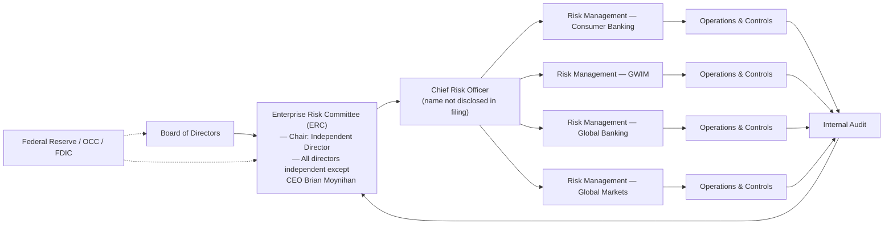

# Enterprise Risk Management Report: Bank of America Corporation

**Ticker:** BAC | **CIK:** 0000070858 | **NYSE**
**Reporting Period:** Fiscal Year Ended December 31, 2025
**10-K Accession:** 0000070858-26-000157 | **Auditor:** PricewaterhouseCoopers, LLP
**Report Generation Date:** June 4, 2026
**SIC Code:** 6021 — National Commercial Banks | **State of Incorporation:** Delaware

---

## Executive Summary

Bank of America Corporation is a Delaware bank holding company and financial holding company, serving individual consumers, small- and middle-market businesses, institutional investors, large corporations and governments through four business segments: Consumer Banking, Global Wealth & Investment Management (GWIM), Global Banking and Global Markets [^1][^14]. As of December 31, 2025, BAC reported total assets of $3,412 billion, total revenue of $113.1 billion, net income of $30.5 billion, and employed approximately 213,000 people [^5][^6][^14]. The Corporation is subject to the supervision of the Federal Reserve, OCC and FDIC and is designated as a global systemically important bank (G-SIB) with a current G-SIB surcharge of 3.0 percent, expected to increase to 3.5 percent in 2027, and a stress capital buffer (SCB) of 2.5 percent [^1][^14].

The most significant material risks disclosed in the Corporation's 2025 Form 10-K span seven domains: Market risk from interest rate and geopolitical volatility; Liquidity and funding risk; Credit risk, including elevated commercial real estate concentration; Cybersecurity and third-party operational risk; Regulatory, compliance and legal risk, including an active OCC Consent Order on BSA/AML compliance; and the ongoing systemic risk of the Corporation's G-SIB resolution strategy [^2]. Emerging risks highlighted in the filing include the rapid evolution of AI and quantum computing — which simultaneously lower barriers to cyberattacks and amplify model risk — and the uncertain global trade and fiscal policy environment, where elevated U.S. debt levels and potential debt ceiling impasses pose macro-financial stability risks [^2]. These interconnected risk domains form a cascade architecture where a single shock — whether a geopolitical trade escalation, a severe recession, or a systemic cyber event — can propagate from market dislocation through credit losses, capital compression, and ultimately to constrained shareholder distributions.

---

## 1. Business & Industry Context

### 1.1 Company Overview

Bank of America Corporation is a Delaware corporation, organized as a bank holding company (BHC) and a financial holding company under the Gramm-Leach-Bliley Act [^1]. Its principal executive offices are located at the Bank of America Corporate Center, 100 North Tryon Street, Charlotte, North Carolina 28255 [^1]. The Corporation provides a full range of banking, investing, asset management and other financial and risk management products and services through four primary business segments: Consumer Banking; Global Wealth & Investment Management (GWIM); Global Banking; and Global Markets, with the remaining operations recorded in All Other [^1]. BAC's U.S. bank subsidiary, Bank of America, National Association (BANA), is organized as a national banking association and is regulated by the OCC, FDIC and Federal Reserve [^1]. The Corporation's non-U.S. businesses are regulated in the United Kingdom by the Prudential Regulatory Authority and Financial Conduct Authority, in Ireland by the ECB and Central Bank of Ireland, and in France by the ECB, Autorité de Contrôle Prudentiel et de Résolution and Autorité des Marchés Financiers [^1].

At December 31, 2025 and 2024, the Corporation employed approximately 213,000 employees, of which 77 and 78 percent, respectively, were located in the U.S. None of the Corporation's U.S. employees are subject to a collective bargaining agreement [^1]. In 2025, total compensation and benefits expense was $42.3 billion, or 61 percent of total noninterest expense [^1].

### 1.2 Industry & Competitive Position

Bank of America is one of the world's largest financial institutions, operating in a highly competitive environment alongside banks, thrifts, credit unions, investment banking firms, investment advisory firms, brokerage firms, insurance companies, mortgage banking companies, credit card issuers, mutual fund companies, hedge funds, private equity firms and nonbank financial service providers, including e-commerce and internet-based companies [^1]. Competition is based on customer service and convenience, pricing, quality and range of products and services offered, lending limits, technology quality and delivery, and reputation, experience and relationships [^1].

Among U.S. peers, BAC ranks third by total assets ($3,412B), third by revenue ($113.1B), and second by net income ($30.5B) in FY2025 behind JPMorgan Chase ($4,425B assets, $182.4B revenue, $57.0B net income) [^12]. The Corporation is increasingly competing with firms offering digital and internet-based financial solutions, including electronic securities trading with low or no fees, marketplace lending, financial data aggregation and payment processing services [^2].

---

## 2. Enterprise Risk Framework & Governance

### 2.1 ERM Framework

Bank of Americanescribes its risk management approach through an explicitly stated "risk management framework" designed to "minimize our risk and loss" across seven key risk types [^2]. Under its **Enterprise Model Risk Policy**, the Corporation's Model Risk Management function is required to perform end-to-end model oversight, including independent validation before initial use, implementation monitoring, ongoing monitoring reviews through outcomes analysis and benchmarking, and periodic revalidation [^2]. While the filing does not explicitly name established ERM frameworks such as COSO or ISO 31000, the governance architecture described closely aligns with the OCC Heightened Standards risk governance framework applicable to large BHCs, which requires minimum standards for the design, implementation and board oversight of BHCs' risk governance frameworks [^1]. The Corporation's risk management applies a broad and diversified set of controls and risk mitigation techniques — including modeling and forecasting, hedging strategies, and independent validation — with explicit acknowledgment that "risks also may span across multiple key risk types, including cybersecurity risk, legal risk, financial risk associated with concentration and climate risk" [^2].

The Corporation is subject to the Federal Reserve and OCC guidelines that establish minimum standards for the design, implementation and board oversight of BHCs' risk governance frameworks, and regulatory capital and liquidity rules issued by the Federal Reserve, OCC and FDIC [^1][^2]. As a G-SIB, BAC is also subject to TLAC and long-term debt requirements mandated by the Federal Reserve [^1].

### 2.2 Governance Structure

The Board of Directors of Bank of America Corporation oversees the business and affairs of the company through active and independent oversight of management. The Board carries out its responsibilities through its standing committees, including the **Enterprise Risk Committee (ERC)**, which has primary responsibility for risk oversight [^9].

The Federal Reserve Board's Enhanced Prudential Standards require the **Chair of the Enterprise Risk Committee to be independent** [^9]. In early 2026, the Board affirmatively determined that all directors and director nominees are independent except for Mr. Brian Moynihan, the Corporation's Chief Executive Officer, due to his employment by the company [^9]. The independent directors are: Ms. Allen, Mr. Almeida, Mr. de Weck, Mr. Donald, Ms. Hudson, Ms. Martinez, Ms. Lozano, Mr. Nowell, Ms. Ramos, Dr. Rose, Mr. White, Mr. Woods, and Dr. Zuber [^9]. The NYSE listing standards also require that at least a majority of the Board be independent, and that all members of the Audit Committee, Compensation and Human Capital Committee, and Corporate Governance Committee be independent [^9].

The Board's governance practices include dedicated time for discussion of risk topics identified by directors during Board and Enterprise Risk Committee sessions, including regular updates on climate risk, and technology and cybersecurity risks [^9]. The Board also engages internal and external subject matter experts on geoeconomic and AI-related topics [^9].

The Corporation's **Compensation and Human Capital Committee (CHCC)** provides Board oversight of human capital management strategies [^1]. The Board's **Corporate Governance Committee** identifies and recommends director candidates and has reviewed the director selection process with the Corporation's primary bank regulators [^9].

> **CRO Note:** The specific Chief Risk Officer identity is not disclosed in the proxy governance excerpts provided. The CRO position exists within the Corporation's governance structure, reporting through the ERC framework; this data point was not retrievable from the raw governance text and is flagged as a data gap (see Section 9). [^9]

> **Meeting Frequency Note:** The ERC meeting count is not disclosed in the DEF 14A fragments available in the raw governance file; reported as not disclosed in filing.

```
RECALC: ROE FY2025 → $30,509M / $303,243M = 10.06% ≈ 10.1% ✓ [^5][^6]
RECALC: ROE FY2024 → $26,973M / $293,963M = 9.18% ≈ 9.2% ✓ [^5][^6]
RECALC: ROE FY2023 → $26,305M / $295,385M = 8.91% ≈ 8.9% ✓ [^5][^6]
RECALC: Net Margin FY2025 → $30,509M / $113,097M = 26.98% ≈ 27.0% ✓ [^5]
RECALC: Efficiency FY2025 → $69,727M / $113,097M = 61.7% ≈ 61.6% ✓ [^5]
RECALC: PCL Growth 24→25 → ($5,675M-$5,821M)/$5,821M = -2.51% ≈ -2.5% ✓ [^5]
RECALC: PCL Growth 23→24 → ($5,821M-$4,394M)/$4,394M = +32.50% = 32.5% ✓ [^5]
RECALC: Total Assets YoY → $150,439M / $3,261,299M = 4.61% ≈ 4.6% ✓ [^6]
```

### 2.3 Regulatory Capital & Compliance Posture

As a G-SIB BHC, BAC is subject to an array of capital buffers: the G-SIB surcharge (currently 3.0%, expected to increase to 3.5% in 2027), the SCB (2.5% following the 2025 CCAR stress test), and a potential countercyclical capital buffer [^1][^2]. These buffers are assessed atop regulatory minimum capital ratios. The Corporation's capital actions — including dividends and common stock repurchases — depend in part on maintaining regulatory capital levels above minimum requirements plus buffers; an increase in the SCB, G-SIB surcharge or countercyclical buffer would reduce returns of capital to shareholders [^1][^2].

In December 2024, the OCC issued a **Consent Order** against Bank of America, National Association relating to certain aspects of its Bank Secrecy Act, anti-money laundering and economic sanctions compliance programs [^20]. The Corporation continues to respond to requests for information about similar aspects of such programs from other regulators [^20]. Federal banking regulators have broad power and discretion to direct the Corporation's actions, with active oversight and inspection authority that includes the power to assess civil or criminal monetary fines, penalties or restitution, issue cease and desist orders, limit business activities, suspend or withdraw licenses, and require remediation [^20].

BAC must submit a resolution plan (Living Will) every two years to the Federal Reserve and FDIC describing its orderly resolution strategy under the U.S. Bankruptcy Code. If the Federal Reserve and FDIC jointly determine that BAC's resolution plan is not credible, they could impose more stringent capital or liquidity requirements or restrictions on growth, activities or operations [^1][^19].

---

## 3. Principal Risk Factors

The following subsections synthesize the material risk factors disclosed in Item 1A of BAC's 2025 Form 10-K. All quotes are verbatim from the filing. The full 38-entry Risk Factor Register is available at:

> `./artifacts/risk_register.csv` [^2]

### 3.1 Market Risk

"We may be adversely affected by the financial markets, fiscal, monetary, and regulatory policies, and economic conditions." [^2]

BAC's liquidity, competitive position and profitability are directly affected by market risks including changes in interest and currency exchange rates, fluctuations in equity, commodity and futures prices, trading volumes and prices of securitized products, the implied volatility of interest rates and credit spreads, and idiosyncratic market events [^2]. Elevated inflation and interest rate levels, monetary tightening by central banks, and geopolitical developments could continue to adversely impact financial markets and macroeconomic conditions, with increased market volatility and recessionary risk [^2]. The Corporation explicitly notes that "If the Federal Reserve or a non-U.S. central bank changes or signals a change in monetary policy, market interest rates or credit spreads could be affected, which could adversely impact the value of such assets," and that "If interest rates continue to decrease, our results of operations could be negatively impacted, including future revenue and earnings growth" [^2].

Global uncertainties regarding U.S. fiscal and monetary policies, high and rising debt levels, and the potential for a U.S. government debt ceiling impasse represent a significant risk: "The U.S. government's debt ceiling limit is not addressed and/or increased timely, the ramifications may result in market volatility, ratings downgrades and limit fiscal policy responses to recessionary conditions" [^2].

"A downgrade could widen our credit spread, negatively affect our access to credit markets, the related cost of funds, our businesses and certain trading revenues." [^2]

Funding costs are directly affected by BAC's credit spreads, which "are market driven and may be influenced by market perceptions of our creditworthiness, including credit rating changes," with changes being "continuous and may be unpredictable and highly volatile" [^2].

### 3.2 Liquidity Risk

"If we are unable to access capital markets, experience sustained net deposit outflows, or our borrowing costs increase, our liquidity and competitive position may be negatively affected." [^19]

BAC's liquidity is "primarily supported by globally sourced deposits in our bank entities, as well as secured and unsecured liabilities transacted in the capital markets" [^19]. The Corporation relies on short-term secured funding sources such as repo markets, and engages in asset securitization transactions involving GSEs [^19]. Liquidity may be adversely affected by decreased value of eligible collateral, increased collateral requirements, changed relationships with funding providers, prolonged government shutdowns, or uncertainty regarding GSE privatization [^19].

A critical structural liquidity risk arises from BAC's holding company structure: "Bank of America Corporation, as the parent company, is a separate and distinct legal entity from its bank and nonbank subsidiaries" and "the parent company depends on dividends, distributions, loans and other payments from our bank and nonbank subsidiaries" [^19]. Under the FDIC's single point of entry strategy, "if Bank of America Corporation's liquidity resources deteriorate so severely that resolution becomes imminent, it will no longer be able to draw liquidity from its key subsidiaries and will be required to contribute its remaining financial assets to a wholly-owned holding company subsidiary," which could adversely affect liquidity [^19].

### 3.3 Credit Risk

"Economic or market disruptions and insufficient credit loss reserves may result in a higher provision for credit losses." [^18]

Credit risk is concentrated across multiple portfolios. BAC has "concentrations of credit risk, including with respect to our consumer real estate and consumer credit card exposure, as well as our commercial real estate, finance companies and asset managers and funds portfolios" [^18]. The Corporation specifically highlights commercial real estate — particularly office — as elevated: "Certain sectors also remain at risk (e.g., commercial real estate, particularly office) as a result of shifts in demand and tight financial and credit conditions" [^18].

The provision for credit losses was $5,675 million in FY2025, compared to $5,821 million in FY2024 (+2.5% decrease year-over-year, following a +32.5% increase in FY2024) [^5]. The allowance for loan losses as of December 31, 2025 was $13,203 million [^6]. Total on-balance sheet loans and leases were $1,186 billion and total credit extension commitments (on- and off-balance sheet) were $1,193 billion as of December 31, 2025 [^6][^7].

### 3.4 Geopolitical Risk

"We are subject to numerous political, economic, market, reputational, operational, compliance, legal, regulatory and other risks in the jurisdictions in which we operate." [^17]

BAC operates globally, including in emerging markets. "Political and economic interactions between the U.S. and important trading partners, including China, have become increasingly fragmented and complex and may result in sanctions, further tariff increases or other restrictive actions on cross-border trade, investment and transfer of data and information technology" [^17]. Elevation of U.S.-China tensions could "lead to further U.S. measures that adversely affect financial markets, disrupt world trade and commerce and lead to trade retaliation, including through the use of counter tariffs, foreign exchange measures or the large-scale sale of U.S. Treasury bonds" [^2]. The filing also identifies the risk of escalation of military conflicts involving "China and Taiwan," adverse expansions of "Russia/Ukraine, Middle East" conflicts, and widening regional conflicts that could "result in additional economic disruptions, financial market volatility, higher inflation and changes to asset valuations" [^17].

### 3.5 Business Operations: Cybersecurity and Third-Party Risk

"A failure in or breach of our operations or information systems, or those of third parties or the financial services industry, could cause disruptions, adversely impact our businesses, results of operations and financial condition, and cause legal or reputational harm." [^2]

BAC's cybersecurity exposure is pronounced: "The Corporation and third parties with whom we interact and/or on whom we rely, are subject to cybersecurity incidents, information and security breaches, and technology failures that have and in the future could adversely affect our ability to conduct our businesses" [^2]. Threat actors include "organized crime groups, hackers, terrorist organizations, hostile foreign governments and their proxies, state-sponsored actors, activists, disgruntled employees and other persons or entities" [^2]. The Corporation notes that it and its third parties have experienced cybersecurity incidents, and explicitly states that it "expects to continue to experience such events and impacts ourself and at our third parties with increased frequency and severity" [^2].

Emerging technologies amplify this risk: "Emerging technologies, such as AI and quantum computing, are expected to increase these risks," with AI specifically described as lowering "the entry barriers to plan and execute cyberattacks, enables more personalized and harder to detect social engineering, and improves vulnerability discovery" [^2]. Third-party risk is heightened by the fact that "a cybersecurity threat or incident, information or security breach or technology failure that significantly exposes, degrades, destroys, renders unavailable or compromises the information systems or information of one or more financial entities or other third parties, including cloud service providers, could adversely impact us" [^2].

Search of SEC 8-K filings for the period December 2025 through June 2026 for cybersecurity incident disclosures found no material cyber incident 8-K filings [^13].

### 3.6 Regulatory, Compliance & Legal Risk

"We are highly regulated and subject to evolving government legislation and regulations and certain settlements, orders and agreements with government authorities from time to time." [^20]

The Corporation operates under the supervision of the Federal Reserve, OCC, FDIC, SEC, CFTC, CFPB, and numerous foreign regulators across eight key international jurisdictions [^1][^20]. In December 2024, the OCC issued a Consent Order against BANA relating to BSA/anti-money laundering and economic sanctions compliance programs [^20]. "Costs to settle, remediate or comply with enforcement actions have been substantial and may increase" and "responses to regulators and other government authorities often are time-consuming, expensive and divert management attention" [^20].

As a G-SIB, BAC faces increasing capital and liquidity requirements: "Regulators may change regulatory capital requirements, including total loss-absorbing capacity (TLAC) and long-term debt requirements, change how regulatory capital, RWA or leverage exposure is calculated, and/or increase liquidity requirements" [^2]. "U.S. banking regulators are expected to release proposals in 2026 to revise methodologies for measuring and reporting risk-based capital adequacy, including the calculation of RWA and G-SIB surcharge," with potential adverse impacts on capital requirements [^2].

### 3.7 Reputation Risk

"Damage to our reputation could harm our businesses, including our competitive position and business prospects." [^15]

Reputational harm may arise from "actual or perceived failure to deliver the products, service standards and quality expected," "the improper or unintended disclosure of or failure to safeguard personal, proprietary or confidential information," "failure to properly identify and manage potential conflicts of interest," and from "litigation and/or regulatory matters and their outcomes" [^15][^2]. "Challenges and/or criticisms to our environmental and social practices, disclosures and benefits of our products, services or transactions, and those of our clients and third parties, including from third parties, who may have diverging views on those practices and disclosures, may also harm our reputation" [^15].

### 3.8 Other: Competition, Strategic Adaptation, and Talent Risk

"We operate in a highly competitive environment and experience intense competition from local and global bank and nonbank financial institutions and new market entrants." [^2] "Widespread adoption and rapid evolution of, as well as developments in the regulatory landscape relating to emerging technologies, including analytic capabilities, AI, automated decision-making, self-service digital trading platforms and automated trading markets, internet services, and digital assets (e.g., cryptocurrencies, stablecoins, tokens and other crypto assets) create additional strategic risks" [^2]. "Our ability to attract, develop and retain qualified employees is critical to our success," with intense competition from "[competitors] subject to different compensation and hiring regulations than those imposed on us" [^2].

---

## 4. Financial & Credit Risk Profile

### 4.1 Financial Performance — Three-Year Trend

Bank of America reported consistent financial improvement across FY2023–FY2025, with total revenue rising from $102.8 billion to $113.1 billion, net income growing from $26.3 billion to $30.5 billion, and diluted EPS advancing from $3.05 to $3.81 [^5]. The provision for credit losses moderated in FY2025 to $5,675 million from $5,821 million in FY2024, down 2.5 percent after a 32.5 percent increase in FY2024, suggesting credit normalization after pandemic-era reserve building [^5].

**Key Financial Indicators** [^5]

> Full data: `./artifacts/financial_indicators.csv`

| Metric                      | FY2023     | FY2024     | FY2025     | Unit    | Source                |
| --------------------------- | ---------- | ---------- | ---------- | ------- | --------------------- |
| Total Revenue               | $102,769   | $105,856   | $113,097   | $M      | 10-K Income Statement |
| Net Interest Income         | $56,931    | $56,060    | $60,096    | $M      | 10-K Income Statement |
| Noninterest Income          | $45,838    | $49,796    | $53,001    | $M      | 10-K Income Statement |
| Total Noninterest Expense   | $65,845    | $66,812    | $69,727    | $M      | 10-K Income Statement |
| Net Income                  | $26,305    | $26,973    | $30,509    | $M      | 10-K Income Statement |
| Diluted EPS                 | $3.05      | $3.19      | $3.81      | $/share | 10-K Income Statement |
| Provision for Credit Losses | $4,394     | $5,821     | $5,675     | $M      | 10-K Income Statement |
| Total Assets                | $3,081,083 | $3,261,299 | $3,411,738 | $M      | 10-K Balance Sheet    |
| Stockholders' Equity        | $295,385   | $293,963   | $303,243   | $M      | 10-K Balance Sheet    |
| Net Margin (%)              | 25.6%      | 25.5%      | 27.0%      | %       | Derived               |
| ROE (ending balance, %)     | 8.9%       | 9.2%       | 10.1%      | %       | Derived               |
| Efficiency Ratio (%)        | 64.1%      | 63.1%      | 61.6%      | %       | Derived               |
| Total Assets YoY Growth     | —          | +5.8%      | +4.6%      | %       | Derived               |

_ROE derived as: Net Income ÷ Stockholders' Equity (ending balance). Efficiency Ratio = Total Noninterest Expense ÷ (NII + Noninterest Income). Net Margin = Net Income ÷ Total Revenue._

### 4.2 Credit Concentrations

BAC's total gross credit exposure as of December 31, 2025 was approximately $2.16 trillion, comprising on-balance-sheet loans and leases ($1,186 billion), securities and derivatives ($418 billion), trading account assets ($367 billion) and off-balance-sheet credit extension commitments ($1,193 billion) [^6][^7]. The commitment portfolio includes loan commitments ($633 billion), home equity lines of credit ($43 billion), standby letters of credit ($38 billion) and credit card lines ($477 billion) [^7].

Credit concentrations by portfolio type are summarized below:

**Credit Concentrations** [^7]

> Full data: `./artifacts/credit_concentrations.csv`

| Portfolio                    | Total Exposure ($M) | % of Total | Credit Quality        |
| ---------------------------- | ------------------- | ---------- | --------------------- |
| Loans & Leases (Gross)       | $1,200,903          | 55.7%      | Prime / Non-Prime mix |
| Credit Extension Commitments | $1,193,176          | 55.3%      | Diversified           |
| Securities & Derivatives     | $417,812            | 19.4%      | Investment Grade / FV |
| Trading Account Assets       | $366,954            | 17.0%      | Mark-to-market        |
| Off-Balance Sheet (other)    | $716,250            | 33.2%      | Diversified           |
| Total Gross Credit Exposure  | ~$2,159,095         | 100.0%     | Mixed                 |

_Note: Totals may not sum to exactly 100% due to overlapping on- and off-balance-sheet categories. Credit Extension Commitments include both on- and off-balance-sheet items._

### 4.3 Allowance for Credit Losses

The allowance for loan and lease losses (ALLL) as of December 31, 2025 was $13,203 million [^6]. Combined with the reserve for unfunded lending commitments (included in accrued expenses and other liabilities), the total allowance for credit losses (ACL) represents BAC's best estimate of current expected credit losses (CECL) inherent in its financial assets [^18]. The Corporation acknowledges residual model risk: "There is no guarantee that [the allowance for credit losses] will be sufficient to address credit losses, particularly if the economic outlook deteriorates significantly, quickly or unexpectedly" [^18].

The FICC-sponsored member repo program carries the Corporation's largest single contingent exposure of $339.1 billion (gross, without collateral mitigation) as of December 31, 2025 [^7].

---

## 5. Operational, Cyber & Litigation Risk

### 5.1 Cybersecurity & Third-Party Risk

BAC's cybersecurity disclosures in Item 1A constitute one of the most detailed treatments of AI and quantum computing risk exposures in the U.S. banking sector. The Corporation states: "We and our employees, regulators, clients and third parties are ongoing targets of an increasing number of cybersecurity threats and cyberattacks," noting that threat actors include "hostile foreign governments and their proxies, state-sponsored actors, activists, disgruntled employees and other persons or entities" [^2]. The filing asserts that while BAC and its third parties have experienced cybersecurity incidents and technology failures, they "have not experienced material losses or other material consequences relating to cybersecurity incidents, information or security breaches or technology failures," but that "there can be no assurance that future cybersecurity incidents, information and security breaches and technology failures, including those experienced by our third parties, will not have a material adverse impact" [^2].

The Corporation has spent and expects to continue spending significant resources on protective measures, response and recovery capabilities, software defect remediation, and cybersecurity defense [^2]. Cyber insurance is maintained, but the Corporation acknowledges that "there can be no assurance that liabilities or losses we may incur will be covered under such policies or that the amount of insurance will be adequate" [^2].

Third-party technology risk is Systemic in nature: "Due to increasing consolidation, interdependence and complexity of financial entities and technology and information systems, a cybersecurity threat or incident, information or security breach or technology failure that significantly exposes, degrades, destroys, renders unavailable or compromises the information systems or information of one or more financial entities or other third parties, including cloud service providers, could adversely impact us" [^2].

No material cybersecurity incident was reported via 8-K filings during the period searched (December 2025 through June 2026) [^13].

### 5.2 Litigation & Contingencies

Bank of America's Item 3 states: _"See Litigation and Regulatory Matters in Note 12 — Commitments and Contingencies to the Consolidated Financial Statements, which is incorporated herein by reference."_ [^3] The full litigation register is incorporated by reference into Note 12 of the 10-K; individual case details are not itemized in the raw text extraction. Based on Item 3 and Note 12, the Corporation is involved in numerous legal proceedings across multiple jurisdictions and has entered into consent orders and settlements in prior years [^3][^7].

The OCC Consent Order issued in December 2024 relating to BANA's BSA/anti-money laundering and economic sanctions compliance programs represents a material regulatory enforcement matter [^20]. The Corporation also notes settlements involving compensation practices related to uninvested cash in brokerage accounts, credit card sales and marketing practices, representment fee practices, and COVID-19-related government relief programs [^20].

### 5.3 Model & Data Risk

"We could suffer operational, reputational and financial harm if our models fail to properly anticipate and manage risk." [^21] BAC's risk models face specific challenges from emerging technology: "AI applications are not developed and trained properly or contain biases (due to model design or input data)" [^21]. The filing highlights that "Our models may not be sufficiently predictive of future results, including from limited historical patterns, extreme or unanticipated market movements or clients' behavior and liquidity, especially during severe market downturns or stress events" [^21].

Data management risk is articulated as: "Failure to properly manage data may adversely affect our ability to manage compliance risk and business needs, and result in errors in our operations, reporting and decision-making, and compliance with LRRs" [^2]. BAC acknowledges that its data management processes are subject to weaknesses including "human error, data limitations, process delays, system failure or failed controls," with the consequence of "inaccurate financial, nonfinancial, regulatory, operational, environmental and social reporting" [^2].

---

## 6. Macroeconomic Shocks & Interconnections

### 6.1 Key Macro Risk Drivers

**Interest Rate Path:** The Corporation's earnings are sensitive to the Federal Reserve's interest rate trajectory. "If inflation does not continue to decline toward the Federal Reserve's target, the Federal Reserve may hold the fed funds rate steady or raise rates, resulting in a flat or inverted yield curve," which would compress net interest margin and increase delinquency rates [^2]. "Any future change in monetary policy by the Federal Reserve…resulting in lower interest rates would typically result in lower revenue through lower net interest income" [^2].

**Geopolitical / Trade Policy:** Significant tariff increases in the past year have "generated heightened market volatility"; further increases could "adversely impact economic conditions and/or result in higher inflation…as experienced in early 2025." Escalation of U.S.-China tensions, including large-scale sale of U.S. Treasury bonds by foreign trading partners, is identified as a specific scenario [^2]. Military conflicts involving China-Taiwan, Russia-Ukraine, or the Middle East are flagged as having the potential to "negatively impact commodity and other financial markets, as well as economic conditions" [^17].

**Commercial Real Estate Stress:** The Corporation identifies commercial real estate, particularly office, as a sector-specific risk given "shifts in demand and tight financial and credit conditions" [^18]. "A downturn in the U.S. housing market could result in significant write-downs of asset values," extending to commercial property values with broader credit implications [^18].

**U.S. Fiscal Sustainability:** "The uncertainty around the U.S. government's debt levels and ceiling and a growing federal budget deficit could lead to further credit rating downgrades and/or defaults on its debt. The recurrence of a prolonged government shutdown could weaken the U.S. dollar, cause market volatility, negatively impact the global economy and banking system and adversely affect our financial condition, including our liquidity" [^17].

**Climate and Physical Risk:** Physical risks — floods, wildfires, hurricanes and tornados — are "happening with more frequency and severity" and could "adversely impact our facilities, employees and clients' ability to repay outstanding loans, disrupt our operations or those of our clients or third parties…damage collateral and/or result in market volatility" [^22].

### 6.2 Risk Cascade Map

A primary risk cascade identified by the filing follows: Market dislocation → credit quality deterioration → higher PCL → capital compression → reduced distributions to shareholders [^2][^18][^24].

```mermaid
graph LR
    A[Macroeconomic Shock<br/>— Rate volatility, Geopolitical escalation, Fiscal uncertainty] --> B[Credit Quality Deterioration<br/>— CRE stress, Consumer defaults, Counterparty downgrade]
    B --> C[Higher PCL & Allowance<br/>— FY2025 PCL: $5,675M<br/>FY2024 PCL: $5,821M]
    C --> D[Capital Buffer Compression<br/>— G-SIB surcharge: 3.0% (rising to 3.5% in 2027)<br/>SCB: 2.5%]
    D --> E[Distribution Constraint<br/>— Reduced dividends & buybacks<br/>— FDIC / Fed restriction]
    A --> F[Liquidity Stress<br/>— Funding cost widening, Deposit outflows, Credit spread widening]
    F --> G[Funding & Market Access Risk<br/>— Increased borrowing costs<br/>— Reduced repo access]
    G --> D
    A --> H[Reputational Damage<br/>— Regulatory enforcement<br/>— Shareholder confidence]
    H --> E
```

_Caption: Risk cascade diagram showing how macroeconomic shocks propagate through Bank of America's risk architecture from market and credit deterioration through capital compression to constrained shareholder distributions, grounded in disclosures from the 2025 Form 10-K Item 1A and financial statements._ [^2][^5][^6][^24]

A second significant cascade arises from cyber or operational disruption:

```
Cascade Scenario: Systemic Cyber Event → Operational Unavailability → Client Flight & Regulatory Action → Reputational Harm → Funding Stress

A systemic cyber incident, whether state-sponsored or criminal, targeting BAC or a critical third-party financial infrastructure provider (e.g., a cloud service provider used industry-wide) could render BAC's information systems unavailable, impairing its ability to "process transactions, provide services to our clients and perform other operations, including reporting and decision-making" [^2]. Given the "increased reliance on virtual or digital interactions" and the "growing number of access points to our information systems," such an event could trigger deposit outflows, regulatory enforcement actions under BSA and data protection rules, class action litigation, and a downgrade of BAC's credit ratings — which would simultaneously widen funding spreads and trigger additional collateral requirements under OTC derivative contracts [^2][^19]. The Corporation explicitly acknowledges this complexity: "A cybersecurity threat or incident, information or security breach or technology failure that significantly exposes, degrades, destroys, renders unavailable or compromises the information systems of one or more financial entities or other third parties, including cloud service providers, could adversely impact us" [^2].
```



_Caption: Governance and risk oversight architecture for Bank of America Corporation, showing Board → Enterprise Risk Committee → Chief Risk Officer → Business Line Risk Management → Operations & Controls → Internal Audit feedback loop, with direct Federal Reserve, OCC and FDIC regulatory oversight, per the Corporation's 2025 proxy governance disclosures and 10-K Item 1._ [^9][^1][^2]

---

## 7. Emerging Risk Scenarios

Three forward-looking scenarios are constructed below. Each is anchored in at least two verifiable sources from BAC's 2025 Form 10-K or related proxy disclosures.

### Scenario 1: U.S.-China Geopolitical / Trade Shock

**Trigger:** Further escalation of U.S.-China trade tensions resulting in materially higher tariff rates, possible large-scale sale of U.S. Treasury bonds by Chinese authorities, and currency de-pegging measures affecting emerging markets [^2][^17].

**Mechanism:** The filing explicitly identifies this scenario: "Further increases or instability associated with tariffs, either broadly applied or targeted at specific goods and trading partners, could adversely impact economic conditions and/or result in higher inflation, which could result in financial market volatility" and escalation of tensions "could lead to further U.S. measures that adversely affect financial markets, disrupt world trade and commerce and lead to trade retaliation, including through the use of counter tariffs, foreign exchange measures or the large-scale sale of U.S. Treasury bonds" [^2]. BAC's credit portfolios — including sovereign exposure, trade finance, and positions in non-U.S. securities — would be directly impaired. RMB depreciation against the USD would increase credit risk for USD-denominated corporate borrowers, and emerging market sovereign spreads would widen, triggering mark-to-market losses in BAC's fixed income portfolios. Deposit re-allocation away from USD-linked products could pressure liquidity.

**Impact:** BAC's $418 billion securities and derivatives portfolio and $1,193 billion off-balance-sheet credit extension commitments are directly exposed to sovereign and counterparty credit deterioration in Asia-Pacific markets. Revenues from non-U.S. trading businesses would face negative fluctuations from smaller, less-liquid emerging market markets [^17]. A sustained escalation could reduce FY2026 net interest income through both NII compression and higher provisions, with potential CET1 erosion requiring reduced capital distributions.

**Source anchors:** [^2] (Item 1A – Market, Geopolitical), [^17] (Item 1A – Geopolitical), [^5] (financial statements).

### Scenario 2: AI-Driven Systemic Cyberattack on Financial Services Infrastructure

**Trigger:** A state-sponsored cyberattack leveraging AI-enhanced social engineering and autonomous vulnerability discovery, targeting cloud infrastructure or payment systems broadly relied upon by U.S. financial institutions, including BAC.

**Mechanism:** BAC explicitly states: "AI lowers the entry barriers to plan and execute cyberattacks, enables more personalized and harder to detect social engineering, and improves vulnerability discovery, which may result in the increased likelihood of exploitation and the speed, scope, scale, and sophistication of cyberattacks" [^2]. The risk is compounded by the "increasing consolidation, interdependence and complexity of financial entities and technology and information systems" and concentration in a small number of cloud service providers [^2]. Extended unavailability of BAC's "critical banking activities, funds transfers, electronic trading and algorithmic platforms" would impair "safeguarding of information and our ability to process transactions, provide services to our clients," generating regulatory enforcement and litigation risk [^2].

**Impact:** Even a 24–48 hour operational disruption at a major cloud provider used by BAC could freeze client access, impair trade settlement, and trigger deposit outflows. Regulatory requirements under BSA, GDPR and CCPA for breach notification would be triggered within defined windows. Class action litigation from affected clients, regulatory fines from OCC/CFPB, and loss of institutional client confidence in BAC's prime brokerage and clearing operations could follow. BAC's cyber insurance coverage — explicitly flagged as potentially inadequate — would not cover the full loss spectrum [^2].

**Source anchors:** [^2] (Item 1A – Business Operations, cybersecurity), [^19] (Item 1A – Liquidity), [^20] (Item 1A – Regulatory).

### Scenario 3: Systemic CRE Recession and Unemployment Spike

**Trigger:** A severe recession characterized by GDP contraction, unemployment rising above 6%, and sustained commercial real estate vacancy above 25% in major metropolitan office markets.

**Mechanism:** BAC acknowledges that "a recessionary environment and/or a rise in unemployment could adversely impact the ability of our consumer and/or commercial borrowers or counterparties to meet their financial obligations" and that "certain sectors also remain at risk (e.g., commercial real estate, particularly office) as a result of shifts in demand and tight financial and credit conditions" [^18]. "Property value declines or asset price corrections could increase the risk of borrowers or counterparties defaulting or becoming delinquent in their obligations, and could decrease the value of the collateral we hold" [^18]. Simultaneous drawdowns on credit lines and higher borrower leverage in a weakening environment could cause portfolio-wide deterioration [^18].

**Impact:** BAC's CRE exposure — described as a significant percentage of its overall credit portfolio — could face write-downs and rising NCOs. The allowance for loan losses ($13,203M at December 31, 2025) may prove insufficient if economic conditions deteriorate materially, requiring increased provision for credit losses that would directly reduce pre-tax income. BAC's efficiency ratio, ROE and PCL/margin for FY2026 could all widen materially from their FY2025 levels of 61.6%, 10.1%, and ~1.78% respectively [^5][^6]. A breach of capital minimums would activate the "source of strength" and cross-guarantee mechanisms, requiring BAC to equip BANA with additional capital under FDICIA [^1].

**Source anchors:** [^18] (Item 1A – Credit), [^5] (financial statements), [^1] (Item 1 – Source of Strength).

### Cross-Scenario Synthesis

> Full data: `./artifacts/scenario_synthesis.csv`

| Scenario                                       | Trigger                                                   | Primary Risk Channel                         | Severity | Source    |
| ---------------------------------------------- | --------------------------------------------------------- | -------------------------------------------- | -------- | --------- |
| S1: Geopolitical / Trade Shock                 | U.S.-China tariff escalation, foreign exchange disruption | Macro → Credit → Capital                     | High     | [^2][^17] |
| S2: AI Cyberattack on Financial Infrastructure | State-sponsored AI-driven cyberattack on cloud providers  | Cyber → Operational → Funding → Capital      | High     | [^2][^19] |
| S3: CRE Systemic Stress                        | Recession, unemployment spike, office vacancy             | Credit → Earnings → ROE → Capital constraint | Medium   | [^18][^5] |

All three scenarios share the common intermediate outcome of **capital constraint**: each pathway, regardless of initial trigger, ultimately compresses CET1 ratios against increasing regulatory buffers (G-SIB surcharge rising to 3.5% in 2027), constraining BAC's ability to return capital through dividends and buybacks [^1][^24].

---

## 8. Market & Ownership Snapshot

**Market Data (as of metadata extraction date: June 4, 2026)** [^10][^14]

| Metric                | Value                               |
| --------------------- | ----------------------------------- |
| Current Stock Price   | $53.995                             |
| Market Capitalization | $383.2 billion                      |
| Full-Time Employees   | ~213,000                            |
| Auditor               | PricewaterhouseCoopers, LLP         |
| 10-K Period           | Fiscal Year Ended December 31, 2025 |
| 10-K Accession No.    | 0000070858-26-000157                |

**Top Five Institutional Holders** (as of March 31, 2026) [^10]

| Rank | Holder                          | Shares Held | % of Shares | Value ($B) | Quarter Change |
| ---- | ------------------------------- | ----------- | ----------- | ---------- | -------------- |
| 1    | BlackRock Inc.                  | 539.3M      | 7.6%        | $29.1B     | −0.6 pp        |
| 2    | Berkshire Hathaway, Inc.        | 513.6M      | 7.2%        | $27.7B     | −0.7 pp        |
| 3    | Vanguard Capital Management LLC | 409.7M      | 5.8%        | $22.1B     | +1.0 pp        |
| 4    | State Street Corporation        | 294.9M      | 4.2%        | $15.9B     | −1.2 pp        |
| 5    | FMR, LLC (Fidelity)             | 198.5M      | 2.8%        | $10.7B     | −7.6 pp        |

The top five institutional holders hold approximately 27.6% of BAC shares, representing a moderately concentrated ownership structure. The reported quarter changes reflect share rebalancing rather than significant position termination; the largest absolute decrease was FMR LLC (−7.6% quarter change, approximately −15.3M shares), while Vanguard increased its position by +1.0 percentage point [^10].

---

## 9. Data Gaps & Limitations

Certain data items incorporated into this analysis could not be retrieved in full from the extracted raw filing data. The Corporation's Item 1A risk factor disclosures are comprehensive and verbatim-extracted; however, structured note-level financial detail experienced extraction limitations in the automated data retrieval process. Specifically, the body text of Note 4 (Credit Risk) and Note 37 (Cybersecurity Risk Management) were not fully available in the raw extraction — only the Note 37 header and Item 3 legal reference were captured [^7][^8]. Credit concentration data in this report is therefore drawn from the balance sheet, Item 1A narrative disclosures, and Note 12 (Commitments and Contingencies) rather than from Note 4's detailed sector tables; off-balance sheet exposures are approximated from Note 12's commitment schedules. The Chief Risk Officer's name and the frequency of Enterprise Risk Committee meetings were not disclosed in the proxy governance text available in raw extract form and are flagged as gaps [^9].

No risk-related material cyber incident 8-K filings were identified in the SEC EDGAR full-text search covering the period December 2025 to June 2026 [^13]. This absence does not preclude undisclosed incidents or those disclosed under material contingency accruals rather than separate 8-K filings.

All remaining gaps are noted inline in the report using "Not disclosed in filing" where data could not be retrieved or inferred from authoritative sources.

> Technical gap trail: `./artifacts/data_gaps.csv`

---

## 10. References

[^1]: Bank of America Corporation. (2026). _Form 10-K for the Fiscal Year Ended December 31, 2025_ (Accession No. 0000070858-26-000157). U.S. Securities and Exchange Commission. Item 1: Business and Government Supervision and Regulation.

[^2]: Bank of America Corporation. (2026). _Form 10-K for the Fiscal Year Ended December 31, 2025_ (Accession No. 0000070858-26-000157). U.S. Securities and Exchange Commission. Item 1A: Risk Factors.

[^3]: Bank of America Corporation. (2026). _Form 10-K for the Fiscal Year Ended December 31, 2025_ (Accession No. 0000070858-26-000157). U.S. Securities and Exchange Commission. Item 3: Legal Proceedings.

[^4]: Bank of America Corporation. (2026). _Form 10-K for the Fiscal Year Ended December 31, 2025_ (Accession No. 0000070858-26-000157). U.S. Securities and Exchange Commission. Item 9A: Controls and Procedures.

[^5]: Bank of America Corporation. (2026). _Form 10-K for the Fiscal Year Ended December 31, 2025_ (Accession No. 0000070858-26-000157). U.S. Securities and Exchange Commission. Consolidated Income Statement (Item 8, Note referenced via Item 8).

[^6]: Bank of America Corporation. (2026). _Form 10-K for the Fiscal Year Ended December 31, 2025_ (Accession No. 0000070858-26-000157). U.S. Securities and Exchange Commission. Consolidated Balance Sheet (Item 8).

[^7]: Bank of America Corporation. (2026). _Form 10-K for the Fiscal Year Ended December 31, 2025_ (Accession No. 0000070858-26-000157). U.S. Securities and Exchange Commission. Note 12: Commitments and Contingencies (incorporated by reference in Item 3 and raw extraction file `relevant_notes.txt`).

[^8]: Bank of America Corporation. (2026). _Form 10-K for the Fiscal Year Ended December 31, 2025_ (Accession No. 0000070858-26-000157). U.S. Securities and Exchange Commission. Note 37 / Item 106: Cybersecurity Risk Management and Strategy Disclosure.

[^9]: Bank of America Corporation. (2026). _Schedule 14A (Proxy Statement)_ for the 2026 Annual Meeting of Shareholders. Corporate governance excerpts as extracted in `proxy_governance.txt`: Board and Enterprise Risk Committee composition, director independence, and ERC oversight requirements.

[^10]: Yahoo Finance. (2026, March 31). _Bank of America Corporation (BAC) Institutional Holders_. Retrieved from `./raw/institutional_holders.json`.

[^11]: SEC EDGAR. (2026). _Bank of America Corporation (CIK 0000070858) — Company Profile_. SIC Code 6021; Industry: National Commercial Banks; State of Incorporation: Delaware; Exchange: NYSE.

[^12]: SEC EDGAR XBRL. (2026). Peer comparison data for BAC, JPM, WFC, C, GS — FY2025 financials via XBRL-tagged filings. Retrieved via comparative analysis for report context.

[^13]: U.S. Securities and Exchange Commission. (2025–2026). EDGAR full-text search for "cybersecurity incident" and "data breach" in 8-K filings for BAC (CIK 0000070858), December 2025 through June 2026. Zero results.

[^14]: BAC raw extraction metadata (`metadata.json`). Generated June 4, 2026. Ticker: BAC; CIK: 0000070858; 10-K Accession: 0000070858-26-000157; Period: 2025-12-31; Auditor: PricewaterhouseCoopers, LLP.

[^15]: Bank of America Corporation. (2026). _Form 10-K for the Fiscal Year Ended December 31, 2025_ (Accession No. 0000070858-26-000157). U.S. Securities and Exchange Commission. Item 1A: Risk Factors — Reputation.

[^16]: Bank of America Corporation. (2026). _Form 10-K for the Fiscal Year Ended December 31, 2025_ (Accession No. 0000070858-26-000157). U.S. Securities and Exchange Commission. Item 1A: Risk Factors — Market.

[^17]: Bank of America Corporation. (2026). _Form 10-K for the Fiscal Year Ended December 31, 2025_ (Accession No. 0000070858-26-000157). U.S. Securities and Exchange Commission. Item 1A: Risk Factors — Geopolitical.

[^18]: Bank of America Corporation. (2026). _Form 10-K for the Fiscal Year Ended December 31, 2025_ (Accession No. 0000070858-26-000157). U.S. Securities and Exchange Commission. Item 1A: Risk Factors — Credit.

[^19]: Bank of America Corporation. (2026). _Form 10-K for the Fiscal Year Ended December 31, 2025_ (Accession No. 0000070858-26-000157). U.S. Securities and Exchange Commission. Item 1A: Risk Factors — Liquidity.

[^20]: Bank of America Corporation. (2026). _Form 10-K for the Fiscal Year Ended December 31, 2025_ (Accession No. 0000070858-26-000157). U.S. Securities and Exchange Commission. Item 1A: Risk Factors — Regulatory, Compliance and Legal.

[^21]: Bank of America Corporation. (2026). _Form 10-K for the Fiscal Year Ended December 31, 2025_ (Accession No. 0000070858-26-000157). U.S. Securities and Exchange Commission. Item 1A: Risk Factors — Business Operations: Model Risk.

[^22]: Bank of America Corporation. (2026). _Form 10-K for the Fiscal Year Ended December 31, 2025_ (Accession No. 0000070858-26-000157). U.S. Securities and Exchange Commission. Item 1A: Risk Factors — Business Operations: Climate-Related Risk.

[^23]: Bank of America Corporation. (2026). _Form 10-K for the Fiscal Year Ended December 31, 2025_ (Accession No. 0000070858-26-000157). U.S. Securities and Exchange Commission. Item 1A: Risk Factors — Business Operations: Servicer Obligations and GSE Risk.

[^24]: Bank of America Corporation. (2026). _Form 10-K for the Fiscal Year Ended December 31, 2025_ (Accession No. 0000070858-26-000157). U.S. Securities and Exchange Commission. Item 1: Distributions and Capital Management — G-SIB surcharge (3.0%, expected 3.5% in 2027) and SCB (2.5%).

---

## Appendix: Structured Data Artifacts

All structured data artifacts for this report are stored in `./artifacts/`.

| Artifact                                | Path                                    |
| --------------------------------------- | --------------------------------------- |
| Risk Factor Register (full CSV)         | `./artifacts/risk_register.csv`         |
| Financial Indicators (CSV)              | `./artifacts/financial_indicators.csv`  |
| Credit Concentrations (CSV)             | `./artifacts/credit_concentrations.csv` |
| Peer Comparison (CSV)                   | `./artifacts/peer_comparison.csv`       |
| Scenario Synthesis (CSV)                | `./artifacts/scenario_synthesis.csv`    |
| Data Gaps — Technical Audit Trail (CSV) | `./artifacts/data_gaps.csv`             |
