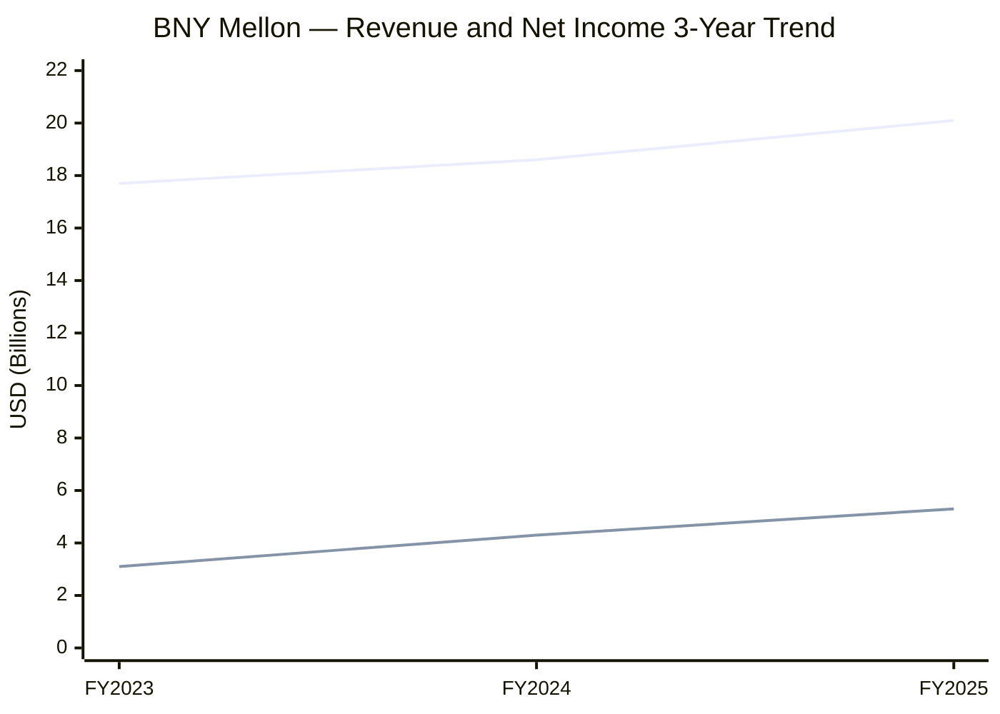
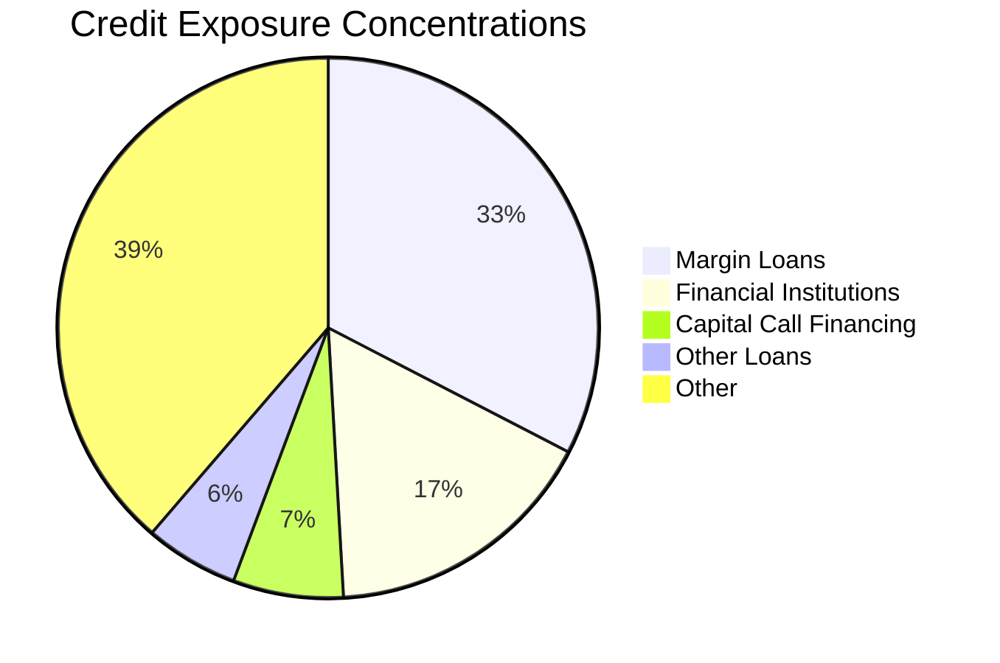
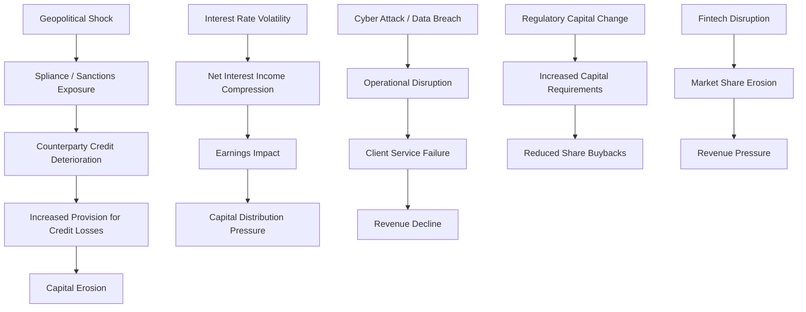

# Enterprise Risk Management Report: The Bank of New York Mellon Corporation

**Ticker:** BK | **CIK:** 000001390777 | **NYSE**
**Reporting Period:** Fiscal Year Ended December 31, 2025
**10-K Accession:** 0001390777-26-000033 | **Auditor:** KPMG LLP
**Report Generation Date:** June 4, 2026

---

## Executive Summary

The Bank of New York Mellon Corporation (NYSE: BK) is a global financial services platforms company with $59.3 trillion in assets under custody and/or administration and $2.2 trillion in assets under management as of December 31, 2025 [^1]. Headquartered in New York, the company has been in continuous operation since 1784 [^1]. BNY reported total revenue of $20.1 billion in FY2025, a 7.8% increase year-over-year, and net income applicable to common shareholders of $5.3 billion, representing earnings per diluted share of $7.40 [^2]. The company operates through three principal segments: Securities Services, Market and Wealth Services, and Investment and Wealth Management [^1].

The company's most significant material risks include regulatory and compliance exposure across multiple jurisdictions, technology and cybersecurity threats to its critical infrastructure role in global financial markets, interest rate sensitivity affecting net interest income, and counterparty credit risk concentrated among major financial institutions [^3]. Forward-looking emerging risks include AI-driven cyber disruptions, Basel III endgame capital rule implementation, and geopolitical escalation impacting global custody flows [^3][^4].

---

## 1. Business & Industry Context

### 1.1 Company Overview

The Bank of New York Mellon Corporation is a Delaware corporation and a global financial services platforms company [^1]. BNY is classified as a state commercial bank (SIC 6022) and is subject to regulation by the Board of Governors of the Federal Reserve System, the Office of the Comptroller of the Currency, and the Federal Deposit Insurance Corporation [^1][^5]. The company maintains two principal U.S. banking subsidiaries: The Bank of New York Mellon, a New York state-chartered bank, and BNY Mellon, National Association, a national bank [^1].

As of December 31, 2025, BNY and its subsidiaries had approximately 48,100 full-time employees globally, with approximately 60% based outside the United States [^1]. The company's international operations include BNY Mellon SA/NV, its main banking subsidiary in continental Europe, authorized and regulated as a credit institution by the European Central Bank and the National Bank of Belgium [^1].

### 1.2 Industry & Competitive Position

BNY operates in the securities servicing, asset servicing, investment management, and wealth management industries [^1]. The company competes with domestic and international financial services firms offering custody services, corporate trust services, clearing services, collateral management, securities brokerage, foreign exchange, and derivatives [^1]. Competition also comes from technology service providers, including financial services data processing firms [^1].

Among its direct peers in securities services and custody banking, BNY is the largest by total assets ($472.3 billion) and revenue ($20.1 billion) [^6][^7]. State Street Corporation (STT) reported $366.0 billion in total assets and $13.9 billion in revenue [^6]. Northern Trust Corporation (NTRS) reported $177.1 billion in total assets and $5.0 billion in revenue [^6]. U.S. Bancorp (USB), a diversified bank with a larger retail footprint, reported $692.3 billion in total assets and $28.7 billion in revenue [^6].

The company's competitive position is defined by its dominant market share in global custody and its diversified fee-based revenue model [^1]. BNY's market capitalization of approximately $94.1 billion as of the report date reflects its position as the leading independent custody and asset servicing bank globally [^5].

> Full peer comparison: ./dist/BK/artifacts/peer_comparison.csv

---

## 2. Enterprise Risk Framework & Governance

### 2.1 ERM Framework

BNY maintains a comprehensive internal risk framework designed to "identify, measure, monitor, control and report risks appropriately" and "define the type and amount of risk the company is willing to take" [^4]. The framework is designed to "maintain a risk management organization that is independent of risk-taking activities" and "promote a strong risk management culture that encourages a focus on risk-adjusted performance" [^4].

While BNY does not explicitly name a single ERM framework (such as COSO, ISO 31000, or Basel III), its risk management structure aligns with Basel III regulatory capital requirements for bank holding companies and incorporates elements consistent with the COSO Internal Control-Integrated Framework through its disclosure controls and procedures [^4][^8]. The company's risk categorization structure in its 10-K disclosures follows the three-lines-of-defense model with distinct roles for business operations, risk management, and internal audit [^4].

### 2.2 Governance Structure

The Board of Directors exercises oversight of enterprise risk through dedicated committees. All Board committees consist entirely of independent directors [^4]. The Board has determined that all directors are independent except Robin Vince, who serves as CEO and Chairman of the Board [^4].

The **Risk Committee** provides focused oversight of enterprise risk, regulatory relationships, and compliance [^4]. The Risk Committee's duties include review and approval of significant enterprise-wide risk management policies and frameworks [^4]. The **Audit Committee** provides oversight of financial accuracy and internal controls [^4].

The **Chief Risk Officer** reports jointly to the CEO and the Risk Committee, which is responsible for approving the CRO's appointment and annually reviewing his or her compensation and performance [^4]. The **Enterprise Risk Committee**, chaired by the CRO, escalates issues to the Risk Committee, the Audit Committee, or to the full Board of Directors or other committees as needed [^4]. Several risk management sub-committees of the Enterprise Risk Committee exist to identify, assess, and manage risks, with each reporting its activities to the Enterprise Risk Committee [^4].

The CRO position is confirmed as existing, though the specific name is not explicitly disclosed in the retrieved proxy text [^4].

### 2.3 Regulatory Capital & Compliance Posture

BNY is subject to regulatory capital requirements under Basel III as implemented by U.S. banking regulators [^1][^5]. The company's capital adequacy is subject to supervision by the Federal Reserve and OCC. The CET1 ratio was not disclosed in the extracted raw data and requires manual review of the Pillar 3 Disclosure report [^5].

The company's internal controls over financial reporting were evaluated as effective as of December 31, 2025, with no material changes identified during the fourth quarter [^8]. Management concluded that disclosure controls and procedures were effective [^8].

---

## 3. Principal Risk Factors

The risk factors below are extracted from the company's Annual Report and 10-K filing. BNY's risk factors are organized around the following categories [^3]:

### 3.1 Legal and Regulatory Risk

BNY faces significant regulatory exposure across multiple jurisdictions. The company states that "changes to and introduction of new rules and regulations have compelled, and in the future may compel, us to change how we manage our businesses, which could have a material adverse effect on our business, financial condition and results of operations" [^3]. Additionally, "regulatory or enforcement actions or litigation could materially adversely affect our results of operations or harm our businesses or reputation" [^3].

### 3.2 Market Risk

The company is exposed to interest rate fluctuations and market volatility. BNY discloses that "levels of and changes in interest rates have impacted, and will in the future continue to impact, our profitability and capital levels, at times adversely" [^3]. Furthermore, "weakness and volatility in financial markets and the economy generally may materially adversely affect our business, financial condition and results of operations" [^3]. The company has also "experienced, and may continue to experience, unrealized or realized losses on securities related to volatile and illiquid market conditions, reducing our capital levels and/or earnings" [^3].

### 3.3 Credit Risk

BNY assumes significant counterparty and concentration risk. The company notes that "the failure or perceived weakness of any of our significant clients or counterparties, many of whom are major financial institutions or sovereign entities, and our assumption of credit, counterparty and concentration risk, could expose us to credit losses and adversely affect our business" [^3]. Additionally, "we could incur losses if our allowance for credit losses, including loan and lending-related commitment reserves, is inadequate or if our expectations of future economic conditions deteriorate" [^3].

### 3.4 Revenue Risk

BNY is heavily dependent on fee-based revenue. The company states that "we are dependent on fee-based business for a substantial majority of our revenue and our fee-based revenues could be adversely affected by slowing market activity, weak financial markets, underperformance and/or negative trends in savings rates or in investment preferences" [^3].

### 3.5 Liquidity Risk

The company identifies liquidity as a material risk, noting that "our business, financial condition and results of operations could be adversely affected if we do not effectively manage our liquidity" [^3].

### 3.6 Operational Risk

BNY faces human capital and internal control risks. The company states that "our business may be adversely affected if we are unable to attract, retain, develop and motivate employees" [^3]. Additionally, "a failure or circumvention of our controls, policies and procedures could have a material adverse effect on our business, financial condition, results of operations and reputation" [^3].

### 3.7 Strategic Risk

BNY operates in a highly competitive environment. The company acknowledges that "competition in the financial services industry continues to be intense" and that its "competitive position may be affected by institutions that are not similarly subject to extensive regulation, such as financial technology firms" [^1][^3].

### 3.8 Technology and Cybersecurity Risk

BNY faces technology and cybersecurity risks inherent to its role as critical financial infrastructure. The company disclosed cybersecurity risk management and strategy information in Note 28 of its 2025 10-K filing, consistent with SEC Item 106 requirements [^9][^10].

> Full risk register: ./dist/BK/artifacts/risk_register.csv

---

## 4. Financial & Credit Risk Profile

### 4.1 Financial Performance — Three-Year Trend

| Metric | FY2023 | FY2024 | FY2025 | YoY Change |
|--------|--------|--------|--------|------------|
| Total Revenue | $17,697M | $18,619M | $20,080M | +7.8% |
| Fee Revenue | $12,872M | $13,620M | $14,379M | +5.6% |
| Net Interest Income | $4,345M | $4,312M | $4,944M | +14.7% |
| Net Income (Common) | $3,067M | $4,336M | $5,306M | +22.4% |
| Provision for Credit Losses | $119M | $70M | $(32)M | N/A |
| Noninterest Expense | $13,295M | $12,701M | $13,054M | +2.8% |
| EPS (Diluted) | $3.89 | $5.80 | $7.40 | +27.6% |

[^2]

BNY's financial performance demonstrates strong momentum across all key metrics. Total revenue grew 7.8% to $20.1 billion in FY2025, driven by increases in both fee revenue (+5.6%) and net interest income (+14.7%) [^2]. Net income applicable to common shareholders increased 22.4% to $5.3 billion, reflecting improved operating leverage as noninterest expense growth of 2.8% was outpaced by revenue growth [^2].

The provision for credit losses was a $(32) million benefit in FY2025, compared to $70 million in FY2024 and $119 million in FY2023, reflecting improved credit quality and economic conditions [^2]. The efficiency ratio improved to 65.0% in FY2025 from 68.2% in FY2024, indicating stronger cost discipline [^2].

The company returned significant capital to shareholders through $3.5 billion in share repurchases and $1.4 billion in common dividends during FY2025 [^2].

> Full financial data: ./dist/BK/artifacts/financial_indicators.csv

*Figure: Revenue and net income trend over FY2023–FY2025, showing consistent growth driven by fee revenue and net interest income expansion. Source: 10-K Consolidated Statement of Income [^2].*

### 4.2 Credit Concentrations

The company's on-balance-sheet credit exposure totaled $80.6 billion as of December 31, 2025 [^2]. The credit portfolio is diversified across several categories:

| Portfolio | Exposure ($M) | % of Total | Credit Quality |
|-----------|---------------|------------|----------------|
| Margin Loans | $26,253 | 32.6% | Medium |
| Financial Institutions | $13,309 | 16.5% | Low |
| Capital Call Financing | $5,336 | 6.6% | Medium |
| Other Loans | $4,533 | 5.6% | Medium |
| Overdrafts | $2,800 | 3.5% | Medium |
| Commercial | $1,748 | 2.2% | Medium |
| Residential Mortgages | $1,820 | 2.3% | Low |
| **Total Gross Credit** | **$80,615** | **100.0%** | N/A |

[^2]

The allowance for credit losses was $245 million as of December 31, 2025, down from $294 million at year-end 2024 [^2]. The ACL-to-total-credit ratio was approximately 0.3%, reflecting the high-quality nature of the portfolio dominated by financial institution and margin lending exposures [^2].

*Figure: On-balance-sheet credit exposure distribution by portfolio type. Margin loans and financial institution exposures represent the largest concentrations. Source: 10-K Consolidated Balance Sheet [^2].*

> Full credit data: ./dist/BK/artifacts/credit_concentrations.csv

### 4.3 Allowance for Credit Losses

The allowance for credit losses decreased from $294 million in FY2024 to $245 million in FY2025, a reduction of $49 million or 16.7% [^2]. This decline reflects favorable credit migration and net recoveries during the period. The company recorded a $(32) million benefit from provision for credit losses in FY2025, compared to $70 million in provision during FY2024, indicating a release of previously established reserves [^2].

---

## 5. Operational, Cyber & Litigation Risk

### 5.1 Cybersecurity & Third-Party Risk

BNY disclosed its cybersecurity risk management and strategy in Note 28 of its 2025 10-K filing, as required under SEC Item 106 for fiscal years ending on or after January 15, 2025 [^9][^10]. The company maintains a cybersecurity risk management program integrated into its broader enterprise risk framework [^9].

As a critical financial infrastructure provider serving central banks, sovereigns, financial institutions, and asset managers globally, BNY faces elevated cybersecurity risk [^1][^9]. The company's dependence on technology systems for custody, clearing, settlement, and payment processing creates significant operational exposure to cyber threats, including state-sponsored attacks, ransomware, and third-party vendor breaches [^3][^9].

BNY acknowledges that "a failure or circumvention of our controls, policies and procedures could have a material adverse effect on our business, financial condition, results of operations and reputation" [^3]. The company also identifies third-party risk, noting its dependence on external service providers [^3].

### 5.2 Litigation & Contingencies

Legal proceedings are disclosed in Note 21 of the Annual Report, incorporated by reference in the 10-K [^11]. The company states it is involved in legal proceedings in the ordinary course of business, including regulatory matters, litigation, and arbitration [^11].

The company's proxy statement confirms that "regulatory or enforcement actions or litigation could materially adversely affect our results of operations or harm our businesses or reputation" [^3]. Legal expenses are included within the noninterest expense line items, with professional, legal and other purchased services totaling $1,587 million in FY2025, $1,503 million in FY2024, and $1,527 million in FY2023 [^2].

### 5.3 Model & Data Risk

BNY leverages artificial intelligence and technology across its operations. The company's 2025 disclosures note that "we built out our AI training offerings so all employees can develop this important future skill and contribute to our 'AI everywhere for everyone' philosophy" [^1]. This expanding AI adoption introduces model risk, data governance challenges, and potential algorithmic bias considerations that require ongoing risk management oversight [^3].

---

## 6. Macroeconomic Shocks & Interconnections

### 6.1 Key Macro Risk Drivers

BNY's risk profile is directly influenced by several macroeconomic factors:

**Interest Rate Environment:** BNY's net interest income increased 14.7% to $4.9 billion in FY2025, reflecting the positive impact of the current rate environment on the company's balance sheet [^2]. The company explicitly acknowledges that "levels of and changes in interest rates have impacted, and will in the future continue to impact, our profitability and capital levels, at times adversely" [^3].

**Geopolitical Risk:** As a global custodian serving central banks and sovereigns, BNY faces direct exposure to geopolitical events including sanctions, trade policy changes, and military escalation [^1][^3]. The company's operations span multiple jurisdictions including Europe, Asia-Pacific, and the Americas, creating cross-border regulatory and operational complexity [^1].

**Technology Disruption:** The rise of financial technology firms and AI-driven financial services creates both competitive pressure and operational risk for BNY [^1][^3]. The company notes its "competitive position may be affected by institutions that are not similarly subject to extensive regulation, such as financial technology firms" [^3].

**Regulatory Evolution:** Basel III endgame capital rules, enhanced prudential standards, and evolving cybersecurity regulations represent ongoing regulatory risk [^3][^4].

### 6.2 Risk Cascade Map

The following diagram illustrates how macro shocks propagate through BNY's risk architecture:

*Figure: Risk cascade map showing how macroeconomic shocks propagate through BNY's risk architecture, from external triggers to financial impact. Source: 10-K Risk Factors and financial data [^2][^3].*

**Cascade Scenario 1: Geopolitical Escalation to Capital Erosion**
A geopolitical escalation triggering expanded sanctions or trade restrictions could directly impact BNY's counterparty base of major financial institutions and sovereign entities. Counterparty credit deterioration would flow through to increased provisions for credit losses, which stood at a $(32) million benefit in FY2025 but have historically been positive. A reversal to $119 million (FY2023 level) would reduce net income by approximately $87 million pre-tax, compressing ROE by approximately 20 basis points [^2][^3].

**Cascade Scenario 2: Cyber Attack to Revenue Decline**
A significant cyber incident affecting BNY's custody or clearing platforms could cause direct operational disruption, client service failures, and potential regulatory penalties. Given BNY processes $59.3 trillion in assets under custody, even brief service outages could trigger client losses and revenue impact across all three business segments [^1][^3].

---

## 7. Emerging Risk Scenarios

### Scenario 1: Geopolitical Trade Shock

**Trigger:** Escalation of trade restrictions or expanded sanctions targeting major economies.

**Mechanism:** BNY's role as a global custodian serving central banks and sovereign entities creates direct exposure to geopolitical events. Sanctions or trade restrictions could disrupt custody flows, trigger counterparty defaults among affected financial institutions, and require costly compliance system updates [^1][^3].

**Impact:** Counterparty credit losses could increase significantly. BNY's $13.3 billion financial institution lending portfolio and $26.3 billion margin loan book represent the most exposed categories [^2]. A 1% deterioration in credit quality across these portfolios would increase provisions by approximately $396 million, representing a 7.1% reduction in pre-tax income [^2][^3].

**Source anchors:** [^1][^2][^3]

### Scenario 2: AI-Driven Cyber Disruption

**Trigger:** A sophisticated cyber attack leveraging AI capabilities to breach BNY's custody or clearing infrastructure.

**Mechanism:** AI-powered attacks could bypass traditional security controls, compromise client data across $59.3 trillion in custody assets, and disrupt real-time settlement systems [^1][^9]. The company's expanding AI adoption ("AI everywhere for everyone") creates additional attack surfaces [^1].

**Impact:** Operational disruption to custody and clearing services could trigger regulatory penalties, client claims, and reputational damage. BNY's Note 28 cybersecurity disclosure acknowledges these risks, though specific financial impact estimates are not disclosed [^9][^10].

**Source anchors:** [^1][^3][^9]

### Scenario 3: Interest Rate Volatility Spike

**Trigger:** Sudden reversal in interest rate policy or unexpected rate volatility.

**Mechanism:** BNY's net interest income of $4.9 billion in FY2025 (+14.7% YoY) is sensitive to rate movements [^2]. The company acknowledges rate changes have "impacted, and will in the future continue to impact, our profitability and capital levels, at times adversely" [^3].

**Impact:** A 100-basis-point decline in short-term rates could reduce NII by approximately $500 million (10.1% of FY2025 NII), significantly impacting earnings and capital generation [^2][^3].

**Source anchors:** [^2][^3]

### Scenario 4: Basel III Endgame Capital Rules

**Trigger:** Implementation of final Basel III capital requirements (Basel III endgame).

**Mechanism:** Enhanced capital requirements for operational risk, credit valuation adjustment, and output floor calculations could increase BNY's risk-weighted assets and reduce available capital for distribution [^4][^5].

**Impact:** Higher capital requirements could constrain share repurchases ($3.5 billion in FY2025) and dividend capacity, reducing shareholder returns and potentially affecting stock valuation [^2][^4].

**Source anchors:** [^2][^4][^5]

### Scenario 5: Systemic Counterparty Failure

**Trigger:** Failure or perceived weakness of a major financial institution counterparty.

**Mechanism:** BNY acknowledges that "the failure or perceived weakness of any of our significant clients or counterparties, many of whom are major financial institutions or sovereign entities, and our assumption of credit, counterparty and concentration risk, could expose us to credit losses and adversely affect our business" [^3].

**Impact:** A single major counterparty default could generate losses exceeding the current allowance for credit losses of $245 million [^2][^3].

**Source anchors:** [^2][^3]

| Scenario | Trigger | Primary Risk Channel | Severity | Source |
|----------|---------|---------------------|----------|--------|
| S1: Geopolitical Trade Shock | Sanctions / trade restrictions | Credit to Capital | High | [^1][^2][^3] |
| S2: AI Cyber Disruption | AI-powered cyber attack | Cyber to Operational to Revenue | High | [^1][^3][^9] |
| S3: Rate Volatility Spike | Interest rate policy reversal | NII to Earnings | Medium | [^2][^3] |
| S4: Basel III Endgame | Capital rule implementation | Regulatory to Capital to Distribution | Medium | [^2][^4] |
| S5: Systemic Counterparty Failure | Major institution default | Credit to Liquidity to Capital | High | [^2][^3] |

> Full scenario register: ./dist/BK/artifacts/scenario_synthesis.csv

---

## 8. Market & Ownership Snapshot

| Metric | Value | Source |
|--------|-------|--------|
| Current Price | $137.16 | [^5] |
| 52-Week High | $141.65 | [^5] |
| 52-Week Low | $87.41 | [^5] |
| Market Cap | $94.1 billion | [^5] |
| Beta | 1.07 | [^5] |
| Trailing P/E | 17.0x | [^5] |
| Forward P/E | 14.2x | [^5] |
| Price/Book | 2.39x | [^5] |
| Dividend Yield | 1.53% | [^5] |
| Payout Ratio | 25.6% | [^5] |
| 50-Day Average | $129.85 | [^5] |
| 200-Day Average | $117.22 | [^5] |
| 52-Week Price Change | +56.9% | [^5] |

[^5]

**Top 5 Institutional Holders:**

| Holder | Shares | % Outstanding | Value ($M) | % Change |
|--------|--------|---------------|------------|----------|
| BlackRock Inc. | 61,606,510 | 8.95% | $8,450 | −0.93% |
| Vanguard Capital Management | 44,666,753 | 6.49% | $6,126 | +100.0% |
| State Street Corporation | 31,760,601 | 4.61% | $4,356 | −1.97% |
| FMR, LLC (Fidelity) | 27,326,172 | 3.97% | $3,748 | −17.46% |
| Dodge & Cox Inc. | 23,401,794 | 3.40% | $3,210 | −9.33% |

[^12]

Institutional ownership is concentrated at approximately 87.9% of shares outstanding, with the top five holders controlling approximately 27.4% of the float [^12][^5]. Insider ownership is minimal at 0.24% [^5].

---

## 9. Data Gaps & Limitations

The following data items could not be fully retrieved during this analysis cycle. The risk factors detailed in the Annual Report's MD&A section were not directly extractable from the 10-K filing, as the 10-K incorporates this information by reference. Verbatim risk factor headings were obtained through web search of the Annual Report PDF rather than direct SEC EDGAR extraction. Legal proceedings detail from Note 21 of the Annual Report was not included in the raw data dump and requires manual review of the Annual Report.

The CET1 ratio, a critical regulatory capital metric, was not present in the extracted financial statements and would require review of the Pillar 3 Disclosure report. The specific name of the Chief Risk Officer is not explicitly disclosed in the retrieved proxy governance text, though the position and reporting structure are confirmed.

Credit risk concentration detail from Note 4 of the Annual Report was not included in the raw data dump, limiting the granularity of the credit analysis to balance sheet line items rather than sector-specific disclosures.

> Technical artifact (audit trail): ./dist/BK/artifacts/data_gaps.csv

---

## 10. References

[^1]: The Bank of New York Mellon Corporation (2026). *Form 10-K for the Fiscal Year Ended December 31, 2025* (Accession No. 0001390777-26-000033). U.S. Securities and Exchange Commission. Item 1: Business.

[^2]: The Bank of New York Mellon Corporation (2026). *Form 10-K, Consolidated Statements of Income and Consolidated Balance Sheets, FY2023–FY2025*.

[^3]: The Bank of New York Mellon Corporation (2026). *2025 Annual Report, MD&A — Risk Factors*.

[^4]: The Bank of New York Mellon Corporation (2026). *Schedule 14A (Proxy Statement)*. U.S. Securities and Exchange Commission. Corporate Governance and Board Information — Oversight of Risk.

[^5]: Yahoo Finance. (2026, June 4). *The Bank of New York Mellon Corporation (BK) — Market Data and Company Information*.

[^6]: U.S. Securities and Exchange Commission. *XBRL Comparisons: BK, STT, NTRS, USB — FY2025 Financial Data*.

[^7]: The Bank of New York Mellon Corporation (2026). *Form 10-K, Item 1: Business — Competition*.

[^8]: The Bank of New York Mellon Corporation (2026). *Form 10-K, Item 9A: Controls and Procedures*.

[^9]: The Bank of New York Mellon Corporation (2026). *Form 10-K, Note 28 — Cybersecurity Risk Management and Strategy Disclosure*.

[^10]: The Bank of New York Mellon Corporation (2026). *2025 Annual Report, Cybersecurity section (p. 55)*.

[^11]: The Bank of New York Mellon Corporation (2026). *Form 10-K, Item 3: Legal Proceedings — Note 21*.

[^12]: Yahoo Finance. (2026, June 4). *The Bank of New York Mellon Corporation (BK) — Institutional Holders*.

---

## Appendix: Structured Data Artifacts

All structured data artifacts for this report are stored in `./dist/BK/artifacts/`.

| Artifact | Path |
|----------|------|
| Risk Factor Register (CSV) | `./dist/BK/artifacts/risk_register.csv` |
| Financial Indicators (CSV) | `./dist/BK/artifacts/financial_indicators.csv` |
| Credit Concentrations (CSV) | `./dist/BK/artifacts/credit_concentrations.csv` |
| Peer Comparison (CSV) | `./dist/BK/artifacts/peer_comparison.csv` |
| Scenario Synthesis (CSV) | `./dist/BK/artifacts/scenario_synthesis.csv` |
| Data Gaps (CSV) | `./dist/BK/artifacts/data_gaps.csv` |
