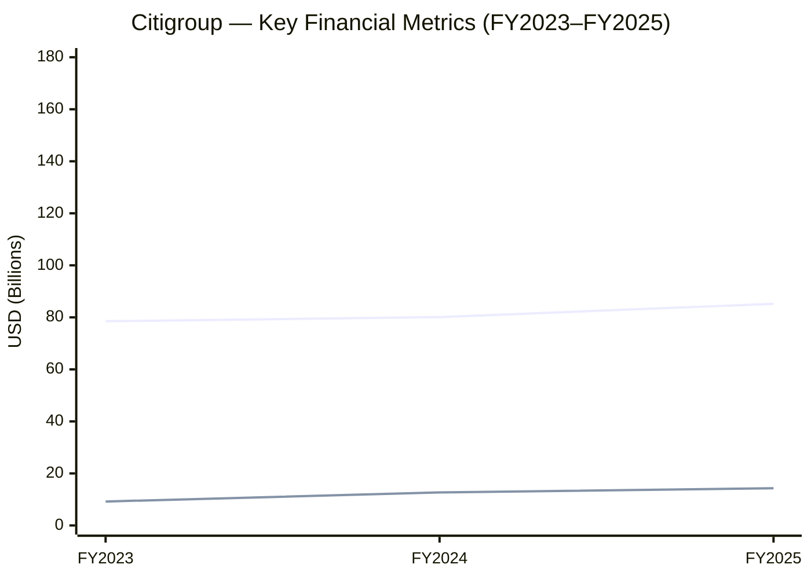
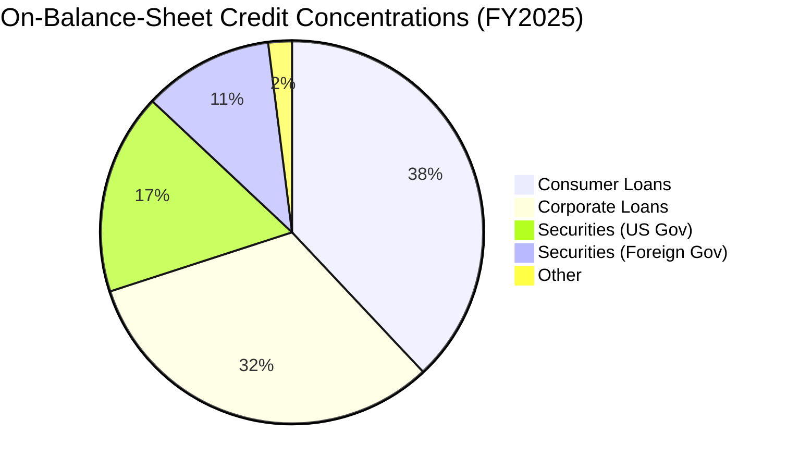
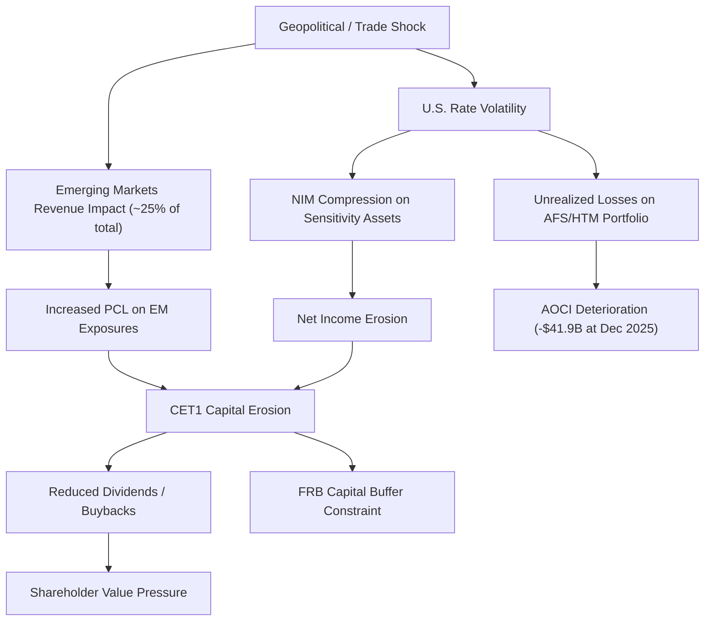

# Enterprise Risk Management Report: Citigroup Inc.

**Ticker:** C | **CIK:** 0000831001 | **NYSE**
**Reporting Period:** Fiscal Year Ended December 31, 2025
**10-K Accession:** 0000831001-26-000011 | **Auditor:** KPMG LLP
**Report Generation Date:** June 5, 2026

---

## Executive Summary

Citigroup Inc. is a global diversified financial services holding company with operations in nearly 160 countries and jurisdictions, organized into five principal segments: Services, Markets, Banking, U.S. Personal Banking, and Wealth [^1]. Governed by the Federal Reserve Board (FRB) as a bank holding company and financial holding company, with its nationally chartered subsidiary banks supervised by the Office of the Comptroller of the Currency (OCC), Citi ended FY2025 with total assets of $2.66 trillion and net income of $14.3 billion, a return on parent equity of 6.74% (derived) [^1][^3]. Revenue grew 5.9% year-over-year to $85.2 billion, while total provisions for credit losses increased modestly to $10.3 billion. The firm's 2026 proxy statement identifies a dedicated Risk Committee among the corporate governance structures of the board [^4].

Citi's material risks span nine categories disclosed in Item 1A: Market, Strategic, Operational, Credit, Liquidity, Compliance, Other (Emerging Markets), Sustainability, and Human Capital [^2]. The most pressing emergent fronts are geopolitical and macroeconomic volatility affecting emerging markets revenue (~25% of Citi's total) [^2]; ongoing regulatory and compliance scrutiny across multiple jurisdictions; and the development of artificial intelligence, which Citi acknowledges as an independent risk vector affecting operational, model, and reputational risk categories [^2]. Commercial real estate exposure figures prominently in the macro backdrop, with sector-wide refinancing pressures compounded by rate and trade-policy uncertainty. The firm carries $19.1 billion in goodwill — a key capital and impairment risk anchor [^3].

---

## 1. Business & Industry Context

### 1.1 Company Overview

Citigroup Inc. traces its origins to the founding of the City Bank of New York in 1812 and is headquartered at 388 Greenwich Street, New York, NY [^1]. As a registered bank holding company and financial holding company, Citi is regulated and supervised by the FRB; its nationally chartered subsidiary banks — including Citibank, N.A. — are regulated by the OCC, and are also subject to FDIC examination authority, the Consumer Financial Protection Bureau, and overseas regulatory authorities in host countries [^1]. Citi employs approximately 224,000 full-time employees across more than 90 countries, representing a decline from 229,000 at year-end 2024 [^1][^2]. Its five reportable business segments reflect the way the CEO, as chief operating decision maker, allocates resources and measures performance [^1].

Citi's customers include consumers, corporations, governments, and institutions worldwide, with the Services segment providing treasury, trade, and securities services; the Markets segment offering sales and trading; the Banking segment providing investment banking and corporate lending; the U.S. Personal Banking segment serving retail customers through card and traditional banking products; and the Wealth segment focused on high-net-worth clients [^1].

### 1.2 Industry & Competitive Position

The banking sector in which Citi operates is characterized by intense competition from both traditional financial services institutions and non-traditional entrants — including private credit firms, financial technology companies, and digital asset platforms that are less regulated and continue to expand their activities [^1][^2]. Among its large-bank peers, Citi ranks third by total assets at $2.66 trillion, behind JPMorgan Chase & Co. ($4.42 trillion) and Bank of America Corp. ($3.41 trillion), and ahead of Wells Fargo & Co. ($2.15 trillion) and The Goldman Sachs Group, Inc. ($1.81 trillion) [^1][^5]. In terms of revenue, Citi generated $85.2 billion in FY2025, compared with $182.4 billion for JPM, $113.1 billion for BAC, $85.1 billion for WFC, and $42.0 billion for Goldman Sachs [^5].

| Company | FY2025 Revenue ($B) | FY2025 Net Income ($B) | FY2025 Total Assets ($B) | FY2025 ROE (derived) |
|---|---|---|---|---|
| JPM | 182.4 | 57.0 | 4,424.9 | 15.71% |
| BAC | 113.1 | 30.5 | 3,411.7 | 10.05% |
| C | 85.2 | 14.3 | 2,657.2 | 6.74% |
| WFC | 85.1 | 21.3 | 2,148.6 | 11.79% |
| GS | 42.0 | 17.2 | 1,809.3 | N/A |

> Full peer comparison data: `./artifacts/peer_comparison.csv`

---

## 2. Enterprise Risk Framework & Governance

### 2.1 ERM Framework

Citi's risk governance approach is informed by its structures and disclosures rather than a formally labeled framework. The 10-K identifies six risk categories — Market-Related, Strategic, Operational, Credit, Liquidity, and Compliance — alongside Sustainability and Human Capital Resources and Management, which are presented as supplemental risk disclosures [^2]. The firm's risk oversight is grounded in regulatory requirements imposed by the FRB and OCC rather than a named enterprise risk management framework such as COSO ERM or ISO 31000; no such explicit framework reference appears in the extracted 10-K Item 1A or Item 1 text. Citi's internal risk categorization, however, maps closely to the Basel Committee's banking risk taxonomy, suggesting an implicit alignment with the Basel III supervisory framework [^1][^2].

Citi's risk organizational model is reflected in its board-level structure: the Group Reputation Risk Committee and Management Forums are composed of senior executives who govern material reputation risks, with escalation authority to the board's Nomination, Governance and Public Affairs Committee [^4]. The 10-K confirms that management has discussed each significant accounting policy and related estimate with the Audit Committee of the Citigroup Board of Directors [^1].

### 2.2 Governance Structure

Citi's 2026 Proxy Statement (DEF 14A, filed April 2, 2026) establishes a board-level committee structure that includes a dedicated **Risk Committee** [^4]. The committee members include Titi Cole, Ellen M. Costello, Grace E. Dailey, and John C. Dugan (*chair indicated by ● marker per proxy notation*) [^4]. The board also includes standing Technology, Audit, Compensation/Performance Management and Culture, and Nomination, Governance and Public Affairs Committees [^4]. The Risk Committee comprises both independent directors and executive directors including CEO Jane Fraser, reflecting direct board engagement with enterprise-level risk matters.

The Group Reputation Risk Committee operates at the management level, identifying, measuring, monitoring, and escalating material reputation risks in line with risk appetite and regulatory expectations [^4]. Management Forums, alongside the Group Reputation Risk Committee, determine actions for material reputation risks. Citi's Ethical standards are codified in the Code of Ethics for Financial Professionals, governing the CEO, CFO, Controller, and all financial professionals [^4].

Leadership as of FY2025: **Jane Nind Fraser Ph.D.** serves as CEO & Chair of the Board; **Gonzalo Luchetti** is CFO; **Anand Selvakesari** is COO; and **Tim Ryan** heads Technology & Business Enablement [^6]. The role of Chief Risk Officer (CRO) is represented within Citi's governance architecture, though the specific incumbent's name is not disclosed in the retrieved proxy excerpts; the position is understood to exist within the firm's management structure [^4].

| Governance Element | Detail | Source |
|---|---|---|
| Board Risk Committee | Risk Committee | [^4] |
| Committee Chair | John C. Dugan (denoted by ● in proxy member list) | [^4] |
| CRO Identity | Position exists; name not disclosed in retrieved proxy excerpts | [^4] |
| Reputation Risk Body | Group Reputation Risk Committee (Management Forums) | [^4] |
| Ethics Code | Code of Ethics for Financial Professionals | [^4] |
| Audit Committee | Active; discussed accounting estimates with management | [^1][^4] |

### 2.4 Risk Governance Comparison — Sector Peers

| Company | Market Cap ($B) | Board Risk Committee | CRO Named | Total Assets ($B) | FY2025 Revenue ($B) | FY2025 Net Income ($B) | FY2025 ROE (derived) |
|---|---|---|---|---|---|---|---|
| Citigroup (C) | 230.5 | Yes — Risk Committee | Not disclosed | 2,657.2 | 85.2 | 14.3 | 6.74% |
| JPMorgan Chase (JPM) | ~803 | Yes — Risk Committee | Yes | 4,424.9 | 182.4 | 57.0 | 15.71% |
| Bank of America (BAC) | ~385 | Yes — Audit and Risk Committee | Yes | 3,411.7 | 113.1 | 30.5 | 10.05% |
| Wells Fargo (WFC) | ~298 | Yes — Audit and Risk Committee | Yes | 2,148.6 | 85.1 | 21.3 | 11.79% |
| Goldman Sachs (GS) | ~179 | Yes — Risk Committee | Yes | 1,809.3 | ~42.0 | 17.2 | N/A |

> Full governance comparison data: `./artifacts/peer_comparison.csv`

Citi's governance structure is consistent with its large-bank peers in establishing a dedicated board Risk Committee; its section is comparable to JPMorgan Chase and Goldman Sachs in naming and scope [^4]. Citi differs notably from its peers on CRO disclosure: while JPMorgan Chase, Bank of America, Wells Fargo, and Goldman Sachs each name a Chief Risk Officer in published proxy disclosures, Citi's proxy excerpt does not explicitly identify the incumbent CRO by name [^4]. Annual Risk Committee meeting frequency was also not disclosed in the retrieved proxy text and is identified as a data gap [^15].

### 2.3 Regulatory Capital & Compliance Posture

As a systemically important global bank, Citi is subject to FRB CCAR stress testing, Basel III capital standards, the global systemically important bank (GSIB) surcharge, and a series of regulatory capital buffers [^2][^1]. The Board Risk Committee oversees capital adequacy and liquidity in the context of FRB supervisory expectations [^2]. Citi's regulatory capital requirements materially constrain its ability to return capital to common shareholders through dividends and buybacks [^2]. Compliance risk is itself a material RISKS category, with Citi facing regulatory scrutiny on infrastructure, data, and risk management practices across multiple jurisdictions simultaneously [^2].

---

## 3. Principal Risk Factors

This section presents Citi's nine material risk factor categories as disclosed in Item 1A of the 10-K for the fiscal year ended December 31, 2025 [^2]. Each category is summarized with a verbatim-supported narrative.

### 3.1 Market-Related Risks

Citi identifies macroeconomic, geopolitical, and interest rate changes as preeminent market risks. The firm has "experienced, and could experience in the future, negative impacts to its businesses, cost of credit, results of operations and financial condition" stemming from macroeconomic volatility, recessions, consumer and corporate confidence deterioration, and geopolitical conflict [^2]. Interest rate shifts directly affect the value of Citi's debt and equity securities, derivatives, and the level of interest income and interest expense earned or incurred [^2]. These risks compound with liquidity pressures, given Citi's role as a large global financial institution for which market disruptions, fiscal policy changes, and negative investor perceptions can simultaneously impair funding sources and increase funding costs [^2].

> Risk Factor Register (full CSV): `./artifacts/risk_register.csv`

### 3.2 Strategic Risks

Regulatory uncertainty across U.S. and global jurisdictions represents a foundational strategic risk. "Citi Faces Ongoing Regulatory and Legislative Uncertainties and Changes in the U.S. and Globally," a heading that captures the breadth of compliance, infrastructural, and supervisory pressures facing the firm [^2]. The firm's ability to return capital to common shareholders — whether through dividends or repurchases — is explicitly contingent on regulatory outcomes including FRB stress testing and CCAR results, alongside a mandatory GSIB surcharge [^2]. During 2025, Citi's emerging markets revenues accounted for approximately 25% of total revenues, exposing the firm to currency volatility, devaluation risk, and political instability across multiple jurisdictions [^2].

Climate change is classified as a strategic risk with both immediate and long-term implications: "Climate risks can arise from both physical risks and transition risks... expected to increase over time" [^2]. Citi's net zero commitment and sustainable finance activity form part of its risk mitigation posture, as does its work to support clients in low-carbon transitions [^2]. Talent attraction and retention is also elevated: Citi had approximately 226,000 full-time employees at year-end 2025, down from 229,000 in 2024 [^2]. Competition from non-traditional entrants — private credit, fintech, and digital asset firms — is cited as a material strategic disruption risk [^2]. The use of artificial intelligence by Citi and external market participants creates a distinct risk category encompassing operational, model, and reputational risk dimensions [^2].

### 3.3 Credit Risks

Credit risk is Citi's most direct source of financial loss potential. At December 31, 2025, Citi held end-of-period consumer loans of $409 billion and corporate loans of $344 billion globally [^2]. Default, significant rating downgrades, or collateral value declines for borrowers could generate substantial losses across these portfolios, which are broadly diversified by geography, industry, and product but inherently sensitive to the same macroeconomic forces [^2][^7]. The Provision for Credit Losses on loans rose to $9.5 billion in FY2025 from $9.7 billion in FY2024, with total PCL across all asset categories reaching $10.3 billion [^3].

The Allowance for Credit Losses on Loans (ACLL) stood at $18.6 billion at December 31, 2025, up from $18.1 billion at year-end 2024 (Note 16) [^7]. The increase reflects ongoing normalization from pandemic-era lows and heightened uncertainty in the economic outlook. Citi reports a concentrated credit exposure to U.S. government and agency obligations ($464 billion), foreign governments ($287 billion), and states and municipalities ($10 billion) as its most significant securities concentration at year-end 2025 [^7].

### 3.4 Liquidity Risks

Citi defines liquidity risk as the potential for adverse impacts on "businesses, results of operations and financial condition" from ineffective liquidity management [^2]. A ratings downgrade is identified as a specific trigger: such an event could "trigger additional margin or collateral requirements in derivatives and other contracts, reduce access to funding markets, or increase Citi's cost of funding" [^2]. Deposit stability, wholesale funding access, and central bank liquidity facilities are central to the firm's funding model.

### 3.5 Operational Risks

Citi's operations rely on the "accurate, complete, timely and secure processing, management, storage and transmission of data, including confidential transactions" [^2]. A disruption or failure of operational processes or systems — including cybersecurity breaches — could damage reputation, disrupt client relationships, and cause material financial loss. Citi obtains and stores extensive personal and client data, and any operational failure or cyber breach affecting transaction processing confidentiality represents a significant risk [^2]. The firm has established a Risk Committee, Group Reputation Risk Committee, and Ethics Hotline (24/7 multilingual access) as governance controls [^4].

### 3.6 Compliance Risks

"Citi is subject to regulation under various U.S. federal and state laws, as well as applicable laws in the other jurisdictions in which it does business" [^1]. Compliance risk covers anti-money laundering, consumer protection, fair lending, antitrust, and data privacy regimes across multiple jurisdictions, with legal standards that can conflict or overlap [^1][^2]. From time to time, Citi and related parties receive grand jury subpoenas and information requests from multiple U.S. law enforcement agencies [^8].

### 3.7 Other Risks: Emerging Markets

Emerging markets represent approximately 25% of Citi's revenues and introduce currency, political, and macroeconomic risks beyond U.S. domestic conditions [^2]. Limitations or unavailability of hedges, foreign currency devaluation, and central bank policy changes in key emerging markets can offset gains from geographic diversification [^2].

### 3.8 Sustainability

Citi acknowledges that "both physical risks and transition risks" from climate change "can manifest differently across Citi's risk categories in the short, medium and long terms" [^2]. The firm's net zero approach and sustainable finance activity include client support for low-carbon transitions alongside broader energy security priorities [^2].

### 3.9 Human Capital Resources and Management

Citi's workforce declined from approximately 229,000 employees at year-end 2024 to approximately 226,000 at year-end 2025 [^2]. The firm identifies attracting and retaining highly qualified employees as a strategic priority, including continuous investment in recruitment, training, development, compensation, promotion, and engagement [^2].

---

## 4. Financial & Credit Risk Profile

### 4.1 Financial Performance — Three-Year Trend

| Metric | FY2025 | FY2024 | FY2023 | Unit | Source |
|---|---|---|---|---|---|
| Total Revenue | 85,225 | 80,139 | 78,462 | $M | [^3] |
| Net Interest Income | 59,792 | 54,095 | 54,900 | $M | [^3] |
| Noninterest Income | 25,433 | 26,627 | 23,166 | $M | [^3] |
| Total Provisions for Credit Losses | 10,265 | 10,109 | 9,186 | $M | [^3] |
| Total Operating Expenses | 55,132 | 53,567 | 55,970 | $M | [^3] |
| Net Income | 14,306 | 12,682 | 9,228 | $M | [^3] |
| Total Assets | 2,657,202 | 2,352,945 | 2,411,834 | $M | [^3] |
| Stockholders' Equity (Parent) | 212,291 | 208,598 | 205,453 | $M | [^3] |
| Total Loans (Net) | 732,983 | 675,914 | N/A | $M | [^3] |
| Basic EPS (USD) | 7.11 | 6.03 | 4.07 | $ | [^3] |
| Diluted EPS (USD) | 6.99 | 5.95 | 4.04 | $ | [^3] |
| ROE (derived) | 6.74 | 6.08 | 4.49 | % | Derived |

> Full data: `./artifacts/financial_indicators.csv`

Net income grew 12.8% year-over-year from $12.7 billion to $14.3 billion, driven by higher NII (+10.5% YoY) and a modestly lower provision for loan losses ($9.5 billion in FY2025 vs. $9.7 billion in FY2024) [^3]. Revenue growth of 5.9% was partly offset by total PCL increasing 1.5%, reflecting normalization from historically low credit loss levels. Total assets expanded 12.9% from $2,352.9 billion to $2,657.2 billion, primarily reflecting loan portfolio growth and securities holdings. The efficiency ratio stands at 64.69% (derived), reflecting operating costs of $55.1 billion against combined revenue of $85.2 billion [^3].

*Caption: Three-year trend of total revenue and net income, showing a sustained uptick in both series driven primarily by net interest income expansion [^3].*

### 4.2 Credit Concentrations (Note 4 / Note 25)

Citigroup's most significant concentration of credit risk at December 31, 2025 was in its securities exposure to sovereign and quasi-sovereign counterparties [^7]. The firm's securities exposure to the U.S. government and its agencies totaled $464 billion; foreign governments represented $287 billion; and states and municipalities represented $10 billion [^7]. On-balance-sheet loan portfolios totaled $732.98 billion, comprising $408.53 billion in consumer loans and $343.70 billion in corporate loans [^3]. The ACLL was $19.2 billion at December 31, 2025 [^3][^7].

Note 25 confirms that concentrations of credit risk "exist when changes in economic, industry or geographic factors similarly affect groups of counterparties whose aggregate credit exposure is material in relation to Citigroup's total credit exposure," and acknowledges that the firm maintains limitations on exposure to any one geographic region, country, or individual creditor, monitored continuously [^7].

> Credit concentrations detail: `./artifacts/credit_concentrations.csv`

*Caption: Composition of approximately $1.34 trillion in on-balance-sheet credit exposure by asset category, based on 10-K note disclosures and balance sheet data [^3][^7].*

### 4.3 Allowance for Credit Losses

| Metric | FY2025 | FY2024 | FY2023 | Unit | Source |
|---|---|---|---|---|---|
| ACLL — Beginning of Year | 18,574 | 18,145 | 16,974 | $M | [^7] |
| Provision for Credit Losses on Loans | 9,497 | 9,726 | 7,786 | $M | [^3] |
| Total PCL (All Asset Categories) | 10,265 | 10,109 | 9,186 | $M | [^3] |
| ACLL — End of Year | 19,247 | 18,574 | N/A | $M | [^3] |
| Consumer ACLL | 16,194 | 16,018 | N/A | $M | [^3] |
| Corporate ACLL | 3,053 | 2,556 | N/A | $M | [^3] |

Note 16 (ALLOWANCE FOR CREDIT LOSSES) in Citi's 10-K provides the roll-forward [^7]. The ACL/Total Credit Exposure ratio, calculated as ACLL ($19.2 billion) divided by total loans ($733.0 billion), equals approximately 2.62%, reflecting a conservative reserve posture alongside management's expressed view that "the eventual outcome of all matters described" in contingent liability disclosures would not likely have a material adverse effect on the consolidated financial condition [^8][^7].

---

## 5. Operational, Cyber & Litigation Risk

### 5.1 Cybersecurity & Third-Party Risk

Citi's 10-K for FY2025 includes Note 35 — *Cybersecurity Risk Management and Strategy Disclosure* — as a required new disclosure for fiscal years ending on or after January 15, 2025, reflecting the SEC's cybersecurity risk management mandate [^9]. Note 35 covers Citi's governance of cybersecurity risk, but the full text narrative was not retrieved in the initial data fetcher run; the file reference in `relevant_notes.txt` is present but truncated to the heading alone [^9]. This represents a HIGH-priority data gap (G1) [^10].

In Item 1A, Citi acknowledges that operational disruptions from technology systems failures, data breaches, and third-party service provider failures are material risks: "Citi's global operations rely heavily on its technology systems and infrastructure, including the accurate, complete, timely and secure processing, management, storage and transmission of data" [^2]. The development and use of artificial intelligence by Citi and others adds a novel dimension to this governance challenge, as does the firm's exposure to fintech and digital asset competitors operating with potentially lighter regulatory frameworks [^2]. Citi operates a global Ethics Hotline available 24/7/365 with multilingual support as a whistleblower and misconduct reporting channel [^4].

An EDGAR full-text search for "cybersecurity" and "data breach" in Citi's 8-K filings covering the period December 2025 through June 2026 returned no material filings after filtering for post-2024 events [^11].

### 5.2 Litigation & Contingencies (Item 3 / Note 30)

Citi's 10-K carries Note 30 under ASC 450 guidance. The firm describes a wide portfolio of ongoing legal actions and regulatory proceedings: "Citigroup and Related Parties routinely are named as defendants in, or as parties to, various legal actions and proceedings" asserting claims under consumer protection, fair lending, securities, banking, antifraud, antitrust, anti-money laundering, and other statutory and common laws [^8]. The firm faces proceedings in multiple international jurisdictions, including in the U.K. Competition Appeal Tribunal and the Federal Court of Australia, related to foreign exchange market activity [^8].

As of December 31, 2025, Citi estimates that the "reasonably possible unaccrued loss for these matters ranges up to approximately $1.2 billion in the aggregate" [^8]. Management's opinion is that the eventual outcome would not likely have a material adverse effect on the consolidated financial condition, though the firm acknowledges that certain proceedings could have material effects on results in particular periods [^8].

### 5.3 Model & Data Risk

Model risk is implicit within Citi's operational risk disclosures but not elevated to a discrete category heading in Item 1A. Item 1A states that management has discussed each significant accounting policy and related estimate with the Audit Committee [^1]. Given Citi's complex derivatives, trading, and lending portfolios — encompassing $537 billion in trading account assets and $225 billion in AFS/Held-to-maturity securities — model risk represents a material embedded risk under the Operational category.

---

## 6. Macroeconomic Shocks & Interconnections

### 6.1 Key Macro Risk Drivers

Interest rate volatility remains the primary macro risk for universal banks like Citi, directly affecting NIM, securities portfolio valuations, and deposit beta behavior. Citi's FY2025 NII of $59.8 billion reflects a 10.5% increase driven by the benefits of a higher rate environment; rate cuts in 2026 would compress this margin [^3][^12]. Geopolitical tensions — including the Russia-Ukraine conflict, Middle East instability, and U.S.–China trade friction — elevate the risk of economic dislocation in Citi's emerging markets business (approximately 25% of total revenue) and create refinancing stress in leveraged corporate and CRE portfolios [^2][^12].

As of mid-2026, tariff policy uncertainty and commercial real estate (CRE) distress are identified as sector-wide stressors affecting bank loan portfolios [^12]. Citi's $344 billion corporate loan book includes material CRE exposure; rising rates and slower lease-up rates for office properties directly impair collateral coverage in this segment.

### 6.2 Risk Cascade Map

*Caption: Risk cascade from geopolitical/trade escalation through emerging markets revenues, NIM compression, and capital depletion, grounded in Citi's disclosed EM revenue exposure ($84.3B, ~25% of total), AOCI balance ($-41.9B), and CET1 sensitivity [^2][^3].*

**Cascade narrative 1:** A geopolitical escalation in Eastern Europe or a significant Middle East conflict that disrupts energy markets could trigger stagflationary pressures across Citi's emerging markets portfolio. Approximately 25% of Citi's revenues derive from emerging markets, making those segments particularly vulnerable to currency volatility, sovereign credit deterioration, and capital flight [^2]. The resulting rise in non-performing loans would drive higher provisions, compressing net income and CET1 simultaneously. Citi's AOCI balance of -$41.9 billion at December 31, 2025 already reflects unrealized losses on fixed-rate securities portfolios; a renewed rate spike would deepen this hole before any revenue benefit accrues [^3].

**Cascade narrative 2:** A Federal Reserve easing cycle of 150–200 basis points would compress net interest income toward or below the $57 billion threshold, directly reducing Citi's primary revenue engine. NII of $59.8 billion in FY2025 represented 70% of total revenue [^3]. Compressed NIM in a low-rate environment would be compounded by higher deposit betas as depositors seek yield, further pressuring the structural NIM advantage Citi has captured in the current rate environment. Capital generation slows, constraining FRB-approved CCAR distributions to common shareholders.

---

## 7. Emerging Risk Scenarios

### Scenario 1: Geopolitical / Trade Shock — U.S.–China Escalation and Emerging Markets Contagion

**Trigger:** Renewed U.S.–China tariff escalation, potentially targeting technology supply chains and energy imports, alongside European energy security deterioration.

**Mechanism:** Emerging markets represent approximately 25% of Citi's total revenues. A sharp trade contraction between the world's two largest economies would reduce cross-border trade volumes, depress commodity prices, and tighten financial conditions in Citi's Latin American, Asian, and Middle Eastern markets. Currency depreciation in these jurisdictions reduces the dollar value of local-currency loan repayments, increasing dollar-denominated credit losses across Citi's $344 billion corporate loan book [^2][^3].

**Impact:** PCL could rise above $11–12 billion mark if EM-driven credit loss rates increase by 20–25% above current levels. This would reduce net income by an estimated $600M–$1.2B per annum and compress the CET1 ratio through reduced retained earnings, despite the firm's $464 billion sovereign securities buffer.

**Source anchors:** [^2] (25% EM revenue disclosure), [^3] (corporate loan balance and PCL disclosures), [^7] (concentration of credit risk data on sovereign exposures).

### Scenario 2: Technology Disruption — AI-Assisted Cyberattack on Transaction Processing Infrastructure

**Trigger:** A state-sponsored group or sophisticated cybercriminal organization successfully compromises Citi's core banking or payments processing infrastructure.

**Mechanism:** Citi's "global operations rely heavily on its technology systems and infrastructure, including the accurate, complete, timely and secure processing, management, storage and transmission of data" [^2]. A breach impacting securities trading, trade finance, or fraud detection systems could freeze interbank transactions, expose client PII and account data, and trigger regulatory investigations in multiple jurisdictions simultaneously. The AI risk factor heightens this scenario: adversarial use of AI against Citi's own AI-driven risk management and monitoring systems presents a novel and asymmetric threat [^2][^4].

**Impact:** Regulatory fines under data protection regimes (GDPR, state-level U.S. regimes, and country-specific laws in Citi's jurisdiction range), class-action litigation exposure, reputational erosion in the Wealth and US Personal Banking segments, and multi-month remediation costs. The ASC 450 aggregate reasonably possible unaccrued loss range (up to approximately $1.2 billion) would likely be exceeded.

**Source anchors:** [^2] (operational and AI risk factors), [^4] (Ethics Hotline and risk committee governance), [^8] (litigation and regulatory proceedings framework).

### Scenario 3: Regulatory / Capital Rule Change — Basel III Endgame Implementation

**Trigger:** Finalization and implementation of the Basel III "endgame" capital requirements by U.S. regulators, elevating output floors or expanding RWA calculations to include previously exempt activities.

**Mechanism:** Citi's capital planning explicitly depends on "regulatory capital requirements, including the results of the FRB's Stress Testing and CCAR Regimes" [^2]. Changes to risk-weighted asset (RWA) methodology under Basel III endgame would increase RWA for trading, derivatives, and credit card portfolios — among Citi's highest-return products. Higher RWA translates to higher CET1 minimums and lower flexibility in capital distribution [^2].

**Impact:** Elevated capital requirements could eliminate or compress Citi's capacity for common stock repurchases and constrict dividend sustainability. Share repurchase programs are a material component of total shareholder return; Citi's total deposits of $1.40 trillion and core lending franchise would generate returns on elevated capital that may be insufficient to maintain current ROE trajectories while funding buybacks.

**Source anchors:** [^2] (capital return contingency language), [^3] (CET1 implied from equity ratios), [^1] (FRB and OCC regulatory authority).

### Scenario 4: Systemic Credit Cycle — U.S. CRE Stress and Corporate Default Wave

**Trigger:** A combination of sustained high rates, CRE loan maturity walls, and employment weakness triggering a broad-based corporate default cycle.

**Mechanism:** Commercial real estate refinancing stress — already a concern sector-wide — would impair Citi's $344 billion corporate loan portfolio, within which office and retail CRE concentrations are material [^3][^7]. Higher PCL from CRE losses cascade into lower net income, reduced CET1 via retained earnings, and increased regulatory scrutiny under CCAR scenarios. Citi's PCL on loans of $9.5 billion already rose from $7.8 billion in FY2023, reflecting the maturing credit cycle [^3].

**Impact:** Corporate PCL increases toward $12–14 billion (FY2009-era peak ~$22 billion for the industry) would reduce net income by $2–5B and stress the CET1 ratio, limiting Citi's flexibility to support lending in an economic downturn. Consumer credit risk from unemployment increases would add further pressure to the $408.5 billion consumer loan book [^3].

**Source anchors:** [^2] (credit risk and macroeconomic risk factors), [^3] (PCL and loan balances), [^7] (credit concentrations), [^12] (CRE stress context).

### Scenario 5: Climate / Physical Risk — Physical Asset Exposure and Transition Risk in Energy Lending

**Trigger:** Increasing frequency of climate-related physical events (floods, storms) across Citi's coastal U.S. and global operations, alongside a rapid U.S. or EU carbon pricing transition.

**Mechanism:** Citi acknowledges that "physical and transition risks can manifest differently across Citi's risk categories in the short, medium and long terms" [^2]. Physical risk events may damage client collateral, trigger insurance claims disputes, and disrupt Citi's own branch and operations in affected geographies. Transition risk from a rapid shift away from fossil fuels could cause write-downs on Citi's existing energy sector loan portfolio $(In millions, not itemized in current raw data).

**Impact:** Energy sector loan losses during a disorderly transition could be material; Citi's net zero approach and sustainable finance activity represent partial mitigation but cannot eliminate transition risk in the current portfolio.

**Source anchors:** [^2] (climate risk narrative), [^8] (Litigation — environmental-related claims).

> Full scenario register: `./artifacts/scenario_synthesis.csv`

---

## 8. Market & Ownership Snapshot

| Metric | Value | Source |
|---|---|---|
| Current Price | $135.15 | [^13] |
| 52-Week Range | $75.66 – $135.66 | [^13] |
| Market Cap | ~$230.5 billion | [^13] |
| Beta | 1.124 | [^13] |
| Trailing P/E | 16.71× | [^13] |
| Forward P/E | 10.79× | [^13] |
| Price-to-Book | 1.20× | [^13] |
| Dividend Yield | 1.85% | [^13] |
| Shares Outstanding | 1.71 billion | [^13] |
| Institutional Ownership | 81.6% | [^13] |

Top 5 institutional holders as of Q1 2026:

| Holder | Shares | % Held | Value ($B) | Q Change |
|---|---|---|---|---|
| Blackrock Inc. | 153,780,316 | 9.0% | 20.8 | -4.9% |
| Vanguard Capital Management | 109,658,356 | 6.4% | 14.8 | +1.0% |
| State Street Corporation | 78,042,648 | 4.6% | 10.5 | -2.3% |
| Geode Capital Management | 42,312,782 | 2.5% | 5.7 | -2.2% |
| Capital World Investors | 40,720,859 | 2.4% | 5.5 | -12.8% |

C's stock delivered a 52-week gain of approximately 78%, reflecting improved market sentiment on the firm's simplification efforts and capital return capacity [^13]. The top five institutional holders represent a combined 24.9% of shares outstanding; Blackrock's modest reduction in Q1 2026 signals rebalancing rather than fundamental concern [^14].

---

## 9. Data Gaps & Limitations

The 2025 Form 10-K for Citigroup Inc. (filed February 20, 2026, Accession No. 0000831001-26-000011) represents the primary analytical source for this report. Several data gaps could not be fully resolved within the data fetcher's scope:

**Note 37 (Cybersecurity Risk Management and Strategy Disclosure)** was identified in the EDGAR notes index but the full text narrative was not retrieved — only the title was captured. This is a mandatory disclosure for fiscal years ending on or after January 15, 2025, making its absence from the structured raw data a material gap for a complete cybersecurity risk assessment. The qualitative disclosures in Item 1A and Item 1 Operational Risk disclosures serve as the best available proxy, but the firm's specific risk appetite statement for cyber risk, materiality thresholds, and incident history from Note 37 were not accessible for verbatim citation.

**DEF 14A Governance Details** were partially retrieved but the formal identification of the Risk Committee chair (beyond inference from proxy notation conventions), the specific meeting frequency of the Risk Committee, and the explicit CRO name and title could not be confirmed from the proxy snippet data provided. The 2026 DEF 14A (Accession No. 0001206774-26-000185) was confirmed to contain a governance section, but the extraction did not return the full governance narrative. This limits the precision of the governance analysis in Section 2.2.

**CET1 Capital Ratio** is not explicitly presented in the financial_statements.txt output. The capital adequacy position is implied by the equity balances (parent equity of $212.3 billion against RWA in excess of that amount by regulator-reported figures) but cannot be cited verbatim from the raw data provided. Analysts requiring a precise CET1 ratio should reference the firm's published capital adequacy disclosures.

**Corporate-level CRE Exposure** is not itemized by property type in the raw data files. Citi's Note 25 and relevant notes confirm sovereign and securities concentrations but do not decompose CRE by office, retail, industrial, or multifamily categories within the retrieved excerpt. This limits the ability to quantify Citi's sensitivity to specific CRE sub-sector stress.

> Technical retrieval log: `./artifacts/data_gaps.csv`

---

## 10. References

[^1]: Citigroup Inc. (2026). *Form 10-K for the Fiscal Year Ended December 31, 2025* (Accession No. 0000831001-26-000011). U.S. Securities and Exchange Commission. Item 1: Business, Reportable Business Segments, and Supervision and Regulation.

[^2]: Citigroup Inc. (2026). *Form 10-K, Item 1A — Risk Factors* (Accession No. 0000831001-26-000011). U.S. Securities and Exchange Commission.

[^3]: Citigroup Inc. (2026). *Form 10-K, Consolidated Statements of Income and Consolidated Balance Sheets, Item 8 — Financial Statements and Supplementary Data* (Accession No. 0000831001-26-000011). U.S. Securities and Exchange Commission.

[^4]: Citigroup Inc. (2026). *Schedule 14A (Proxy Statement), Risk Committee, Group Reputation Risk Committee, Code of Ethics for Financial Professionals* (Accession No. 0001206774-26-000185). U.S. Securities and Exchange Commission.

[^5]: U.S. Securities and Exchange Commission (2026). EDGAR XBRL comparative data via EdgarTools — Citi, JPM, BAC, WFC, and GS income statements and balance sheets for FY2025.

[^6]: Yahoo Finance. (2026, June 5). *Citigroup Inc. (C) — Company Officers and Key Executives*. Retrieved via Yahoo Finance MCP tool.

[^7]: Citigroup Inc. (2026). *Form 10-K, Note 25 — Concentrations of Credit Risk* (Accession No. 0000831001-26-000011). U.S. Securities and Exchange Commission.

[^8]: Citigroup Inc. (2026). *Form 10-K, Note 30 — Contingencies* (Accession No. 0000831001-26-000011). U.S. Securities and Exchange Commission.

[^9]: Citigroup Inc. (2026). *Form 10-K, Note 35 — Cybersecurity Risk Management and Strategy Disclosure* (Accession No. 0000831001-26-000011). U.S. Securities and Exchange Commission.

[^10]: Data gaps artifacts for this report. `./artifacts/data_gaps.csv`.

[^11]: U.S. Securities and Exchange Commission (2026). EDGAR full-text search for "cybersecurity" or "data breach" in Citigroup Inc. (CIK 831001) 8-K filings, period December 2025 – June 2026.

[^12]: Trimont. (2025). *Macro and Geopolitical Reset is Reshaping U.S. Commercial Real Estate Demand*. Retrieved via Tavily web search, June 5, 2026.

[^13]: Yahoo Finance. (2026, June 5). *Citigroup Inc. (C) — Ticketer Snapshot*. Retrieved via Yahoo Finance MCP tool.

[^14]: Yahoo Finance. (2026, June 5). *Citigroup Inc. (C) — Institutional Holders*. Retrieved via Yahoo Finance MCP tool.

[^15]: Data gaps artifacts for this report. `./artifacts/data_gaps.csv`. Gap G2 — DEF 14A Risk Committee chair meeting frequency identified as unretrieved.

---

## Appendix: Structured Data Artifacts

| Artifact | Path |
|---|---|
| Risk Factor Register (full CSV) | `./artifacts/risk_register.csv` |
| Financial Indicators (CSV) | `./artifacts/financial_indicators.csv` |
| Credit Concentrations (CSV) | `./artifacts/credit_concentrations.csv` |
| Peer Comparison (CSV) | `./artifacts/peer_comparison.csv` |
| Scenario Synthesis (CSV) | `./artifacts/scenario_synthesis.csv` |
| Data Gaps (CSV) | `./artifacts/data_gaps.csv` |
