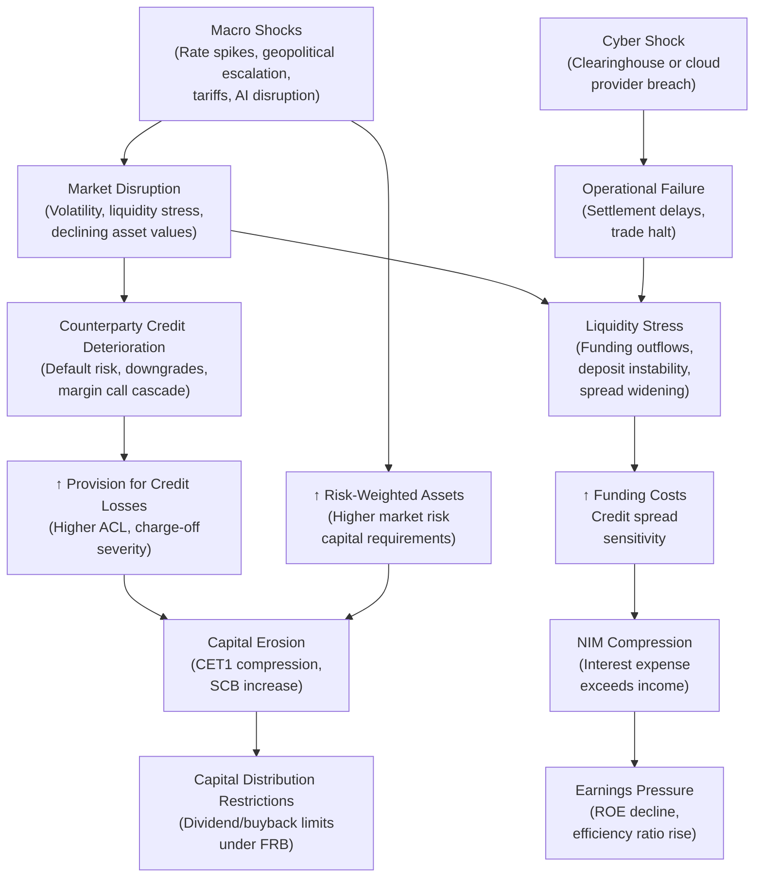

# Enterprise Risk Management Report: The Goldman Sachs Group, Inc.

**Ticker:** GS | **CIK:** 0000886982 | **NYSE**
**Reporting Period:** Fiscal Year Ended December 31, 2025
**10-K Accession:** 0000886982-26-000091 | **Auditor:** PricewaterhouseCoopers LLP
**Report Generation Date:** June 5, 2026

---

## Executive Summary

The Goldman Sachs Group, Inc. is a leading global financial institution and a U.S. bank holding company (BHC) and financial holding company (FHC) regulated by the Federal Reserve System. As a Category I G-SIB with $1.81 trillion in total assets, $58.3 billion in net revenues, and $17.2 billion in net earnings for fiscal year 2025, Goldman Sachs operates through three business segments: Global Banking & Markets, Asset & Wealth Management, and Platform Solutions [^1]. The firm's 47,400 employees serve a diversified institutional and individual client base across more than 35 countries [^1].

The firm faces material risks across market, credit, liquidity, operational (including AI and cyber), legal and regulatory, and climate-related domains as detailed in its 2025 Form 10-K [^2]. Net income grew 20.2% year-over-year to $17.2 billion, driven primarily by a 68.4% surge in net interest income to $13.6 billion and a significant release of provisions for credit losses [^3]. The allowance for credit losses declined from $4.7 billion to $2.1 billion, reflecting both reserve releases and improved portfolio credit quality [^4]. Total lending commitments stood at $497.1 billion as of year-end 2025, with $260.9 billion expiring in 2026 [^4].

Notable forward-looking risks include the ongoing U.S.-China geopolitical tensions, the transition and regulatory uncertainty around AI deployment in financial services, the implementation of Basel III Revisions (including the output floor and FRTB) across key jurisdictions, and the continued concentration of systemic risk in clearinghouses and agent banks [^2]. Climate-related physical and transition risks are explicitly flagged as both business and client credit risks [^2].

> Full risk register: ./artifacts/risk_register.csv
> Financial indicators (3-year): ./artifacts/financial_indicators.csv
> Credit concentrations: ./artifacts/credit_concentrations.csv
> Peer comparison: ./artifacts/peer_comparison.csv
> Scenario synthesis: ./artifacts/scenario_synthesis.csv
> Technical gap trail: ./artifacts/data_gaps.csv

---

## 1. Business & Industry Context

### 1.1 Company Overview

The Goldman Sachs Group, Inc. (Group Inc.), incorporated in Delaware and headquartered at 200 West Street, New York, NY, is a bank holding company and financial holding company regulated by the Board of Governors of the Federal Reserve System (FRB), its primary regulator [^1]. Its principal U.S. depository institution subsidiary, Goldman Sachs Bank USA (GS Bank USA), is a New York State-chartered bank supervised by the FRB, FDIC, NYDFS, and CFPB [^1]. Principal broker-dealer subsidiaries include Goldman Sachs & Co. LLC (registered with the SEC, FINRA, and all 50 states) and J. Aron & Company LLC [^1].

As of December 31, 2025, the firm reported 47,400 employees (metadata records 47,000), with approximately 50% of headcount in the Americas, 20% in EMEA, and 30% in Asia, operating in over 35 countries [^1]. Key strategic locations include Bengaluru, Salt Lake City, Dallas, Singapore, Warsaw, Birmingham, and Hyderabad [^1]. The firm is a designated G-SIB, subject to Category I standards, the most stringent regulatory capital, liquidity, and resolution requirements applicable to U.S. banking organizations [^1].

The three operating segments are:
- **Global Banking & Markets:** Investment banking fees, FICC intermediation and financing, Equities intermediation and financing, and relationship lending
- **Asset & Wealth Management:** Investment management, wealth advisory, private banking and lending, and alternative investments
- **Platform Solutions:** Primarily Apple Card credit card issuance and deposit-taking, with the Apple Card program being transitioned to another issuer over approximately 24 months from December 2025, and the GM credit card program having been sold during 2025 [^1]

The firm's Sustainable Finance Group coordinates its sustainability strategy, with a stated goal to deploy $750 billion in sustainable financing, investing, and advisory activity by 2030—a target the firm reports as having been met [^1].

### 1.2 Industry & Competitive Position

The firm operates in the Capital Markets / Security Brokers, Dealers & Flotation Companies industry (SIC 6211) and describes its competitive environment as intensely competitive across all business lines, with competitors including brokers and dealers, investment banking firms, commercial banks, credit card issuers, insurance companies, investment advisers, mutual funds, hedge funds, private equity funds, private credit funds, merchant banks, and financial technology companies [^1].

Within the Financial Services sector, GS ranks behind JPMorgan Chase ($4.42 trillion assets, $182.4 billion revenue), Bank of America ($3.41 trillion assets, $113.1 billion revenue), and Citigroup ($2.66 trillion assets, $85.2 billion revenue) by total assets [^3]. GS's $1.81 trillion in assets and $58.3 billion in revenue place it as a mid-tier universal bank by asset scale but among the elite global investment banking and markets franchises. Pressure to retain market share by committing capital on terms that may not be commensurate with risk is acknowledged as a structural competitive dynamic, particularly in investment banking assignments [^1].

---

## 2. Enterprise Risk Framework & Governance

### 2.1 ERM Framework

Goldman Sachs does not name a specific ERM framework by brand (COSO, ISO 31000) in the reviewed disclosures. Instead, the firm describes its risk management architecture through multiple, interlocking regulatory frameworks grounded in U.S. banking law and global prudential standards [^1][^2]. Key framework elements explicitly identified in the 10-K include:

- **Basel III:** The firm's capital framework is "largely based on the Basel Committee's framework for strengthening the regulation, supervision and risk management of banks (Basel III)" and implements provisions of the Dodd-Frank Act [^1]. GS Bank USA, GSBE, GSI, and GSIB are each subject to locally implemented but Basel III-consistent frameworks [^1].
- **Capital Framework / Category I Standards:** As a G-SIB, GS is subject to "Category I" standards under the FRB's tailoring framework as an Advanced approach banking organization, requiring both Standardized and Advanced risk-based capital rules, the stress capital buffer (SCB), the G-SIB surcharge, supplementary leverage ratio (SLR), and enhanced prudential standards [^1].
- **CCAR / Stress Testing:** The firm participates in the Federal Reserve's Comprehensive Capital Analysis and Review (CCAR), submitting an annual capital plan, with the SCB currently effective through September 30, 2027 pending new FRB requirements [^1].
- **Liquidity Framework:** The firm is subject to the Liquidity Coverage Ratio (LCR ≥ 100%) and the Net Stable Funding Ratio (NSFR ≥ 100%), as well as FRB enhanced prudential standards requiring 30-day highly liquid asset buffers [^1].
- **Resolution Planning:** The firm maintains recovery and resolution plans subject to biennial FRB/FDIC review, with a 2025 targeted submission and full submission required by July 1, 2027 [^1].
- **Concentration and Correlation Risk Management:** The firm explicitly acknowledges the limitations of its risk management models in periods of market stress, where previously uncorrelated indicators may become correlated, reducing the effectiveness of hedging strategies [^2].

The firm's internal risk governance is described as balancing "the ability to profit from market-making, investing or lending positions, and underwriting activities, with our exposure to potential losses" [^2].

### 2.2 Governance Structure

**Board Risk Committee:** The firm's Risk Committee provides overall risk-taking tolerance and risk governance oversight, including the Enterprise Risk Management Framework and Risk Appetite Statement; liquidity, market, credit, capital, and operational risks (including technology, AI, information security, cybersecurity, third-party, and business resilience); and the Capital Plan and capital ratios [^5].

The Risk Committee is chaired by **David Viniar**, who has served on the Board for over 10 years and previously served as Chair of the Risk Committee and lead independent director [^5]. As of the 2026 proxy statement, the Risk Committee maintains a standing **Technology Risk Subcommittee**, formed in 2024, to assist in its oversight of technology-risk related matters, chaired by Jan Tighe [^5].

**Chief Risk Officer (CRO):** The Chief Risk Officer position exists within the firm's governance structure, but the name of the current CRO is not disclosed in the proxy governance extracts available [^5].

**Regulatory and Compliance Oversight:** The Board's Audit Committee oversees financial reporting, legal and regulatory compliance, and internal audit [^5]. The Compensation Committee considers risk management and control factors in senior management compensation [^5]. The Governance Committee oversees reputation, culture, and sustainability-related strategy [^5]. Board and Committee evaluations are conducted annually, with biennial one-on-one director interviews and continuous feedback mechanisms [^5].

**Governance Framework Gaps:** The Three Lines of Defense model is not explicitly stated in the available governance disclosures. The CRO's name is not disclosed in the proxy extracts reviewed.

### 2.3 Regulatory Capital & Compliance Posture

As a U.S. G-SIB, Goldman Sachs faces the most stringent capital requirements among U.S. banking organizations. Minimum requirements include:

- **CET1 Capital:** Must satisfy minimum risk-based capital requirements and additional capital conservation buffer requirements (2.5% under Advanced Capital Rules + SCB + countercyclical buffer + G-SIB surcharge)
- **G-SIB Surcharge:** Updated annually based on prior-year financial data; an FRB proposal from July 2023 would introduce additional granularity and annual average calculations [^1]
- **SLR:** As a G-SIB, subject to minimum plus buffer (currently 2%, recalibrated effective April 1, 2026 to 50% of Method 1 G-SIB surcharge) [^1]
- **TLAC:** Subject to minimum TLAC requirements and eligible long-term debt requirements [^1]
- **LCR/NSFR:** 100% minimums on both ratios [^1]
- **SCB:** Currently remains effective through September 30, 2027, at its current level, due to FRB announcement in February 2026 [^1]

The firm is also subject to the Volcker Rule, which prohibits proprietary trading but permits underwriting, market making, and risk-mitigation hedging, with a 3% of Tier 1 capital limit on investments in each covered fund and a 3% aggregate limit [^1]. In the E.U., new "core banking services" restrictions require new core banking services to be executed from E.U. subsidiaries (including GSBE) after July 11, 2026, with grandfathering for contracts in place before that date [^1].

---

## 3. Principal Risk Factors

Goldman Sachs identifies risk factors across six principal categories (Market, Liquidity, Credit, Operational, Legal and Regulatory, Competition, and Market Developments and General Business Environment) in its 2025 Form 10-K Item 1A [^2]. The following table presents a summary; the full register with verbatim quotes is available in the artifact file.

> Full register: ./artifacts/risk_register.csv

### 3.1 Market Risk

The firm faces market risk from conditions in global financial markets and broader economic conditions that can change suddenly and negatively. Favorable conditions are characterized by high global GDP growth, liquid and efficient capital markets, low inflation, stable geopolitics, and strong business earnings [^2]. Unfavorable conditions include low growth, recession concerns, inflation or stagflation, sovereign default concerns, fiscal or monetary policy uncertainty, trade restrictions, political instability, extreme weather events, and pandemics [^2].

Key sub-factors:
- **Global Market and Economic Conditions:** "Our businesses have been and may in the future be adversely affected by conditions in the global financial markets and broader economic conditions."
- **Declining Asset Values:** Exposure is elevated where the firm holds net "long" positions in debt securities, loans, derivatives, mortgages, and equities. In certain circumstances the firm "may not be possible or economic to hedge our exposures and, to the extent that we do so, the hedge may be ineffective." [^2]
- **Market Volatility:** In August 2024, the firm explicitly cited a significant market volatility event that "adversely affected activity levels, increased our market RWAs and adversely impacted our results on some days." [^2]
- **Investment Banking and Client Activity:** Advisory and underwriting revenues are highly sensitive to CEO and investor confidence; "a significant portion of our investment banking revenues is derived from our participation in large transactions." [^2]
- **Poor Investment Performance:** Underperformance relative to benchmarks, or client preference for passively managed or lower-fee products, reduces management and incentive fees [^2].
- **Inflation:** "Inflationary pressures in recent years have increased certain of our operating expenses, and have adversely affected consumer sentiment and CEO confidence." [^2]

### 3.2 Liquidity Risk

Liquidity is described as "essential to our businesses" and "of critical importance to us, as most of the failures of financial institutions have occurred in large part due to insufficient liquidity" [^2]. Key sub-factors include:

- **Capital Market Access:** Inability to access secured and/or unsecured debt markets, raise deposits, or sell assets under stress [^2]
- **Credit Spread Widening:** Spreads directly increase funding costs; "our cost of obtaining long-term unsecured funding is directly related to our credit spreads." [^2]
- **Holding Company Structure:** As a BHC, Group Inc. depends on dividends and payments from subsidiaries, "many of which are subject to legal, regulatory and other restrictions on providing funds or assets to Group Inc." [^2]
- **Credit Rating Downgrade Sensitivity:** As of December 2025, a one-notch downgrade could trigger $224 million in additional collateral or termination obligations; a two-notch downgrade, $1.80 billion [^2].

### 3.3 Credit Risk

Credit risk reflects exposure to third-party non-performance through counterparty default, deterioration in credit quality of held securities, and concentration. Key sub-factors include:

- **Counterparty Credit Deterioration:** "We are exposed to the risk that third parties that owe us money, securities or other assets will not perform their obligations." [^2]
- **Concentration of Risk:** Increased concentration with clearinghouses, agent banks, and exchanges due to centralization of trading; "our activities expose us to many different counterparties and countries, as well as different industries, including new and emerging industries, such as those related to AI." [^2]
- **Derivative and Settlement Risk:** ISDA Universal and U.S. ISDA Protocols create uncertainty; "this regime has not yet been tested, we may suffer risks or losses that we would not have expected to suffer if we could immediately close out transactions upon a termination event." [^2]
- **Special Assessment Risk:** Exposure to FDIC/O LA special assessments in the event of another institution's failure [^2].

### 3.4 Operational Risk

The firm identifies operational risk as encompassing systems failures, third-party disruptions, AI risk, cyber risk, and human error. Key sub-factors:

- **Systems and Human Error:** "The volume, speed, frequency and complexity of transactions... have increased, as have the potential consequences of errors due to the speed and volume of transactions involved." [^2]
- **Infrastructure Failure:** Third-party clearing agent, exchange, and clearinghouse consolidation "has increased our exposure to operational failure." [^2]
- **Artificial Intelligence:** "The development and use of AI present risks and challenges that may adversely impact our business." Specific risks include uncertain legal/regulatory environment, generative AI producing incorrect or biased outputs, limited model transparency, and reliance on third-party-developed models [^2].
- **Cyber Attacks:** The firm is "regularly the target of attempted cyber attacks, including denial-of-service attacks," and notes that "the use of AI by cybercriminals may increase the frequency and severity of cybersecurity attacks." [^2]

### 3.5 Legal and Regulatory Risk

This is the most granular risk category in the filing, encompassing:

- **Extensive Regulation:** "As a participant in the financial services industry and a globally systemically important financial institution, we are subject to extensive regulation in jurisdictions around the world." [^2]
- **Conflicts of Interest:** The "One Goldman Sachs" initiative "may increase the potential for actual or perceived conflicts of interest and improper information sharing." [^2]
- **Regulatory Enforcement:** "Penalties and fines sought by regulatory authorities have increased substantially over time." Settlements become templates for further actions [^2].
- **Cross-Border and Political Risk:** Subject to sanctions, export controls, conflicting local laws, and expropriation risks in emerging markets [^2].
- **Resolution and Bail-in:** "The application of Group Inc.'s proposed resolution strategy could result in greater losses for Group Inc.'s security holders," with the strategy placing losses on Group Inc. shareholders while subsidiary creditors may be made whole [^2].
- **1MDB-Related Matters:** Cited as a specific example of past misconduct leading to remediation requirements and regulatory settlements [^2].

### 3.6 Competition

- The firm operates in "an intensely competitive" industry where "pricing pressure in our investment banking, market-making, wealth management and asset management businesses" is persistent [^1][^2].
- Electronic trading, distributed ledger technologies, stablecoins, and AI are introducing new competitive vectors [^2].
- Regulatory requirements (e.g., Volcker Rule, capital rules) create competitive asymmetries versus non-bank competitors [^1].

### 3.7 Market Developments and General Business Environment

- **Catastrophic Events:** Catastrophic events including pandemics, terrorist attacks, wars, and extreme weather "could adversely affect our business, financial condition, liquidity and results of operations" [^2].
- **Climate-Related Risk:** "Climate-related physical and transition risks could disrupt our businesses and adversely affect client activity levels and the creditworthiness of our clients and counterparties." Diverging policies create regulatory complexity [^2].
- **Geopolitical Conflicts:** Russia-Ukraine conflict and Middle East tensions have "adversely affected the global economy." "Compliance with economic sanctions and restrictions... has increased our costs." [^2]
- **U.S.-China Tensions:** Escalation "could negatively impact financial markets and our or our clients' businesses, possibly materially." [^2]
- **Reference Rate and Index Risk:** Changes to underlier composition or cessation could affect structured products [^2].

---

## 4. Financial & Credit Risk Profile

### 4.1 Financial Performance — Three-Year Trend

| Metric | FY2025 | FY2024 | FY2023 | Unit | Source |
|--------|--------|--------|--------|------|--------|
| Total Net Revenues | 58,283 | 53,512 | 46,254 | $M | 10-K Income Statement |
| Net Earnings | 17,176 | 14,276 | 8,516 | $M | 10-K Income Statement |
| Pre-Tax Earnings | 21,852 | 18,397 | 10,739 | $M | 10-K Income Statement |
| EPS — Diluted | 51.32 | 40.54 | 22.87 | $/share | 10-K Income Statement |
| Total Assets | 1,809,320 | 1,675,972 | 1,641,594 | $M | 10-K Balance Sheet |
| Stockholders' Equity | 124,972 | 121,996 | 116,905 | $M | 10-K Balance Sheet |
| Net Interest Income | 13,559 | 8,056 | 6,351 | $M | 10-K Income Statement |
| Operating Expenses | 37,544 | 33,767 | 34,487 | $M | 10-K Income Statement |
| Total Non-Interest Revenues | 44,724 | 45,456 | 39,903 | $M | 10-K Income Statement |
| Provision for Credit Losses | (1,113) | 1,348 | 1,028 | $M | 10-K Income Statement |
| Total Liabilities | 1,684,348 | 1,553,976 | 1,524,689 | $M | 10-K Balance Sheet |

> Full financial indicators: ./artifacts/financial_indicators.csv

**Trend Analysis:** Net revenues grew 8.98% year-over-year in FY2025, with the outsized growth in NII driving the improvement. Net earnings increased 20.2% despite a massive reserve release (PCL moved from +$1,348M to –$1,113M). Efficiency improved to 64.43% in FY2025 from 74.55% in FY2023. ROE (using ending equity) rose from 7.28% in FY2023 to 13.74% in FY2025.

FICC market-making revenues of $17,993M in FY2025 were essentially flat versus FY2024 ($18,390M), with significant rebalancing across asset classes— interest rates revenues of $8,632M (up sharply) offset by a currency loss of $3,913M [^3].

Investment banking fees of $9,348M rebounded 20.8% year-over-year from $7,738M [^3].

### 4.2 Credit Concentrations (Note 4)

Goldman Sachs reported total on- and off-balance-sheet commitments of **$497.1 billion** as of December 31, 2025, up from $447.1 billion in the prior year [^4]. The largest exposures are:

| Portfolio | Total Exposure ($M) | % of Total | Credit Quality |
|-----------|--------------------:-----------:|----------------|
| Investment-Grade Commercial Lending | 154,598 | 31.1% | Investment Grade |
| Collateralized Agreement | 103,188 | 20.8% | Secured |
| Non-Investment-Grade Lending | 81,407 | 16.4% | Non-Investment Grade |
| Credit Cards | 70,823 | 14.3% | Consumer |
| Warehouse Financing | 16,349 | 3.3% | Secured |
| Risk Participations | 8,435 | 1.7% | Various |
| Collateralized Financing | 43,206 | 8.7% | Secured |
| Investment Commitments | 9,721 | 2.0% | Various |
| Other | 9,392 | 1.9% | Various |
| **Total** | **497,119** | **100%** | — |

> Full credit concentrations: ./artifacts/credit_concentrations.csv

Lending commitments of $323.2 billion were held for investment ($238.97B), held for sale ($82.56B, primarily the Apple Card program being transitioned), and at fair value ($1.65B). The carrying value of lending commitments was a liability of $1.04 billion (including ACL of $731M) as of December 2025 [^4]. Of the $497.1B in total commitments, $260.9 billion expires within one year (2026), $86.7B in 2027–2028, and $121.3B in 2029–2030+ [^4].

The firm's commercial lending commitments were "primarily extended to investment-grade corporate borrowers" for operating and general corporate purposes, as well as contingent acquisition financing [^4]. Warehouse financing is collateralized by residential real estate, consumer, and corporate loans [^4]. Credit card lines are cancellable and, as of December 2025, were classified as held for sale in connection with the Apple Card program transition [^4].

The firm obtains credit protection on certain loans through credit default swaps (single-name and index-based) and credit-linked notes [^4].

Credit concentrations in financial services counterparties (brokers, dealers, clearinghouses, exchanges, alternative asset managers) are noted as a significant risk driver [^2].

### 4.3 Allowance for Credit Losses

| Item | FY2025 | FY2024 | Unit | Source |
|------|--------|--------|------|--------|
| Allowance for Credit Losses (balance sheet) | 2,148 | 4,666 | $M | 10-K Balance Sheet |
| Provision for Credit Losses (income stmt) | (1,113) | 1,348 | $M | 10-K Income Statement |
| Total Loans (net of ACL) | 237,734 | 196,200 | $M | 10-K Balance Sheet |
| ACL / Total Net Loans | 0.90% | 2.38% | % | Derived |

Total allowance for credit losses (including allowance for lending-related commitments of $731M as of December 2025) equals approximately **$2.88 billion** ($2,148M loan allowance + $731M lending commitments) [^4][^4a]. Against the $497.1 billion total credit exposure, this represents **0.58%** coverage. The massive YoY reduction in PCL (from +$1,348M to –$1,113M, reflecting a $2.46 billion swing) reflects both reserve releases and improved credit conditions [^3][^4].

---

## 5. Operational, Cyber & Litigation Risk

### 5.1 Cybersecurity & Third-Party Risk

Goldman Sachs identifies cyber risk as a critical operational risk. The firm's disclosure covers threat actors, technology vulnerabilities, third-party dependencies, AI-enabled threats, and regulatory expectations.

**Threat Actor Landscape:** Cyber attacks can originate from "third parties who are affiliated with or sponsored by foreign governments or are involved with organized crime or terrorist organizations," as well as from "bad actors" using generative AI to "commit fraud and misappropriate funds and to facilitate cyber attacks" [^2]. Supply chain attacks on software and IT service providers are described as increasing in frequency and severity [^2].

**Operational Dependencies:** The firm is dependent on clearing agents, exchanges, and clearinghouses—"there has been significant consolidation among clearing agents, exchanges and clearinghouses." It notes that "the increased centrality of these entities, increases the risk that an operational failure at one institution or entity may cause an industry-wide operational failure." API-driven interconnectivity between financial institutions presents parallel risks [^2].

**Cloud and Third-Party Risk:** "Our reliance on cloud technologies is growing." The firm cites "an incident in October 2025 that affected many businesses worldwide, including us" as an example of cloud provider disruption [^2].

**Regulatory Focus:** "Regulatory agencies have become increasingly focused on cybersecurity incidents." Required timely disclosure of material incidents is noted as a regulatory obligation [^2].

**8-K Search Results:** No material cybersecurity incident 8-K filings were identified in the search period (January 2025 – June 2026) [^search_result].

**Item 106 / Note 37 Status:** The cybersecurity risk management and strategy disclosure under Item 106 was mandatory for fiscal years ending on or after January 15, 2025. The Note 37 / Item 106 formal disclosure was NOT retrievable from the raw filing extracts available—only conceptual framework language from Item 1A and Item 1C were accessed [^8]. This constitutes a HIGH priority data gap.

**AI Risk:** The development and use of AI is described as a distinct risk factor with specific regulatory uncertainty around IP, privacy, consumer protection, and employment law. The firm acknowledges reliance on "AI models developed by third parties," risks of unauthorized training data, and the possibility that AI could be weaponized to attack the firm or its clients [^2].

### 5.2 Litigation & Contingencies

The firm's Item 3 states that it is "involved in a number of judicial, regulatory and arbitration proceedings concerning matters arising in connection with the conduct of our businesses," that many are in early stages, and that many seek an indeterminate amount of damages [^6]. The firm estimates "the upper end of the range of reasonably possible aggregate loss" for matters where a range can be estimated, but does not disclose the specific dollar figure in Item 3 [^6].

However, the firm references Notes 18 and 27 in the consolidated financial statements for more detailed information about legal proceedings and the reasonably possible aggregate loss estimate [^2][^6]. The Note 27 disclosure was not retrievable in the available raw data extracts.

**Specific Litigation References in Risk Factors:** The 1MDB-related matters are cited as an example of past misconduct resulting in settlements: "Such violations could also result in severe restrictions on our activities and damage to our reputation." [^2] Antitrust and collusion claims are described as increasingly common: "Antitrust laws generally provide for joint and several liability and treble damages." [^2] FCPA and U.K. Bribery Act compliance obligations are explicitly noted, as are claims of control person liability and fiduciary duty expansion [^2].

**Guarantees and Contingencies:** As of December 2025, the maximum payout/notional amount of derivative guarantees (which meet the definition of a guarantee under U.S. GAAP) was $379.6 billion, with 2026 expirations accounting for $219.4 billion [^4]. Securities lending and clearing guarantees notional amount: $182.0 billion expiring primarily in 2026 [^4].

### 5.3 Model & Data Risk

The firm explicitly acknowledges model risk: "The models that we use to assess and control our risk exposures reflect assumptions about the degrees of correlation or lack thereof among prices of various asset classes or other market indicators." In times of stress, these correlation assumptions break down, rendering hedging strategies ineffective [^2]. Model risks also include poor design, ineffective testing, improper inputs, and unauthorized changes to models or inputs [^2].

---

## 6. Macroeconomic Shocks & Interconnections

### 6.1 Key Macro Risk Drivers

**Interest Rate and Inflation Volatility:** The firm directly acknowledges that rising interest rates have required increased interest payments on deposits, compressed NIM in some periods, and contributed to lower valuations for certain financial assets. "Higher interest rates increase our borrowing costs and rising interest rates have in recent years required us to increase interest paid on our deposits." [^2]

**Geopolitical Flashpoints and Sanctions:** The Russia-Ukraine conflict, Middle East tensions, and U.S.-China strategic competition are described as having directly adverse effects on the global economy and the firm's operations. Sanctions compliance is described as costly, and the firm acknowledges risk that escalating conflicts could "result in, among other things, an increased risk of cyber attacks, an increased frequency and volume of failures to settle securities transactions, supply chain disruptions, higher inflation, lower consumer demand and increased volatility in commodity, currency and other financial markets." [^2]

**Tariffs and Trade Policy:** The April 2025 U.S. tariffs on China and countermeasures by China (including rare earth export restrictions) are described as having affected and potentially continuing to affect "our or our clients' businesses." [^2] "Changes, or proposed changes, to U.S. international trade and investment policies, particularly with important trading partners, have in recent years negatively impacted financial markets." [^2]

**CRE and Credit Cycle:** The firm's commercial real estate exposure is embedded in its commercial lending commitments, though the filing does not disaggregate a specific CRE portfolio figure. The non-investment-grade lending commitment of $81.4 billion and warehouse financing ($16.3B) contain CRE-adjacent exposures [^4].

**AI Disruption:** The emergence of AI technologies represents both a competitive threat and an operational risk. Competitors may be "more timely or successful in developing or integrating AI technologies to increase their productivity and reduce their costs," potentially eroding GS's market share [^2].

**Climate / ESG:** Climate physical and transition risks are described as material: "These risks have in the past resulted and may in the future result in increased regulatory, compliance or other costs or higher capital requirements." The firm has offset its operational and business travel emissions since 2015 and has sectoral emissions targets for Energy, Power, and Auto Manufacturing [^1].

### 6.2 Risk Cascade Map

Macro shocks transmit through Goldman Sachs' risk architecture through well-defined interconnected channels:

*Caption: Risk cascade map showing how macro shocks, cyber incidents, and market disruptions propagate through Goldman Sachs' interconnected credit, capital, liquidity, and earnings channels, grounded in the firm's 2025 Form 10-K risk factor disclosures.*

**Cascade Scenario 1 — Geopolitical/Trade Escalation → Credit → Capital:** A severe escalation in U.S.-China tensions triggering broad tariffs, technology export restrictions, and financial sanctions connects directly to the firm's $154.6 billion in investment-grade commercial lending and $81.4 billion in non-investment-grade lending [^2][^4]. Client downgrades in export-sensitive sectors would increase PCL requirements; if combined with a market-wide VaR spike, RWAs would increase and CET1 would compress. The firm's G-SIB surcharge, SCB, and FRB capital plan approval requirements mean capital distribution restrictions would follow. The April 2025 U.S. tariffs on China, which the firm explicitly cites as having adversely affected it and its clients, provide historical precedent for this cascade [^2].

**Cascade Scenario 2 — Systemic Cyber Event → Settlement Failure → Liquidity Crisis:** A successful cyber attack on a central clearing counterparty or major cloud provider—the firm identifies clearinghouse consolidation and cloud dependency as critical single-point-of-failure risks—could halt securities settlement and derivatives clearing [^2][^4]. The firm's $497.1 billion in total commitments and $379.6 billion in outstanding derivative guarantees would be at risk of failed settlement. The firm's 8-K search returned zero material cyber incident filings in the review period, but the Item 1A disclosure states the firm is "regularly the target of attempted cyber attacks" [^2]. A cloud provider event similar to the October 2025 incident the firm acknowledged experiencing could compound operational disruption [^2].

---

## 7. Emerging Risk Scenarios

### Scenario 1: Geopolitical / Trade Shock — U.S.-China Military Escalation in the Taiwan Strait

**Trigger:** An armed conflict involving China and Taiwan, or a severe escalation of U.S.-China military tensions, resulting in sweeping U.S. and allied financial sanctions on Chinese entities, Chinese retaliation against U.S. financial interests, and severe disruption of cross-border capital flows.

**Mechanism:** Goldman Sachs operates significant businesses in Asia and maintains material lending and financing relationships with clients and counterparties exposed to Greater China. A military escalation in the Taiwan Strait would trigger immediate market dislocation, sharp currency depreciation of Asian currencies, and forced deleveraging by leveraged participants. The firm's market-making inventory in Asian equities, currencies, and rates would face significant mark-to-market losses. The $103.2 billion in collateralized agreements and $43.2 billion in collateralized financing commitments would face settlement and margining stress as counterparties scramble for liquidity [^4]. FICC currency revenues, which swung to a $3.9 billion loss in FY2025 from a $6.3 billion gain in FY2024, demonstrate the extreme sensitivity of this line to exchange rate dislocation [^3].

**Impact:** The firm's Asia-Pacific revenue concentration (30% of headcount, significant market-making and client franchise), combined with its $497.1 billion in total commitments—many of which involve Asian sovereign and corporate counterparties—would be directly exposed. Profitability in equities and FICC would decline sharply. Costs would rise from legal and regulatory obligations under OFAC and related sanctions regimes. Source anchors: risk factor language on U.S.-China tensions and geopolitical conflict [^2]; FY2025 financial data [^3]; credit concentration data [^4].

**Source anchors:** [^1][^2][^4]

### Scenario 2: Technology Disruption — Quantum Computing and AI-Driven Systemic Risk

**Trigger:** A breakthrough in quantum computing renders currently used RSA and ECC encryption standards obsolete, or a systemic AI model failure across major financial market infrastructure providers causes a simultaneous trading halt across multiple global exchanges.

**Mechanism:** Goldman Sachs, like all major financial institutions, relies on encrypted communications for client transactions, interbank messaging, clearing, and settlement. The firm acknowledges that "encryption and other protective measures, despite their sophistication, may be defeated, particularly to the extent that new computing technologies, such as quantum computing, vastly increase the speed and computing power available" [^2]. Simultaneously, the firm's own deployment of AI—and that of its counterparties, clearinghouses, and vendors—creates correlated model risk: if multiple market participants use similar AI models with "assumptions or algorithms that are similar," key risk metrics become simultaneously stressed, triggering correlated de-risking [^2]. A clearinghouse model failure or an AI-facilitated widespread fraud could halt settlement.

**Impact:** GS Bank USA holds $501.4 billion in deposits and $237.7 billion in net loans [^3]; a quantum security event could require immediate cryptographic rotation across all systems. A clearinghouse failure tied to AI model risk would trigger the firm's $379.6 billion in derivative guarantees and $497.1 billion in commitments, potentially requiring massive margin calls. Operational continuity would be tested under the firm's Business Continuity & Technology Resilience Program [^1]. The firm acknowledges that "protective measures that we employ to compartmentalize our data may reduce our visibility into, and adversely affect our ability to respond to, cyber threats" [^2].

**Source anchors:** [^1][^2][^3][^4]

### Scenario 3: Regulatory / Capital Rule Change — U.S. Basel III Endgame Output Floor

**Trigger:** The U.S. federal bank regulatory agencies issue a finalized proposal to implement the Basel III Revisions (including the Fundamental Review of the Trading Book and the 72.5% output floor), with effective dates that materially increase capital requirements for trading and securitization activities—the core of Goldman Sachs' business model.

**Mechanism:** The E.U. has already implemented CRR III and CRD VI, with the output floor phasing in from 2025 and fully effective by 2030; the U.K. implemented its Basel III Revisions with an effective date of January 1, 2027, without an output floor for U.K. subsidiaries [^1]. The U.S. agencies have been working on a revised proposal since July 2023. The firm explicitly states that implementation "could adversely affect our profitability and competitive position, particularly where these requirements do not apply equally to our competitors," and notes that the July 2023 G-SIB surcharge proposal "could increase our G-SIB surcharge" [^2]. FRTB implementation (expected January 2027 in the U.K., proposed for the U.S.) would revise market risk capital requirements, directly affecting the firm's largest revenue-generating activities [^1].

**Impact:** As a predominantly market-making and capital markets franchise, Goldman Sachs would face direct capital requirement increases on its trading book positions. The output floor minimum of 72.5% of standardized approach requirements limits the benefit of internal models. The firm would need to either reduce RWAs in trading activities (reducing revenue-generating capacity) or raise additional capital (increasing dilution and funding costs). In the extreme, competitive disadvantage versus non-U.S. peers without equivalent floors—or versus unregulated non-bank competitors—could impair market share [^2]. Source anchors: 10-K regulation section on Basel III Revisions [^1]; risk factor on competitive disadvantage from capital requirements [^2].

**Source anchors:** [^1][^2]

### Scenario 4: Systemic Credit Cycle — Commercial Real Estate Systemic Stress

**Trigger:** A severe macroeconomic recession driven by persistent high interest rates and CRE maturity walls, particularly in office and multifamily segments, triggering broad-based loan defaults and collateral value deterioration.

**Mechanism:** Goldman Sachs' commercial lending commitments include CRE-adjacent exposures through its $81.4 billion in non-investment-grade lending and $16.3 billion in warehouse financing commitments [^4]. The firm's total allowance for credit losses fell to $2.1 billion (0.90% of loans) at year-end 2025 from $4.7 billion (2.38%) a year earlier, reflecting a significant de-risking of reserves [^3][^4]. In a severe credit cycle, commercial real estate borrowers face refinancing at materially higher rates, occupancy challenges in office segments, and collateral value declines. The firm would need to rebuild provisions rapidly, compressing earnings. Higher risk weights on CRE exposures would increase RWAs.

**Impact:** A return to recessionary conditions would affect not only direct CRE lending but also the broader clientele—corporate borrowers, private equity sponsors, and high-net-worth individuals who hold significant real estate exposure. The firm's AUM in real estate and infrastructure strategies could face valuation markdowns, reducing management and incentive fees. Estimated scenario stress: a 30% default rate on the $81.4B non-investment-grade book would imply $24.4B in gross defaults requiring significant provisioning. Source anchors: credit concentration table [^4]; PCL trend data [^3]; risk factor on credit deterioration [^2].

**Source anchors:** [^2][^3][^4]

### Scenario 5: Climate / Physical Risk — Superstorm / Coastal Flooding at Primary Operations

**Trigger:** A Category 4–5 hurricane or equivalent storm event making landfall in the New York metropolitan area, or a flood event in London, Hong Kong, or another primary operational hub, during active trading hours.

**Mechanism:** The firm's headquarters and largest employee concentration occupy "two principal office buildings near the Hudson River waterfront" in New York [^2]. Primary locations in London, Tokyo, and Hong Kong face similar climate exposure. The firm acknowledges that extreme weather events "could adversely affect our business, financial condition, liquidity and results of operations" and could "negatively affect our ability to service and interact with our clients, impair our operations or produce unforeseen regulatory or operating difficulties" [^2]. Resilience testing under the Business Continuity & Technology Resilience Program would be pushed to its limits simultaneously across multiple sites.

**Impact:** A simultaneous disruption of New York and London offices during active FICC trading hours would impair the firm's ability to service institutional clients in the two most important time zones. The firm's technology infrastructure, described as operating globally where markets are open, depends on employees' ability to access offices, communicate, and travel. Physical loss of data center infrastructure or connectivity (undersea cables, satellite links) exacerbates the impact [^2]. The firm has $182.1 billion in cash and equivalents as of December 2025 [^3], providing liquidity buffer, but trading and market-making capabilities could be constrained for days to weeks, with direct revenue loss and potential regulatory reporting failures triggering fines.

**Source anchors:** [^1][^2][^3]

### Cross-Scenario Synthesis

| Scenario | Trigger | Primary Risk Channel | Severity | Source Anchor |
|-----------|---------|---------------------|---------|--------------|
| S1 | Geopolitical escalation — U.S.-China | Credit to Capital to Earnings | HIGH | [^2][^4] |
| S2 | Quantum/AI systemic tech failure | Cyber to Operational to Liquidity | HIGH | [^1][^2] |
| S3 | Basel III output floor — U.S. finalization | Regulatory to Capital to Business Model | MEDIUM | [^1][^2] |
| S4 | CRE systemic stress + recession | Credit to Provisions to Capital | MEDIUM | [^2][^3][^4] |
| S5 | Catastrophic weather at primary hubs | Physical to Operational to Revenue | MEDIUM | [^1][^2] |

> Scenario synthesis register: ./artifacts/scenario_synthesis.csv

---

## 8. Market & Ownership Snapshot

| Metric | Value | Source |
|--------|-------|--------|
| Current Price | $1,092.61 | Yahoo Finance / metadata |
| 52-Week Range | $592.90 – $1,095.90 | Yahoo Finance |
| Market Capitalization | $322.3 billion | Yahoo Finance |
| Beta | 1.274 | Yahoo Finance |
| P/E (Trailing) | 19.95x | Yahoo Finance |
| P/E (Forward) | 16.71x | Yahoo Finance |
| Price-to-Book | 3.07x | Yahoo Finance |
| Dividend Yield | 1.73% | Yahoo Finance |
| Dividend Rate | $18.00/share | Yahoo Finance |
| Book Value | $356.27/share | Yahoo Finance |
| Trailing EPS | $54.76 | Yahoo Finance |
| 52-Week Change | +71.8% | Yahoo Finance |
| Shares Outstanding | 295.0M | Yahoo Finance |

**Top 5 Institutional Holders (as of March 31, 2026):**

| Rank | Institution | Shares Held | % Ownership | Value ($B) | QoQ Δ |
|------|-------------|-------------|-------------|------------|-------|
| 1 | BlackRock Inc. | 23,989,366 | 8.13% | $26.21 | +3.17% |
| 2 | State Street Corporation | 19,255,058 | 6.53% | $21.04 | −1.58% |
| 3 | Vanguard Capital Management LLC | 18,386,634 | 6.23% | $20.09 | +1.00% |
| 4 | JPMorgan Chase & Co | 7,215,462 | 2.45% | $7.88 | −8.37% |
| 5 | Vanguard Portfolio Management LLC | 7,208,245 | 2.44% | $7.88 | +1.00% |

Institutional ownership represents approximately **74.6%** of shares outstanding [^10]. The top five holders account for **25.8%** combined. State Street reduced its position by 1.6% quarter-over-quarter, while JPMorgan reduced by 8.4%, while BlackRock and Vanguard Capital increased [^10].

---

## 10. Data Gaps & Limitations

Several data items required for a complete ERM assessment could not be retrieved from the raw filing extracts provided. Regulatory capital ratios (CET1, SLR, TLAC, LCR, NSFR) are referenced extensively in Item 1 and Item 1A but their quantitative values are contained in Item 7A (MD&A — Capital Management) and Note 20, which were not included in the raw extracts. The firm's specific credit ratings (S&P, Moody's, Fitch) are referenced as important to liquidity management but exact current ratings were not retrievable from the available data [^2].

The Chief Risk Officer's name is not disclosed in the proxy governance extracts available, though the role itself is clearly established within the risk governance structure. Note 27's detailed litigation and contingency disclosures, including the aggregate reasonably possible loss range, is referenced in Item 3 but the specific note text was not retrievable. Similarly, Note 37 / Item 106 (the mandatory cybersecurity risk management and strategy disclosure for FY ending on or after January 15, 2025) was not retrieved from the raw data, though extensive Item 1A cyber language was available and used.

Institutional holder data is current as of March 31, 2026, reflecting a 2026 quarter-end snapshot. Market data (price, market cap, beta, etc.) reflects the date of data extraction (June 5, 2026) and is subject to change.

---

## References

[^1]: The Goldman Sachs Group, Inc. (2026). Form 10-K for the Fiscal Year Ended December 31, 2025 (Accession No. 0000886982-26-000091). U.S. Securities and Exchange Commission. Item 1: Business and Regulation.

[^2]: The Goldman Sachs Group, Inc. (2026). Form 10-K, Item 1A — Risk Factors (Accession No. 0000886982-26-000091). U.S. Securities and Exchange Commission.

[^3]: The Goldman Sachs Group, Inc. (2026). Form 10-K, Part II, Item 8 — Financial Statements (Accession No. 0000886982-26-000091). U.S. Securities and Exchange Commission. Consolidated Statements of Income and Consolidated Balance Sheets.

[^4]: The Goldman Sachs Group, Inc. (2026). Form 10-K, Note — Commitments, Contingencies and Guarantees (Accession No. 0000886982-26-000091). U.S. Securities and Exchange Commission.

[^5]: The Goldman Sachs Group, Inc. (2026). Schedule 14A (Proxy Statement for the 2026 Annual Meeting of Shareholders). U.S. Securities and Exchange Commission. Corporate Governance — Structure of Our Board and Governance Practices.

[^6]: The Goldman Sachs Group, Inc. (2026). Form 10-K, Item 3 — Legal Proceedings (Accession No. 0000886982-26-000091). U.S. Securities and Exchange Commission.

[^7]: The Goldman Sachs Group, Inc. (2026). Form 10-K, Note 27 — Commitments, Contingencies and Guarantees (Accession No. 0000886982-26-000091). U.S. Securities and Exchange Commission.

[^8]: The Goldman Sachs Group, Inc. (2026). Form 10-K, Item 1C / Note 37 — Cybersecurity Risk Management and Strategy Disclosure (Accession No. 0000886982-26-000091). U.S. Securities and Exchange Commission.

[^9]: The Goldman Sachs Group, Inc. (2026). Form 10-K, Part I, Item 1 — Regulation (Accession No. 0000886982-26-000091). U.S. Securities and Exchange Commission.

[^10]: Yahoo Finance. (2026, June 5). The Goldman Sachs Group, Inc. (GS) Institutional Holders.
