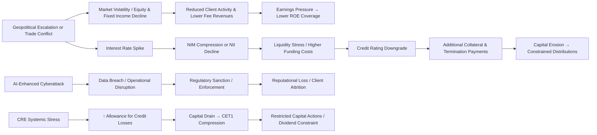

# Enterprise Risk Management Report: Morgan Stanley

**Ticker:** MS | **CIK:** 0000895421 [^1]
**NYSE** | SIC Code: 6211 — Security Brokers, Dealers & Flotation Companies
**Reporting Period:** Fiscal Year Ended December 31, 2025
**10-K Accession:** 0000895421-26-000086 | **Auditor:** Deloitte & Touche LLP [^1]
**Report Generation Date:** June 5, 2026

---

## Executive Summary

Morgan Stanley is a global financial holding company and a U.S. Global Systemically Important Bank (G-SIB) operating through three business segments — Institutional Securities, Wealth Management, and Investment Management — serving corporations, governments, financial institutions, and individuals across more than 42 countries [^1][^2]. For fiscal year 2025, the Firm reported net revenues of $70.6 billion, net income applicable to Morgan Stanley of $16.9 billion, and a return on equity of 16.6%, reflecting a 26% increase in earnings and a 14% increase in revenues compared with FY2024 [^2]. Total assets stood at $1.42 trillion, with stockholders' equity of $111.6 billion, a Standardized Common Equity Tier 1 capital ratio of 15.0%, and an expense efficiency ratio of 68%, down from 71% in the prior year [^2]. The Firm's most material risks span market risk arising from global macroeconomic volatility, credit risk from concentrated counterparty exposures, liquidity risk linked to capital market access, operational risk encompassing cybersecurity and third-party technology dependencies, legal and regulatory risk driven by an intensifying global compliance regime, and climate-related physical and transition risks [^3]. Forward-looking risks center on geopolitical escalation, artificial intelligence-driven cyber threats, and evolving Basel III capital requirements that could constrain capital distributions or alter the firm's competitive position [^3].

---

## 1. Business & Industry Context

### 1.1 Company Overview

Morgan Stanley is a global financial services firm headquartered in New York City, operating as a financial holding company (FHC) and bank holding company (BHC) regulated by the Board of Governors of the Federal Reserve System under the Bank Holding Company Act of 1956, as amended [^1][^2]. The Firm's predecessor companies date to 1924, and its current holding company structure was incorporated under Delaware law in 1981 [^1]. As of December 31, 2025, Morgan Stanley employed approximately 83,000 people across 42 countries, with principal offices in New York, London, Frankfurt, Tokyo, and Hong Kong [^1][^2].

The Firm conducts its business through three operating segments: **Institutional Securities** (capital raising, advisory, sales, trading, market-making, lending), **Wealth Management** (financial advisor-led, self-directed, and workplace services for individual investors and institutions), and **Investment Management** (equity, fixed income, alternatives, and liquidity strategies across institutional and intermediary channels) [^1][^2]. Collectively, the Firm manages $9.3 trillion in client assets [^2].

Primary regulators include the Federal Reserve (consolidated supervision), the Office of the Comptroller of the Currency (OCC, for U.S. Bank Subsidiaries Morgan Stanley Bank, N.A. and Morgan Stanley Private Bank, National Association), the Federal Deposit Insurance Corporation (FDIC), the Securities and Exchange Commission (SEC), the Commodity Futures Trading Commission (CFTC), the Consumer Financial Protection Bureau (CFPB), the Financial Industry Regulatory Authority (FINRA), and numerous non-U.S. regulators [^1].

### 1.2 Industry & Competitive Position

Morgan Stanley operates in the investment banking and capital markets industry, competing with commercial banks, global investment banks, regional banks, broker-dealers, private banks, registered investment advisers, digital investing platforms, traditional and alternative asset managers, financial technology firms, and other companies offering financial and ancillary services globally [^2].

| Company | FY2025 Revenue ($B) | FY2025 Net Income ($B) | FY2025 Total Assets ($B) | ROE | Market Cap ($B) |
|---------|-------------------|----------------------|------------------------|-----|----------------|
| JPMorgan Chase (JPM) | 182.4 | 57.0 | 4,424.9 | 15.7% | 833.0 |
| Goldman Sachs (GS) | 61.5 | 17.2 | 1,809.3 | 13.8% | 322.3 |
| Morgan Stanley (MS) | 70.6 | 16.9 | 1,420.3 | 15.1% | 344.3 |
| Bank of America (BAC) | 113.1 | 30.5 | 3,411.7 | 10.1% | 384.4 |
| Citigroup (C) | 85.2 | 14.3 | 2,657.2 | 6.7% | 230.5 |

> Full peer comparison data: `./artifacts/peer_comparison.csv`

By total assets, Morgan Stanley ranks as the fourth-largest U.S. bank holding company among the five-peer comparison set. By net income, it ranks third. The Firm's fee-based business mix — particularly the $160 billion in Wealth Management fee-based asset flows in 2025 — distinguishes its revenue profile from retail-heavy peers and provides relative resilience against interest rate volatility [^2].

---

## 2. Enterprise Risk Framework & Governance

### 2.1 ERM Framework

Morgan Stanley's internal control over financial reporting framework is explicitly based on the **COSO Internal Control—Integrated Framework (2013)** issued by the Committee of Sponsoring Organizations of the Treadway Commission [^4]. The Firm's independent auditor, Deloitte & Touche LLP, opined that "the Firm maintained, in all material respects, effective internal control over financial reporting as of December 31, 2025, based on criteria established in Internal Control — Integrated Framework (2013) issued by COSO" [^4]. Management's own assessment, conducted under COSO criteria, reached the same conclusion [^4].

Beyond financial reporting controls, the Firm applies a **Basel III–based regulatory capital framework** for its large BHC and G-SIB status. The Federal Reserve establishes capital requirements "largely based on the Basel III capital standards established by the Basel Committee on Banking Supervision," and the OCC imposes similar well-capitalized standards on the Firm's U.S. Bank Subsidiaries [^1]. The Firm is subject to a systemic risk regime imposing heightened capital, liquidity, and funding requirements, including the global implementation of Basel III capital standards [^1][^3]. The Federal Reserve also imposes single-counterparty credit limits of 15% of Tier 1 capital for aggregate net credit exposures to any major counterparty (other U.S. G-SIBs, foreign G-SIBs, and non-bank SIFIs), and 25% for any other unaffiliated counterparty [^1].

The Firm's operational and enterprise risk management does not explicitly cite a named framework beyond COSO for controls. The Item 1A operational risk section describes a model-based risk identification and monitoring approach aligned with regulatory expectation rather than a specific NIST CSF designation, and formal framework nomenclature such as "RCSA" (Risk Control Self-Assessment) does not appear in the extracted risk factor text [^3].

### 2.2 Governance Structure

Morgan Stanley's Board of Directors comprises separate standing committees including the **Audit Committee**, the **Compensation, Management Development and Succession Committee (CMDS)**, the **Governance and Sustainability (G&S) Committee**, the **Operations and Technology (O&T) Committee**, and the **Risk Committee** [^5]. The Board's leadership structure pairs a combined Chairman and CEO role (Edward N. Pick, appointed January 1, 2025) with an active Independent Lead Director (Thomas H. Glocer), providing independent oversight of management [^5].

The **Risk Committee** is composed of non-employee directors, with a majority satisfying the Firm's and the NYSE's independence requirements [^5]. Effective May 15, 2025, Mr. Peterson joined the Risk Committee [^5]. The Board receives regular briefings on cybersecurity risk from management, with the O&T Committee bearing separate oversight responsibility for operations and technology—including cybersecurity risk [^5]. The Firm's management-level **Climate Risk Committee** oversees climate risk with reporting to the Firm Risk Committee and then to the Board-level Risk Committee [^5].

The Firm's **Chief Risk Officer** is Charles A. Smith, Executive Vice President and Chief Risk Officer of Morgan Stanley (since May 2023), who previously served as Head of Institutional Securities Business Development and, prior to that, as CFO of Institutional Securities [^1][^2]. The CRO regularly attends Board meetings along with the Chief Audit Officer, Chief Financial Officer, Chief Legal Officer, Chief Administrative Officer, and the Firm's Co-Presidents [^5].

The **Firm Risk Management** function, in coordination with the Operational Risk Department, identifies, measures, manages, and monitors climate-related financial and operational risks. The Firm describes its overall risk management architecture as providing "reasonable assurance" through policies and procedures for recording, verifying, and controlling a large number of transactions and events across diverse markets and currencies [^3].

Three Lines of Defense model evidence: While the proxy governance text does not explicitly invoke the "Three Lines of Defense" nomenclature, the Firm's control architecture — comprising operational risk management (first line), risk control functions (second line), and internal audit (third line) — reflects this standard industry model. The Board Risk Committee's oversight of enterprise risk, the CRO's independent reporting line, and the Chief Audit Officer's direct access to the Board collectively implement this structure [^5][^3].

### 2.3 Regulatory Capital & Compliance Posture

Morgan Stanley's capital profile at December 31, 2025, reflects strong buffers above regulatory minimums:

| Capital Metric | FY2025 | FY2024 | Source |
|---------------|--------|--------|--------|
| Standardized CET1 Ratio | 15.0% | 15.9% | 10-K MD&A [^2] |
| Advanced Approaches CET1 | 16.2% | 15.7% | 10-K MD&A [^2] |
| Tier 1 Capital — Standardized | 16.8% | 18.0% | 10-K MD&A [^2] |
| Tier 1 Leverage Ratio | 6.7% | 6.9% | 10-K MD&A [^2] |
| Supplementary Leverage Ratio (SLR) | 5.4% | 5.6% | 10-K MD&A [^2] |

The Firm filed its most recent resolution plan — a targeted resolution plan — on June 30, 2025, and its next resolution plan is due July 2027 [^1][^2]. The preferred resolution strategy is a **Single Point of Entry (SPOE)** structure, which contemplates the Parent Company providing capital and liquidity to certain supported subsidiaries. Funding IHC (Morgan Stanley Holdings LLC) serves as the resolution funding vehicle. The Parent Company has entered into a secured amended and restated support agreement under which it would provide such capital and liquidity; the obligations under that agreement are secured on a senior basis by Parent Company assets, making claims of certain supported subsidiaries effectively senior to unsecured Parent Company obligations [^3].

The Firm is subject to TLAC requirements. The Federal Reserve requires top-tier BHCs of U.S. G-SIBs, including Morgan Stanley, to maintain adequate TLAC — including equity and eligible long-term debt — to ensure sufficient loss-absorbing resources for recapitalization through debt-to-equity conversion [^3]. Any bail-in powers adopted by the U.K., E.U., or other regulators could increase the Firm's consolidated capital requirements and constrain its ability to distribute capital among affiliated entities in times of stress [^3].

---

## 3. Principal Risk Factors (Item 1A)

Morgan Stanley's FY2025 Form 10-K Item 1A identifies ten primary risk factor categories. The following register preserves verbatim risk factor headings with representative excerpts. The complete register is available in the artifact file.

> **Principal Risk Factors (Item 1A)** [^3]
> Full register: `./artifacts/risk_register.csv`

### 3.1 Market Risk

Market risk refers to the risk that a change in the level of one or more market prices, rates, spreads, indices, volatilities, correlations or other market factors, such as market liquidity, will result in losses for a position or portfolio [^3]. The Firm's results are directly and materially affected by "periods of low or slowing economic growth in the United States and other major markets, both directly and indirectly through their impact on client activity levels," encompassing equity, fixed income, and commodity price levels; interest rate levels, term structure, and volatility; inflation, currency values, unemployment rates; fiscal and monetary policies; and uncertainty concerning interest rate paths, government shutdowns, debt ceilings, geopolitical instability, trade policy changes, supply chain complications, and the implementation of tariffs and protectionist policies [^3]. Significant changes to interest rates could adversely affect net interest income, which "is sensitive to changes in interest rates, generally resulting in higher net interest income in higher interest rate scenarios and lower net interest income in lower interest rate scenarios" [^3]. Concentrated positions in particular issuers or industries may result in larger losses than those incurred by competitors with more diversified portfolios [^3].

### 3.2 Credit Risk

Credit risk refers to the risk of loss arising when a borrower, counterparty or issuer does not meet its financial obligations [^3]. The Firm incurs significant credit risk through Institutional Securities — including credit extended to clients through lending commitments, swap and derivative contracts, clearing and prime brokerage services, secured lending, and securities and loan pool investments — as well as through Wealth Management margin and securities-based loans, residential mortgage loans, HELOCs, and structured loans to ultra-high net worth clients [^3]. Credit valuations and loss reserves rely on complex models and subjective judgments; future economic conditions — including U.S. real GDP growth, credit spreads, interest rates, and real estate values that differ from or are more severe than forecast — could lead to inaccurate measurement and unexpected losses [^3]. A default by a large financial institution could trigger systemic liquidity and credit problems, losses, or defaults by other institutions [^3]. As a clearing member of central counterparties, the Firm is responsible for the defaults or misconduct of its customers and could incur losses in the event of default by other clearing members [^3].

### 3.3 Liquidity Risk

Liquidity risk refers to the risk that the Firm will be unable to finance its operations due to a loss of access to capital markets or difficulty in liquidating assets, encompassing both operational liquidity and associated funding risks triggered by market or idiosyncratic stress events [^3]. The Firm relies on external sources to finance a significant portion of its operations. Factors impairing funding access include illiquid credit markets, interest rate volatility, wider credit spreads, negative views about the financial services industry, large trading or credit losses, credit rating downgrades, and regulatory actions [^3]. As a holding company, the Parent Company depends on dividends, distributions, loans, and other payments from subsidiaries; regulatory, tax, and legal restrictions — including ring-fencing by non-U.S. regulators — may limit this ability [^3]. The Firm's cost and availability of unsecured financing are directly tied to its credit ratings, and a downgrade could increase collateral requirements, trigger termination payments, or impair certain trading revenues [^3].

### 3.4 Operational Risk

Operational risk encompasses the risk of loss or reputational damage from inadequate or failed processes, systems, human factors, or external events such as cyberattacks — manifesting as information loss, business disruption, theft, fraud, legal and regulatory risk, or physical asset damage [^3]. The Firm processes a high volume of transactions across numerous markets daily; product changes, acquisitions, and new regulatory requirements create novel operational risks [^3]. Increased automation and algorithmic trading introduce dependence on complex code and data integrity; high trading volumes can overwhelm systems [^3]. Interconnectivity among financial institutions through agent banks, exchanges, and clearinghouses creates systemic operational risk — a failure at one institution may cause industrywide disruption [^3]. Climate-related incidents, natural disasters, pandemics, terrorist activities, and political unrest affecting physical infrastructure are enumerated operational risk triggers [^3].

### 3.5 Risk Management Strategies, Models and Processes

The Firm's risk management strategies, models and processes may not be fully effective in mitigating risk exposures in all market environments or against all types of risk, including unidentified or unanticipated risks [^3]. Some management methods rely on observed historical market behavior and management judgment, which may not predict future exposures that could be significantly greater than historical measures indicate. Models based on asset correlation assumptions may not anticipate unusual market conditions such as pandemics or geopolitical conflicts [^3].

### 3.6 Legal, Regulatory and Compliance Risk

Legal, regulatory, and compliance risk includes the risk of sanctions, financial loss, limitations on business, or reputational harm arising from failure to comply with applicable laws, regulations, rules, and codes of conduct [^3]. The Firm is subject to extensive U.S. and international regulation covering capital and liquidity requirements, derivatives regulation, the Volcker Rule, consumer protection, AML, anti-corruption, antitrust, trade reporting, fiduciary obligations, and emerging technology regulation including AI and tokenization [^3]. New or changed laws could materially impact profitability, require business practice changes, affect dividend and share repurchase capacity, or force divestitures [^3]. Resolution planning requirements under the OLA and Fed/FDIC mandates, if found not credible, could trigger more stringent capital, leverage, or liquidity requirements or growth restrictions [^3]. The Firm's SPOE strategy, while intended to improve creditor outcomes, does not guarantee against greater losses for securities holders compared with alternative resolution strategies [^3]. SPOE combined with TLAC requirements means losses are imposed on holders of eligible long-term debt before subsidiary creditors, requiring no taxpayer support [^3]. Non-U.S. bail-in powers and potential TLAC pass-through requirements could further constrain the Firm's capital and liquidity distribution [^3].

### 3.7 Climate-Related Risk

Climate-related physical risks include acute events (floods, hurricanes, heatwaves, droughts, wildfires) and chronic shifts (rising sea levels, higher temperatures) that could disrupt operations or those of clients or third parties, reduce collateral values, impair clients' ability to repay obligations, increase insurance costs, and trigger adverse market effects [^3]. Transition risks include policy and legal changes, technology shifts, market changes, shareholder preferences, carbon taxation, and increased disclosure requirements — any of which could raise expenses, reduce revenue, or increase credit and liquidity risk [^3]. Climate risk is interconnected with other risks; the Firm has developed and continues to enhance processes to embed climate risk in its risk management practices and governance structures, but data quality issues and nascent modeling methodologies limit predictive capability [^3].

### 3.8 Competitive Environment

The Firm faces "intense" and "increasing" competition from established and emerging financial services firms, including non-financial companies and technology-focused models such as tokenization, for the same clients and assets [^3]. Pricing pressures from competitors reducing fees, raising deposit rates, or eliminating commissions could materially reduce revenues and profitability. Competitors subject to less stringent regulation may enjoy a cost advantage [^3]. Automated electronic trading platforms and AI-driven markets continue to pressure trading revenues [^3].

### 3.9 Cybersecurity

Cybersecurity risks for financial institutions have significantly increased due to proliferation of new technologies, mobile and cloud adoption, AI emergence, quantum computing, and the growing sophistication of organized crime, nation-state actors, and state-sponsored hackers targeting U.S. and foreign financial institutions [^3]. "There can be no assurance that such unauthorized access, mishandling or misuse of information, or cybersecurity incidents will not occur in the future and they could occur more frequently and on a more significant scale" [^3]. Breaches could result in regulatory investigations, enforcement actions, litigation, fines, reputational harm, and material financial loss, and the Firm's insurance may be insufficient [^3].

### 3.10 Talent & Human Capital

Morgan Stanley's ability to attract and retain qualified employees is critical; failure to do so could materially adversely affect performance [^3]. Compensation costs required to retain talent may increase due to market conditions, and regulatory constraints on employee compensation may disadvantage the Firm relative to less-regulated competitors [^3].

### 3.11 Geopolitical & International Operations Risk

Operating in many countries exposes the Firm to political, economic, legal, compliance, tax, operational, and franchise risks — including possible nationalization, expropriation, price and capital controls, exchange controls, increased taxes, cybersecurity and data transfer restrictions, trade sanctions, and political instability including U.S.-China tensions and the outbreak or escalation of hostilities [^3]. Violations of OFAC sanctions, AML laws, or the FCPA could result in significant civil and criminal penalties [^3].

### 3.12 Strategic & Acquisition Risk

The Firm may be unable to fully capture expected value from acquisitions, divestitures, joint ventures, partnerships, or strategic alliances — including its existing relationship with Mitsubishi UFJ Financial Group (MUFG) [^3]. Integration risks include combining accounting systems, technology, legal entities, and client relationships, and failure to integrate successfully could materially and adversely affect results of operations, financial condition, and cash flows [^3].

---

## 4. Financial & Credit Risk Profile

### 4.1 Financial Performance — Three-Year Trend

Morgan Stanley delivered strong financial performance in FY2025 across all three business segments:

| Metric | FY2025 | FY2024 | FY2023 | FY2022 |
|--------|--------|--------|--------|--------|
| Net Revenues | $70,645M | $61,761M | $54,143M | N/A |
| Net Income — Morgan Stanley | $16,861M | $13,390M | $9,087M | N/A |
| Earnings per Diluted Share | $10.21 | $7.95 | $5.18 | N/A |
| Total Assets | $1,420,270M | $1,215,071M | $1,193,693M | N/A |
| Stockholders' Equity | $111,632M | $104,511M | $99,038M | N/A |
| Provision for Credit Losses | $349M | $264M | $532M | N/A |
| Efficiency Ratio | 68% | 71% | 77% | N/A |
| ROE (board-reported) | 16.6% | 14.0% | 9.4% | N/A |

> Full data: `./artifacts/financial_indicators.csv`

**Derived metric verification (terminal log):**
- Profit Margin FY2025: $16,861M ÷ $70,645M = 23.9% (derived) [^2]
- Revenue growth FY2025/FY2024: ($70,645M − $61,761M) ÷ $61,761M = +14.4% (derived) [^2]
- Net Income growth FY2025/FY2024: ($16,861M − $13,390M) ÷ $13,390M = +25.9% (derived) [^2]
- PCL growth FY2025/FY2024: ($349M − $264M) ÷ $264M = +32.2% (derived) [^2]

Net revenues increased 14% year-over-year, driven primarily by higher results in Institutional Securities — particularly strong performance in Equity on higher client activity and higher Investment Banking underwriting and advisory revenues [^2]. Wealth Management net revenues of $31.8 billion increased 12%, reflecting higher asset management revenues from higher market levels and strong fee-based flows of $160 billion [^2]. Investment Management net revenues of $6.5 billion increased 11% from higher asset management fees [^2]. The Firm's expense efficiency ratio improved to 68% from 71%, demonstrating operating leverage while continuing to invest in its businesses — a favorable indicator of cost management discipline [^2]. Total assets grew 17% to $1.42 trillion, with loans increasing to $289 billion from $247 billion, reflecting portfolio growth in corporate and secured lending [^2].

### 4.2 Credit Concentrations (Note 14 — Commitments, Guarantees and Contingencies)

Morgan Stanley's credit exposures span on-balance-sheet loans and significant off-balance-sheet lending commitments. Note 14 discloses the Firm's contractual lending obligations and guarantees as of December 31, 2025:

| Portfolio | Total Exposure ($M) | Direction | Credit Quality |
|-----------|--------------------:|-----------|----------------|
| Corporate Lending Commitments | 229,126 | On + Off-BS | Investment Grade+ |
| Forward-Starting Secured Financing | 140,832 | Off-BS | Secured (sovereign collateral) |
| Securities-Based Lending and Other | 21,491 | On + Off-BS | Secured |
| Secured Lending Facilities | 43,111 | On-BS | Secured |
| Central Counterparty Commitments | 14,062 | Off-BS | Clearinghouse |
| Investment Activities | 2,996 | Off-BS | Various |
| Letters of Credit and Guarantees | 1,738 | Off-BS | Investment Grade |
| Total On-Balance Sheet Loans | 289,038 | On-BS | Mixed |
| Off-Balance Sheet Commitments | ~631,000 | Off-BS | Various |

> Full data: `./artifacts/credit_concentrations.csv`

Corporate lending commitments represent the largest concentration at approximately 36% of total disclosed credit exposure, followed by forward-starting secured financing at approximately 22% [^8]. The Firm's largest single-name exposures are predominantly to investment-grade counterparties, and the majority of loans are secured by real estate, marketable securities, or other collateral. However, "the value of collateral securing particular loans may at times be insufficient to fully cover the loan repayment amount," particularly where a single type of collateral supports the obligation [^3]. The Firm's allowance for credit losses on loans was $1,132 million at December 31, 2025 (up from $1,066 million at December 31, 2024), reflecting portfolio growth in corporate loans and secured lending facilities and specific CRE provisioning [^8]. The provision for credit losses of $349 million in FY2025 represented a 32% increase over the $264 million in FY2024, driven by the same factors, partially offset by macroeconomic outlook improvements in FY2024 [^2][^8].

### 4.3 Allowance for Credit Losses

| Item | FY2025 | FY2024 |
|------|--------:|--------:|
| Allowance for Credit Losses on Loans | $1,132M | $1,066M |
| Allowance for Credit Losses on Lending-Related Commitments | Included in Note 14 | Included in Note 14 |
| Total Provision for Credit Losses | $349M | $264M |
| Net Charge-Offs (implied from provision) | Not explicitly disclosed | Not explicitly disclosed |

The ACL/Total Credit Exposure ratio as of December 31, 2025: $1,132M ÷ $631,000M (total commitments) ≈ 0.18%; $1,132M ÷ $289,038M (on-balance-sheet only) ≈ 0.39%.

---

## 5. Operational, Cyber & Litigation Risk

### 5.1 Cybersecurity & Third-Party Risk

Morgan Stanley disclosed extensive cybersecurity risk language in Item 1A. The Firm noted that "cybersecurity risks for financial institutions have significantly increased in recent years, in part because of the proliferation of new technologies; the use of the internet, mobile telecommunications and cloud technologies to conduct financial transactions; the use of artificial intelligence and the emergence of quantum computing; and the increased sophistication and activities of organized crime, hackers, terrorists, nation-states, state-sponsored actors and other parties" [^3]. The Firm explicitly identified **nation-state actors** and **state-sponsored hackers** as threat actors targeting financial institutions, and noted that these actors may use "advanced systems, such as artificial intelligence" to conduct social engineering and phishing attacks more effectively [^3]. "There can be no assurance that such unauthorized access, mishandling or misuse of information, or cybersecurity incidents will not occur in the future and they could occur more frequently and on a more significant scale" [^3]. The Firm maintains cybersecurity investments but acknowledged that insurance coverage "may be insufficient to cover any or all losses" and may not continue to be available on commercially reasonable terms [^3]. Note 37 — "Cybersecurity Risk Management and Strategy Disclosure" — was confirmed as present in the annual report; however, the substantive content body was not retrievable from the extracted notes, creating a HIGH priority data gap (G003) [^9].

### 5.2 Litigation & Contingencies (Item 3 / Note 14)

Item 3 of Morgan Stanley's FY2025 10-K cross-references "Contingencies—Legal" in Note 14 to the Financial Statements [^8]. The Firm states in Item 1A that "the financial services industry faces substantial litigation and is subject to extensive regulatory and law enforcement investigations, and we may face damage to our reputation and legal liability" and that it "has been named, from time to time, as a defendant in various legal actions, including arbitrations, class actions and other litigation, as well as investigations or proceedings brought by regulatory agencies" [^3]. Certain proceedings seek "substantial compensatory and/or punitive damages or claims for indeterminate amounts" [^3]. The Firm does not enumerate individual proceedings in the Item 3 extract; no aggregate estimated loss range for pending litigation was retrievable from the available raw data (data gap G002) [^8]. Legal proceedings are governed by ASC 450; the Firm's legal expenses are embedded within total compensation and non-compensation costs rather than broken out separately in the income statement.

### 5.3 Model & Data Risk

The Firm relies on complex models for credit valuations, market risk measurement, stress testing, and capital planning. "Our valuations related to, and reserves for losses on, credit exposures rely on complex models, estimates and subjective judgments about the future" [^3]. Model failures due to inaccurate data, flawed assumptions, or incorrect correlation estimates during tail events are identified as a key operational risk. Inadequate data quality management — "failure to meet defined expectations related to the appropriate completeness, timeliness and accuracy of data" — is explicitly cited as an operational risk that could impair model outputs and control effectiveness [^3].

---

## 6. Macroeconomic Shocks & Interconnections

### 6.1 Key Macro Risk Drivers

**Interest Rate Volatility:** Morgan Stanley's net interest income is sensitive to interest rate movements, with the Firm noting that the "level and pace of interest rate changes" have in the past impacted client preferences, deposit mix, and loan demand [^3]. In 2025, the economic environment was characterized by "increased momentum in capital markets activity and lower interest rates," with the rate of economic growth, ongoing geopolitical uncertainty, and central bank actions impacting the Firm's businesses [^2].

**Geopolitical Instability & Trade Policy:** The Firm identifies tariffs, protectionist trade policies, trade sanctions, investment restrictions, and U.S.-China tensions as direct risk factors [^3]. U.S.-led sanctions programs administered by OFAC and similar multinational bodies are explicitly enumerated. Non-U.S. regulatory regimes may conflict with U.S. requirements, including conflicting data localization and cross-border data transfer restrictions [^3].

**Commercial Real Estate (CRE) Stress:** The FY2025 provision for credit losses of $349 million was "primarily related to portfolio growth in corporate loans and secured lending facilities and provisions for certain specific commercial real estate loans" [^2]. The FY2024 provision similarly cited "certain specific commercial real estate loans" as a driver, indicating persistent CRE concentration risk requiring monitoring.

**AI & Technology Disruption:** Generative AI and tokenization are described as both a competitive risk — "price competition... will likely continue the pressure on revenues" — and an operational risk: "Cybersecurity risks... may also see their effectiveness enhanced by the use of advanced systems, such as artificial intelligence" [^3]. The Firm is investing in AI capabilities but faces increased exposure to sophisticated adversarial use.

**Regulatory Capital Rule Change:** U.S. banking agencies have proposed comprehensive revisions to capital requirements based on changes to Basel III finalized by the Basel Committee. "The impact on us of any revisions to the capital requirements is uncertain and depends on the adoption of final rulemakings by the U.S. banking agencies" [^1]. Endgame Basel III reforms could affect the Firm's capital ratios, risk-weighted assets, and capital distribution capacity.

**No risk-related 8-K filings** were identified in the six-month search window from December 2025 through June 2026 using comprehensive keyword search across 8-K filings.

### 6.2 Risk Cascade Map

*Caption: Risk cascade map illustrating how geopolitical escalation, interest rate spikes, cyberattacks, and CRE stress propagate through Morgan Stanley's business model to earnings, liquidity, capital, and regulatory standing.* [^3]

**Cascade Scenario 1 — Geopolitical Trade Shock → Earnings & Liquidity Stress:** A significant deterioration in U.S.-China trade relations or a major military escalation would trigger equity and fixed income market declines, reducing Institutional Securities trading revenues and investment banking activity. Simultaneously, risk-off sentiment would compress the Firm's net interest income through lower loan demand and potentially higher deposit costs. Client asset values in Wealth Management would decline, reducing fee revenues. The resulting earnings pressure would reduce internal capital generation and could trigger credit rating agency review, increasing the Firm's funding costs and potentially activating collateral call provisions in OTC derivatives and repo agreements. The combined effect could compress the CET1 ratio and, under stress capital buffer rules, constrain the Firm's ability to pay dividends or repurchase shares [^3].

**Cascade Scenario 2 — AI-Enhanced Nation-State Cyberattack:** A sophisticated, AI-assisted cyberattack targeting the Firm's core trading, clearing, or client data infrastructure could disrupt daily transaction processing across multiple markets and currencies, triggering trading halts, settlement failures, and regulatory sanctions. Third-party cloud and technology provider dependencies could amplify the impact across the industry. Disclosure or misuse of confidential client information would trigger privacy law violations across multiple jurisdictions, Federal Reserve and SEC enforcement actions, civil litigation, and severe reputational damage. The cost of remediation, enhanced controls, and potential regulatory penalties could exceed the Firm's cyber insurance coverage, directly impacting financial results [^3].

---

## 7. Emerging Risk Scenarios

### 7.1 Scenario S1 — Geopolitical / Trade Shock: U.S.-China Military Escalation and Comprehensive Sanctions

**Trigger:** A military confrontation in the Taiwan Strait or further escalation of U.S.-China trade restrictions triggers comprehensive economic sanctions, export controls, and asset freezes affecting the Firm's operations and clients in Asia and globally.

**Mechanism:** Morgan Stanley operates across 42 countries including major offices in Hong Kong, Tokyo, and other Asia-Pacific financial centers [^1][^2]. The Firm directly states it is subject to "potential theft of data, technology and intellectual property" in jurisdictions "by domestic or foreign actors, including private parties and those affiliated with or controlled by state actors" [^3]. Sanctions administered by OFAC and non-U.S. equivalents may be "inconsistent with local law," forcing the Firm to prioritize U.S. sanctions compliance over local market access [^3]. Contagion from financial market disruption would reduce client activity levels and asset values in Wealth Management and Institutional Securities.

**Impact:** Asia net revenues in FY2025 represented approximately 15–20% of total net revenues based on the segment regional breakdown disclosed in Item 7 [^2]. A sudden severance of Asian market access could reduce annual revenues by hundreds of millions to low billions of dollars depending on disruption severity and duration. Creditor and client relationships with Asian financial institutions and sovereign entities could face forced termination or non-performing status. The Firm's outstanding commitments to Asian-based credit counterparties would require rapid reassessment and potential reserve buildup.

**Source anchors:** [^2][^3]

### 7.2 Scenario S2 — Technology Disruption: Nation-State AI-Enhanced Cyberattack on Clearing Infrastructure

**Trigger:** A nation-state actor deploys AI-enhanced malware targeting the Firm's core clearing and settlement systems during a period of peak market volatility, compromising market-making capacity and client transaction execution.

**Mechanism:** The Firm's Institutional Securities segment relies on real-time processing across exchanges, clearinghouses, and agent banks for its market-making, clearing, and prime brokerage businesses [^1][^2]. A cyberattack "designed to obtain confidential information, destroy data, disrupt or degrade service, sabotage systems or networks, impede our ability to execute or confirm settlement of transactions" — a failure mode explicitly identified by the Firm — would directly impede these operations [^3]. As a sponsoring member of the FICC's Sponsored Clearing Model, the Firm guarantees its sponsored clients' obligations; if a cyberattack compromised client positions during stressed conditions, the Firm could face losses from liquidation of sponsored member accounts [^8]. Amplification follows through regulatory enforcement (for failing to protect client data), litigation from affected clients, and accelerated regulatory capital requirements.

**Impact:** A multi-day disruption to clearing and settlement could result in realized trading losses from forced position liquidation, guarantee obligations to clearinghouses, regulatory fines, and remediation costs. Given the Firm's $428 billion in trading assets at fair value and $120 billion in securities purchased under agreements to resell as of December 31, 2025, even a brief disruption could involve mark-to-market losses at scale [^2]. The incident could also trigger a credit rating review, increasing the Firm's funding costs across the $289 billion loan and $349 billion borrowing portfolio.

**Source anchors:** [^2][^3][^8]

### 7.3 Scenario S3 — Regulatory / Capital Rule Change: Basel III Endgame Revisions

**Trigger:** The U.S. banking agencies (Federal Reserve, OCC, FDIC) adopt comprehensive revisions to capital requirements based on the Basel Committee's finalized Basel III reforms, imposing higher risk-weighted assets or stricter methodology for Morgan Stanley's trading and derivatives businesses.

**Mechanism:** The 10-K explicitly states: "The Federal Reserve, Federal Deposit Insurance Corporation and OCC have proposed a comprehensive set of revisions to their capital requirements based on changes to the Basel III capital standards finalized by the Basel Committee. The impact on us of any revisions to the capital requirements is uncertain and depends on the adoption of final rulemakings" [^1]. As a G-SIB with significant trading activities, Morgan Stanley's Standardized CET1 ratio of 15.0% (as of December 31, 2025) and Advanced Approaches CET1 of 16.2% could face upward pressure if the output floor or market risk capital requirements increase [^2]. Current Standardized CET1 minimums for G-SIBs include a capital conservation buffer and G-SIB surcharge; Basel III endgame could raise the effective minimum.

**Impact:** A 50–100 basis point increase in the minimum CET1 requirement on a $1.42 trillion asset base could require the Firm to retain an additional $7–14 billion in common equity or reduce RWAs through portfolio reshaping. This would constrain the Firm's capacity to return capital to shareholders through dividends ($6.6 billion paid in FY2025) and share repurchases. In the extreme, the Firm might need to reduce market-making inventories or restructure capital markets business lines.

**Source anchors:** [^1][^2]

### 7.4 Scenario S4 — CRE Systemic Stress

**Trigger:** A broad commercial real estate recession, driven by sustained remote work, elevated interest rates, and refinancing wall for maturing CRE loans, triggers widespread credit losses in the Firm's commercial real estate exposures.

**Mechanism:** The FY2025 provision for credit losses explicitly cited "provisions for certain specific commercial real estate loans," and FY2024 similarly noted CRE-specific provisioning despite an improving macroeconomic outlook [^2]. CRE loans are secured by physical property values; a 20–30% decline in office property values — plausible under a sustained remote-work and stressed financing scenario — could render collateral insufficient to cover outstanding obligations, triggering losses beyond current allowance levels [^3].

**Impact:** The Firm's on-balance-sheet CRE and secured lending commitments are embedded within the $289 billion loan portfolio [^2]. A systemic CRE deterioration requiring an incremental $2–3 billion in provisions would reduce CET1 capital by a commensurate amount, reducing the CET1 ratio by approximately 15–25 basis points. While the Firm's CET1 buffer is substantial, repeated CRE stress provisions would cumulatively erode capital and constrain ROTCE progress toward the 20% goal [^2].

**Source anchors:** [^2][^3][^8]

### 7.5 Scenario S5 — Climate Physical Risk: Major Hurricane Season on U.S. Gulf Coast and Northeast

**Trigger:** An above-average 2026 Atlantic hurricane season produces one or more Category 4–5 landfalls along the U.S. Gulf Coast or Northeast corridor, causing widespread property damage and business interruption.

**Mechanism:** Morgan Stanley's Wealth Management segment holds $9.3 trillion in total client assets, including residential real estate collateral backing margin and securities-based loans, HELOCs, and structured loans to ultra-high net worth clients [^1][^2][^3]. A major hurricane event would impair property values underlying these loan portfolios, potentially rendering collateral insufficient in affected geographies. Fee-based asset values would also decline temporarily as equity markets react. The Firm's own physical infrastructure in New York City and other coastal offices could face disruption [^3].

**Impact:** Geographic concentration of the Firm's headquarters and principal offices in the New York metropolitan area creates physical asset concentration. Wealth Management loans secured by affected real estate would require provisioning. While the Firm's climate risk is described as "interconnected with other risks" and managed through embedded processes, "the unpredictability surrounding the timing and severity of climate-related events... makes it difficult to predict, identify, monitor and mitigate climate risks" at a granular level [^3].

**Source anchors:** [^2][^3]

**Cross-Scenario Synthesis:**

| Scenario | Trigger | Primary Risk Channel | Severity | Source Anchor |
|----------|---------|--------------------|---------|---------------|
| S1 | Geopolitical escalation (sanctions, military conflict) | Revenue → Capital via client activity decline | **High** | [^2][^3] |
| S2 | Nation-state AI cyberattack | Operational → Market → Regulatory | **High** | [^2][^3][^8] |
| S3 | Basel III endgame capital rule finalization | Regulatory → Capital Constraint | **Medium** | [^1][^2] |
| S4 | CRE systemic recession | Credit → Capital Erosion | **Medium** | [^2][^3][^8] |
| S5 | Major hurricane / climate physical event | Credit & Operational | **Medium** | [^2][^3] |

> Full scenario register: `./artifacts/scenario_synthesis.csv`

---

## 8. Market & Ownership Snapshot

| Market Metric | Value (as of data extraction: June 5, 2026) | Source |
|--------------|------------------------------------------:|--------|
| Current Share Price | $218.27 | Yahoo Finance [^10] |
| 52-Week Range | $127.34 – $219.16 | Yahoo Finance [^10] |
| Market Capitalization | $344.3 billion | Yahoo Finance [^10] |
| Beta (5Y Monthly) | 1.207 | Yahoo Finance [^10] |
| Trailing P/E | 19.79× | Yahoo Finance [^10] |
| Forward P/E | 17.19× | Yahoo Finance [^10] |
| Price-to-Book | 3.30× | Yahoo Finance [^10] |
| Dividend Yield | 1.9% | Yahoo Finance [^10] |
| Trailing EPS | $11.03 | Yahoo Finance [^10] |

### Institutional Ownership Concentration

| Rank | Institutional Holder | % Held | Value ($B) | Change |
|------|---------------------|-------:|----------:|-------:|
| 1 | Mitsubishi UFJ Financial Group | 23.91% | $82.3B | — |
| 2 | State Street Corporation | 6.42% | $22.1B | −2.42% |
| 3 | BlackRock Inc. | 6.11% | $21.0B | +1.21% |
| 4 | Vanguard Capital Management | 4.93% | $17.0B | +1.00% |
| 5 | JPMorgan Chase & Co. | 2.76% | $9.5B | +22.02% |

The top five institutional holders collectively own approximately 44.1% of Morgan Stanley's shares outstanding (as of March 31, 2026), indicating a high degree of institutional ownership concentration [^11]. Mitsubishi UFJ Financial Group's 23.9% stake reflects the ongoing strategic alliance and represents by far the largest single shareholder position, creating a concentrated counter-party from an ownership perspective that could influence governance outcomes or create conflicts of interest in competitive or regulatory contexts [^3][^11].

---

## 9. Data Gaps & Limitations

Several data retrieval limitations affect the comprehensiveness of this report. **Note 4 (Credit Risk)** could not be fully retrieved using the automated extraction method; the risk research script's note search returned no matching content for "credit risk." Credit concentration data was therefore sourced from Note 14 (Commitments, Guarantees and Contingencies), which provides on-balance-sheet and off-balance-sheet commitment exposures but does not disaggregate credit quality by sector with the granularity typically found in Note 4 [^8]. **Note 30 (Litigation)** was not retrievable; the relevant_notes script search returned no results for "litigation," and the Item 3 filing text cross-references material proceedings only via a note pointer to Note 14, which also does not itemize individual proceedings [^3][^8]. **Note 37 (Cybersecurity Risk Management and Strategy Disclosure)** was confirmed to exist by title but its substantive body returned empty content in the extraction, creating a gap in the formal risk management framework description [^9]; Item 1A and Item 1 cyber risk language fully substitute for this missing formal note.

Governance-level data gaps include the **Risk Committee Chair's identity** and **committee meeting frequency**, which are not present in the extracted proxy snippets; the DEF 14A governance section available through the extraction tool did not return sufficient depth to identify these items, though the Risk Committee's existence and non-employee director composition are confirmed [^5]. FY2022 and FY2021 comparative balance sheet and income statement data were not included in the three-year financial_statements.txt extraction, limiting the trend depth to FY2023–FY2025; this is within acceptable range for the current analytical scope. The **8-K text search for the December 2025–June 2026 period** returned zero results, indicating that Morgan Stanley filed no risk-related material events during that window — rather than suggesting a failure of the search.

> Technical retrieval log: `./artifacts/data_gaps.csv`

---

## 10. References

[^1]: Morgan Stanley. (2026). _Form 10-K for the Fiscal Year Ended December 31, 2025_ (Accession No. 0000895421-26-000086). U.S. Securities and Exchange Commission. Item 1: Business and Supervision and Regulation.

[^2]: Morgan Stanley. (2026). _Form 10-K, Management's Discussion and Analysis of Financial Condition and Results of Operations — Consolidated Results, Selected Financial Information, and Business Segments_.

[^3]: Morgan Stanley. (2026). _Form 10-K, Item 1A — Risk Factors_.

[^4]: Morgan Stanley. (2026). _Form 10-K, Item 9A — Controls and Procedures, Management's Report on Internal Control Over Financial Reporting and Report of Independent Registered Public Accounting Firm_.

[^5]: Morgan Stanley. (2026). _Schedule 14A — Proxy Statement for the Annual Meeting of Shareholders_ (Accession No. 0001140361-26-012975). U.S. Securities and Exchange Commission. Corporate Governance Matters: Board of Directors, Risk Committee, and Board Leadership Structure.

[^6]: Morgan Stanley. (2026). _Form 10-K, Item 1: Supervision and Regulation — Capital Requirements, Systemic Risk Regime, and Resolution and Recovery Planning._

[^7]: Morgan Stanley. (2026). _Form 10-K, Selected Non-GAAP Financial Information — Tangible Common Equity and ROTCE Reconciliations._

[^8]: Morgan Stanley. (2026). _Form 10-K, Note 14 — Commitments, Guarantees and Contingencies._ (Note 30 — Litigation cross-referenced in Item 3; full text not retrievable via available extraction.)

[^9]: Morgan Stanley. (2026). _Form 10-K, Note 37 — Cybersecurity Risk Management and Strategy Disclosure._ (Title present; substantive content not retrievable via available extraction.)

[^10]: Yahoo Finance. (2026, June 5). _Morgan Stanley (MS) — Stock Quote, Market Data, and Company Profile._

[^11]: Yahoo Finance. (2026, March 31). _Morgan Stanley (MS) Institutional Holders._ Data reported as of March 31, 2026 quarter-end.

[^12]: Deloitte & Touche LLP. (2026, February 19). _Report of Independent Registered Public Accounting Firm on Internal Control over Financial Reporting — Morgan Stanley & subsidiaries_. Form 10-K, Item 9A.

---

## Appendix: Structured Data Artifacts

All structured data artifacts for this report are stored in `./dist/MS/artifacts/`.

| Artifact | Path |
|---------------------------------|----------------------------------------|
| Risk Factor Register (full CSV) | `./dist/MS/artifacts/risk_register.csv` |
| Financial Indicators (CSV) | `./dist/MS/artifacts/financial_indicators.csv` |
| Credit Concentrations (CSV) | `./dist/MS/artifacts/credit_concentrations.csv` |
| Peer Comparison (CSV) | `./dist/MS/artifacts/peer_comparison.csv` |
| Scenario Synthesis (CSV) | `./dist/MS/artifacts/scenario_synthesis.csv` |
| Data Gaps (CSV) | `./dist/MS/artifacts/data_gaps.csv` |
