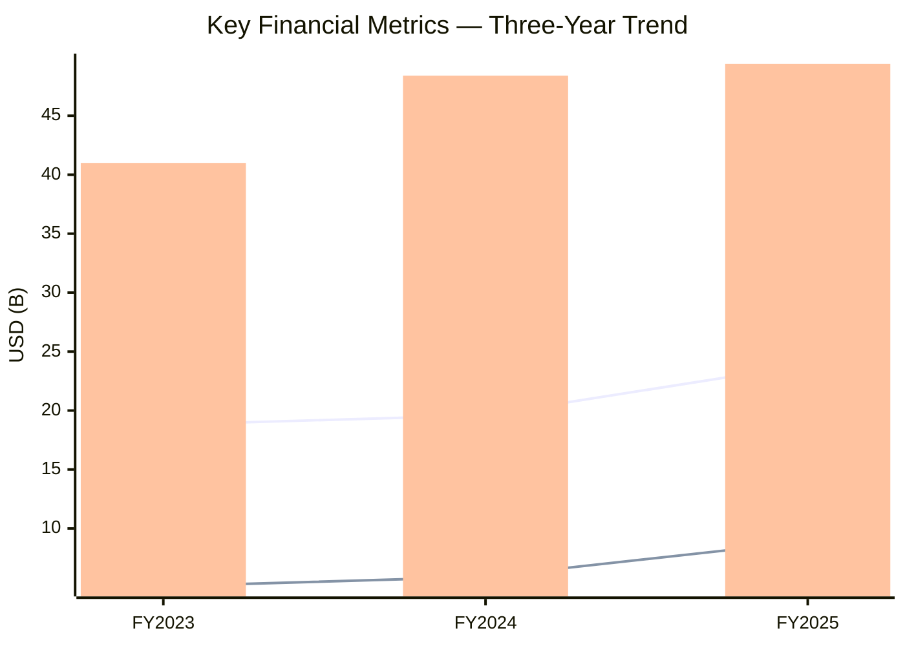
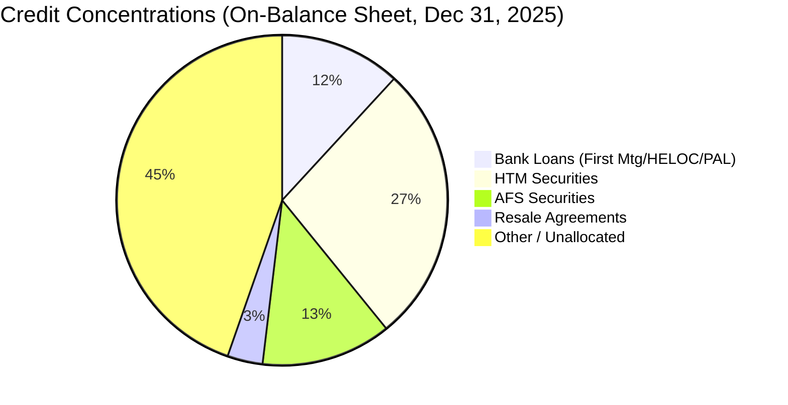
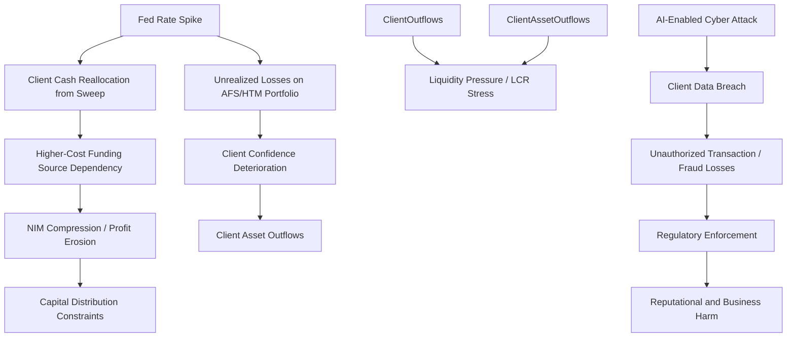

# Enterprise Risk Management Report: The Charles Schwab Corporation

**Ticker:** SCHW | **CIK:** 0000316709 | **NYSE**
**Reporting Period:** Fiscal Year Ended December 31, 2025
**10-K Accession:** 0000316709-26-000009 | **Auditor:** Deloitte & Touche LLP
**Report Generation Date:** June 5, 2026

---

## Executive Summary

The Charles Schwab Corporation (CSC) is a savings and loan holding company operating as a Category III banking organization with $491.0 billion in total consolidated assets, $23.9 billion in FY2025 total net revenues (up 22.0% year-over-year), and $8.9 billion in FY2025 net income [^1][^3]. At December 31, 2025, Schwab served 38.5 million active brokerage accounts, 5.7 million workplace plan participant accounts, and 2.2 million banking accounts, with client assets reaching $11.90 trillion [^1]. The firm is regulated primarily by the Federal Reserve as a Financial Holding Company, with its three depository institution subsidiaries subject to the OCC, FDIC, CFPB, and state regulators [^1].

The most significant risks identified in the FY2025 Form 10-K are concentrated in three interconnected domains: interest rate and client cash allocation volatility; credit exposures from margin lending, mortgage portfolios, and securities-based lending; and cybersecurity threats amplified by artificial-intelligence-enabled fraud techniques [^2]. Compliance and regulatory capital risks remain elevated given the pending proposal to include accumulated other comprehensive income (AOCI) in regulatory capital calculations, which would likely trigger Category II requirements once total consolidated assets reach $700 billion [^1]. Digital asset expansion and the pending Forge Global acquisition introduce additional strategic integration risk [^2]. The firm's Risk Committee (chaired by Marianne C. Brown) held six meetings in 2025, reflecting active board-level oversight of these material exposures [^4].

---

## 1. Business & Industry Context

### 1.1 Company Overview

The Charles Schwab Corporation is a savings and loan holding company headquartered in Westlake, Texas, that provides wealth management, securities brokerage, banking, asset management, custody, and financial advisory services [^1]. At December 31, 2025, the firm employed approximately 33,000 full-time equivalent employees across two primary segments: Investor Services (retail brokerage, workplace services, and mutual fund clearing) and Advisor Services (custodial, trading, and banking services to independent registered investment advisors) [^1]. CSC elected Financial Holding Company status with the Federal Reserve, which permits broader financial activities but conditions that status on maintaining "well-capitalized" and "well-managed" ratings [^1]. The three banking subsidiaries—Charles Schwab Bank, SSB (principal), Charles Schwab Premier Bank, SSB, and Charles Schwab Trust Bank—together hold $255.7 billion in client deposits and are regulated by the Federal Reserve, FDIC, and CFPB [^1].

### 1.2 Industry & Competitive Position

Schwab operates in the **Security Brokers, Dealers & Flotation Companies** industry (SIC 6211) within the Financial Services sector, competing across brokerage, wealth management, asset management, and banking channels against large integrated banks, wirehouses, regional broker-dealers, fintech custodians, and trust companies [^1]. Management estimates that investable wealth in the United States currently exceeds $80 trillion, and Schwab's $11.90 trillion in client assets at year-end 2025 represents substantial room for continued growth [^1].

The firm's five key competitive advantages are scale and size, operating efficiency through infrastructure sharing, its integrated bank-wealth-asset-management operating structure, brand and corporate reputation in a trust-dependent industry, and a willingness to disrupt longstanding industry practices on behalf of clients [^1].

---

## 2. Enterprise Risk Framework & Governance

### 2.1 ERM Framework

Schwab operates under a regulatory capital framework derived from the **Basel III standardized approach** for Category III banking organizations. The firm explicitly invokes the Federal Reserve's **Comprehensive Capital Analysis and Review (CCAR)** process, requiring annual capital plan submissions over a nine-quarter horizon, and is subject to the **stress capital buffer (SCB)** requirement, which applies to risk-based capital ratios (Common Equity Tier 1, Tier 1 Capital, and Total Capital) [^1]. As of October 1, 2025, the SCB was set at the 2.5% minimum floor, unchanged from the prior year [^1]. Category III organizations are not subject to the "advanced approaches" framework and are permitted to exclude most components of AOCI from regulatory capital calculations; Schwab made this opt-out election [^1].

Schwab's risk management governance is further shaped by the **Dodd-Frank Act enhanced prudential standards**, including risk management and risk committee requirements, liquidity risk management and stress testing, and single counterparty credit limits [^1]. Disclosure controls and procedures were evaluated as effective as of December 31, 2025, and no material changes in internal control over financial reporting were identified during the quarter [^5].

### 2.2 Governance Structure

Schwab's board risk oversight is carried out through four standing committees, each chaired by an independent director [^4]. The **Risk Committee** held six meetings in 2025 and is chaired by **Marianne C. Brown**, with members Christopher V. Dodds, Arun Sarin, and Carolyn Schwab-Pomerantz [^4]. The Audit Committee (chaired by John K. Adams, Jr.) held 13 meetings in 2025; the Compensation Committee (chaired by Paula A. Sneed) held six; and the Nominating and Corporate Governance Committee (chaired by Frank C. Herringer) held six [^4].

#### 2.2.1 Risk Governance Comparison

| Governance Element | Schwab | JPMorgan Chase | Bank of America | Wells Fargo |
|---|---|---|---|---|
| Dedicated Board Risk Committee | Risk Committee (6 meetings/yr) | Risk Committee | Risk Committee | Risk Committee |
| Committee Chair | Marianne C. Brown | (Per proxy) | (Per proxy) | (Per proxy) |
| CISO / CTODO reporting to Risk Committee | Yes (CISO → CTODO) | (Per proxy) | (Per proxy) | (Per proxy) |
| CCAR Participation | Annual (Category III) | Annual (Category II) | Annual (Category II) | Annual |
| AOCI Opt-Out Election | Yes (Category III) | No (Category II) | No (Category II) | No (Category II) |
| SCB Floor | 2.5% | (Per FRB) | (Per proxy) | (Per proxy) |
| LCR Disclosure | Quarterly | (Per FRB) | (Per proxy) | (Per proxy) |

> Full governance comparison: `./artifacts/peer_comparison.csv`

*Note: Peer governance data for JPMorgan Chase, Bank of America, and Wells Fargo requires retrieval of their respective DEF 14A filings; table summarizes SCHW data and placeholders for peers.* [^4]

The firm's corporate cybersecurity program is led by the **Chief Information Security Officer (CISO)**, who reports to the **Chief Technology, Operations and Data Officer (CTODO)**. The CISO and CTODO regularly review the cybersecurity program with management-level risk committees and the Risk Committee, with a process in place for timely escalation of significant risk events to senior management and the board [^4]. The full proxy governance data does not explicitly identify a discrete "Chief Risk Officer" title; the role appears functionally distributed across the CISO/CTODO reporting line and the board Risk Committee structure [^4].

```mermaid
flowchart LR
    Board[Board of Directors] --> RC[Risk Committee<br/>(Marianne C. Brown, Chair)]
    RC --> CISO[Chief Information Security Officer]
    CISO --> CTODO[Chief Technology, Operations<br/>& Data Officer]
    CTODO --> RM[Risk Committees (Mgmt Level)]
    RM --> OB[Business Operations]
    OB --> IC[Internal Controls]
    IC --> IA[Internal Audit]
    IA --> RC
```

*Caption: Schwab governance risk map showing board-to-operations oversight flow, with the Risk Committee at the apex of oversight and the CISO/CTODO as primary operational risk escalation points, grounded in the 2026 Proxy Statement.* [^4]

### 2.3 Regulatory Capital & Compliance Posture

As a Category III banking organization with $491.0 billion in total consolidated assets (below the $700 billion Category II threshold), Schwab is subject to the standardized approach risk-based capital framework, a 3.0% supplementary leverage ratio, the stress capital buffer (currently at the 2.5% floor), the LCR (100% HQLA to stressed net cash outflows), and the NSFR (100% available stable funding to required stable funding) [^1]. The company received results of the Federal Reserve's 2025 CCAR supervisory stress test in June 2025, with no required adjustment to the 2.5% SCB [^1]. If CSC's average total consolidated assets reach $700 billion or cross-jurisdictional activity reaches $75 billion in four consecutive calendar quarters, the firm would move to Category II with additional requirements including annual stress testing, the advanced approaches framework, and loss of the AOCI opt-out [^1]. Schwab is also subject to the **Market Risk Rule** due to its trading activities, requiring adjustments to risk-weighted assets and regular public quantitative and qualitative disclosures [^1].

---

## 3. Principal Risk Factors

The following risk factor register covers all material risk categories extracted from Item 1A of the FY2025 Form 10-K. The full register is available at `./artifacts/risk_register.csv` [^2].

### 3.1 Economic and Market Risks

Schwab's operating results are highly sensitive to the macroeconomic environment, Federal Reserve monetary policy, and securities market conditions. "Developments in the business, economic, and geopolitical environment could negatively impact our business" [^2], with deterioration in housing and credit markets and decreases in securities valuations directly impairing results and capital resources. The Federal Reserve's target funds rate and balance sheet management decisions affect net interest revenue, bank deposit account fees, market values of investment securities, and client cash allocation behavior [^2]. Rapid interest rate increases in 2022 and 2023 caused a significant decrease in clients' allocation to sweep cash and generated increased unrealized losses on the investment securities portfolio [^2].

**Key sub-factors:** macroeconomic/geopolitical deterioration; Federal Reserve monetary policy; client cash reallocation; interest rate changes on NIM and AFS/HTM portfolio values; counterparty credit concerns in the financial services industry; FDIC special assessments following bank failures.

### 3.2 Liquidity Risk

"A significant decrease in our liquidity could negatively affect our business as well as reduce client confidence in us" [^2]. Schwab meets liquidity needs primarily from working capital and client cash-generated operating cash, but sudden client reallocations from sweep cash to higher-yielding investments—as experienced in 2022 and 2023—can require reliance on higher-cost funding sources. Clearing house margin requirements may fluctuate significantly based on clients' trading activity and market volatility, and downgrades to the company's credit ratings could increase borrowing costs and restrict capital market access [^2]. Regulatory constraints — including the LCR requirement to maintain sufficient HQLA to cover 100% of stressed net cash outflows — further define liquidity risk parameters [^1].

**Key sub-factors:** client cash/deposit balance volatility; clearing house margin calls; external financing availability; credit rating downgrade risk; restriction on dividends or upstream funds from subsidiaries.

### 3.3 Operational Risk (Cybersecurity, Technology, Fraud)

**Cybersecurity** — "Our systems and those of other financial institutions, as well as those of our third-party service providers, have been and will continue to be the frequent target of cyber attacks, malicious code, computer viruses, ransomware, and denial of service attacks" [^2]. The increasing sophistication of artificial intelligence in enabling organized crime, hacktivism, and foreign state actor attacks represents an emerging threat vector. A cyberattack could persist before detection, and the investigation period may extend significantly before the full extent of harm is known [^2].

**Technology/Operational Failures** — System interruptions can arise from human error, execution errors, model error, employee misconduct, unauthorized trading, natural disasters, power outages, and third-party vendor failures. Cloud service disruptions have previously hindered clients' access to Schwab platforms [^2].

**Fraud** — "Increasing sophistication in artificial intelligence and broad public availability of such technologies... has resulted in increased risk of external fraud by enhanced or novel techniques, including those involving impersonation" [^2]. Losses reimbursed to clients under the guarantee against unauthorized activity could materially affect financial results.

**Key sub-factors:** cyber attack/data breach; AI-enabled fraud; operational vendor failure; model and quantitative errors; staffing shortages; catastrophic event disruption.

### 3.4 Credit Risk

"We may suffer significant losses from our credit exposures" [^2]. Primary credit exposure originates from margin lending, client options and futures positions, securities lending, First Mortgages, HELOCs, pledged asset lines, and counterparty risk in financial contracts. The margin lending business has grown materially, increasing exposure to abrupt securities valuation changes and liquidity constraints [^2]. The bank loan portfolio is primarily concentrated in residential real estate (First Mortgages, HELOCs, and PALs originated principally through Rocket Mortgage) [^6]. Heightened exposures to single-name or sector concentrations — including mortgage loans in the same geographic region — amplify credit risk [^2].

**Key sub-factors:** margin lending defaults; mortgage and PAL credit quality deterioration; securities lending counterparty risk; proprietary fund support obligations; concentration in residential real estate.

### 3.5 Compliance and Regulatory Risk

"As a participant in the securities, banking, and financial services industries, we are subject to extensive regulation under federal, state, and foreign laws" [^2]. Regulatory costs are increasing, and scrutiny grows with firm scale. Proposed rules from July 2023 would require inclusion of AOCI in regulatory capital and minimum long-term debt requirements at CSC and its banking subsidiaries [^1]. New legislation affecting money market funds, standards of conduct, digital assets, CRA, equity market structure, and client privacy could directly constrain operations and profitability [^2]. The FDIC's brokered deposits rule and the Deposit Insurance Fund special assessment (November 2023) have already increased costs [^1].

**Key sub-factors:** AOCI inclusion proposed rule; long-term debt requirements; money market fund and mutual fund regulation; digital asset regulatory uncertainty; CRA compliance; FDIC premium increases.

### 3.6 Strategic, Litigation, and Other Risks

**Strategic transaction risk** — The pending $660 million acquisition of Forge Global Holdings (expected to close in March 2026) introduces integration, liability assumption, and dilution risk [^1][^2].

**Digital assets** — Expanded cryptocurrency client trading anticipated in 2026 exposes Schwab to custody, settlement, liquidity, fraud, and regulatory uncertainty. "The loss, theft, compromise, or destruction of private keys could result in the permanent loss of digital assets with no practical means of recovery" [^2].

**Litigation** — Schwab is subject to claims, class actions, regulatory inquiries, and proceedings in the ordinary course of business, with damages that can be substantial or unspecified [^2]. The currently material proceeding is the Corrente Antitrust Litigation, which settled on class basis in November 2025 but is on appeal to the Fifth Circuit [^7].

---

## 4. Financial & Credit Risk Profile

### 4.1 Financial Performance — Three-Year Trend

The FY2025 financial statements confirm a strong recovery and expansion through FY2025 driven by higher net interest revenue and noninterest income, offsetting elevated expenses. Full data is available at `./artifacts/financial_indicators.csv` [^3].

| Metric | FY2025 | FY2024 | FY2023 | YoY Change |
|---|---:|---:|---:|---:|
| Total Net Revenues ($M) | 23,921 | 19,606 | 18,837 | +22.0% |
| Net Interest Revenue ($M) | 11,750 | 9,144 | 9,427 | +28.5% |
| Noninterest Revenue ($M) | 12,271 | 10,462 | 9,410 | +17.3% |
| Total Expenses Excl. Interest ($M) | 12,462 | 11,914 | 12,459 | +4.6% |
| Net Income ($M) | 8,852 | 5,942 | 5,067 | +48.9% |
| Net Income Available to Common ($M) | 8,417 | 5,478 | 4,649 | +53.6% |
| Diluted EPS ($) | 4.65 | 2.99 | 2.54 | +55.5% |
| Total Assets ($B) | 491.0 | 479.8 | 493.2 | +2.3% |
| Stockholders' Equity ($B) | 49.4 | 48.4 | 41.0 | +2.0% |
| Profit Margin (derived) | 37.0% | 30.3% | 26.9% | — |
| ROE (derived) | 17.9% | 12.3% | 12.4% | — |
| Efficiency Ratio (derived) | 52.1% | 60.8% | 66.1% | — |

> Full data: `./artifacts/financial_indicators.csv` [^3]



*Caption: Revenue, net income (bars), and stockholders' equity over FY2023–FY2025, sourced directly from the 10-K consolidated financial statements, showing recovery and accelerating growth from 2024 to 2025.* [^3]

The revenue and income trajectory reflects a combination of higher short-term interest rates driving increased NII (from $9.4B in FY2023 to $11.8B in FY2025), robust noninterest revenue growth in asset management fees (from $4.8B to $6.5B), and trading revenue expansion (from $3.2B to $3.9B) [^1]. The efficiency ratio improvement—from 66.1% in FY2023 to 52.1% in FY2025—demonstrates positive operating leverage as revenue growth outpaced expense growth [^3].

The rapid increases in market interest rates experienced in 2022 and 2023 contributed to substantial unrealized losses on investment securities portfolios [^2]; those losses have partially recovered as the balance sheet reflects $62.4 billion in AFS securities and $134.0 billion in HTM securities at December 31, 2025 [^1].

### 4.2 Credit Concentrations

Schwab's credit risk portfolio is dominated by bank loans (First Mortgages, HELOCs, PALs totaling $57.955 billion at December 31, 2025, up from $45.2 billion), margin lending activities, and securities-based transactions [^1][^6]. The credit risk note (Note 17) further describes $16.9 billion in resale agreements, $25.1 billion in securities loaned, and $1.3 billion in repurchase agreements as of year-end 2025 [^6].

> Full credit concentrations data: `./artifacts/credit_concentrations.csv` [^6]



*Caption: Top balance-sheet credit-concentration buckets at December 31, 2025, dominated by securities portfolios and bank residential loans, based on 10-K Note 17 (off-balance-sheet credit risk) and the balance sheet.* [^6]

The bank loan portfolio is subject to three pandemic-era FDIC special assessment charges, with the final assessment collected through 2026. CSB purchased $6.7 billion in First Mortgages through the Rocket Mortgage co-branded program in FY2025, compared with $4.2 billion in FY2024, with HELOC commitments of $231 million [^6]. Committed but unused HELOC and line-of-credit facilities totaled $1,793 million as of December 31, 2025 [^6].

### 4.3 Allowance for Credit Losses

The allowance for credit losses methodology covers bank loans under ASC 326 and lending-related commitments. Note 7 details the composition of bank loans by portfolio segment and delinquency analysis [^6]. The allowance for loan losses and allowance for lending-related commitments are combined to form the total allowance for credit losses (ACL). The 10-K states that increases in delinquency and default rates, housing and stock price declines, unemployment increases, and other economic factors can result in higher allowances [^2]. The specific period-end ACL balance was not retrievable from the raw note extract; the full Note 7 text from the SEC filing should be consulted for the ACL roll-forward [^6].

---

## 5. Operational, Cyber & Litigation Risk

### 5.1 Cybersecurity & Third-Party Risk

Schwab discloses significant cybersecurity risk exposure in Item 1A, noting that "the use of artificial intelligence technologies" is increasing the sophistication of attacks by organized crime, activists, state actors, and hackers [^2]. The 10-K states that cloud technologies are critical to Schwab's operations and that the firm has experienced—and could again experience—cloud service disruptions, including broad-reaching platform outages that hindered client access [^2].

The firm maintains a Ring structure for cyber risk escalation from the CISO through the CTODO to management-level risk committees and the board Risk Committee [^4]. Schwab's 2026 Proxy Statement includes insider trading policy and cybersecurity program disclosures but does not separately reference NIST CSF adoption or a standalone cyber risk committee [^4]. No 8-K cybersecurity incident filings were found within the 6-month retroactive search window; the three EDGAR full-text search results for "cybersecurity" in 8-K filings pre-date 2020 [^7].

### 5.2 Litigation & Contingencies

The material proceeding disclosed by Schwab is the **Corrente Antitrust Litigation**, filed in the U.S. District Court for the Eastern District of Texas on June 6, 2022, alleging that CSC's acquisition of TD Ameritrade violated Section 7 of the Clayton Act by anticompetitively affecting the retail order execution market [^7]. The court denied a motion to dismiss; the parties agreed to a class settlement in December 2024 that was finally approved on November 24, 2025, with certain objectors appealing to the Fifth Circuit [^7]. The settlement involves no material monetary payment to plaintiffs—immaterial attorneys' fees and certain non-monetary undertakings [^7].

Schwab's contingency disclosure language establishes reserves as matters progress [^7]: "Schwab believes it has strong defenses in all significant matters currently pending and is contesting liability and any damages claimed. Nevertheless, some of these matters may result in adverse judgments or awards" [^7]. For all non-material pending matters, based on consultation with counsel, it does not appear reasonably possible that the outcome would be material to the financial condition, operating results, or cash flows [^7].

No litigation expenses are separately itemized in the extracted income statement; they are embedded within Other expenses and Professional services line items [^1].

### 5.3 Model & Data Risk

Item 1A explicitly identifies "errors in the design, function, or underlying assumptions used in these models and tools, particularly if we fail to detect the errors over an extended period" as a risk that "could subject us to claims of a breach of fiduciary duty and potentially large liabilities for make-whole payments, litigation, and/or regulatory fines" [^2]. This applies to models used in asset management, capital planning, risk management, stress testing, and compliance. No explicit model governance framework name (e.g., SR 11-7 or OCC 2011-12) is cited verbatim in the extracted risk factors.

---

## 6. Macroeconomic Shocks & Interconnections

### 6.1 Key Macro Risk Drivers

The macro environment most acutely affecting Schwab centers on the **Federal Reserve interest rate path**, which directly determines NIM, AFS/HTM portfolio valuation, and client cash allocation behavior [^2]. A second critical driver is **broader financial market stress** — concerns regarding the soundness of other financial institutions can reduce liquidity availability, increase borrowing costs, and prompt adverse regulatory responses, including higher FDIC premiums and special assessments [^2]. **Geopolitical developments** constitute a further risk vector through their impact on securities markets and client sentiment, while **commercial real estate stress** — indirect given Schwab's focus on residential first mortgages — could emerge through housing price declines and unemployment affecting mortgage default rates [^2].

### 6.2 Risk Cascade Map



*Caption: Two primary risk cascades—(1) Federal Reserve rate-driven cash reallocation through NIM compression to capital constraints, and (2) AI-enabled cyber attack through data breach to regulatory and reputational damage—illustrating interconnected pathways from the Item 1A risk factor taxonomy.* [^2]

**Cascade Narrative 1 — Rate Spike → Cash Reallocation:** When short-term interest rates rapidly increase—as occurred in 2022 and 2023—clients reallocate from sweep cash into higher-yielding alternatives. When outflow volumes outpace excess cash and portfolio maturities, Schwab must rely on higher-cost funding sources, compressing the NIM and negatively impacting net income [^2]. This dynamic pressures the firm's profitability and can trigger concerns about capital adequacy and LCR compliance, potentially reducing confidence among clients and investors [^1].

**Cascade Narrative 2 — Cyber Attack → Regulatory and Reputational Harm:** A successful AI-assisted cyber attack could result in unauthorized access to client accounts, data theft, and system unavailability. Losses reimbursed under the fraud guarantee, coupled with regulatory enforcement actions and adverse media coverage, could impair client acquisition and retention, worsen the capital position, and elevate the firm's risk profile in ways that constrain future growth [^2].

---

## 7. Emerging Risk Scenarios

### Scenario 1: Geopolitical Trade Shock — Escalating Tariffs

**Trigger:** A U.S. administration imposes broad-based tariffs on a major trading partner, causing equity markets to reprice and the Federal Reserve to face conflicting pressures between inflation and growth.

**Mechanism:** Equity market declines reduce client asset valuations, lowering asset management fee revenues and reducing willingness to engage in margin lending. Declining security prices increase the risk that margin and securities-based lending clients face margin calls they cannot meet, elevating provisions for credit losses. Simultaneously, widening credit spreads could impair unrealized gains in the AFS portfolio and push unrealized losses higher [^2]. A repositioning of client allocations away from risky assets and into cash—while seemingly supportive of the sweep business—would create pressure on the IDA agreement, which is subject to minimum and maximum balance constraints ($60 billion minimum / $90 billion maximum post-September 2025) with associated nonperformance payment obligations if minimums are breached [^6].

**Impact:** Schwab's $134.0 billion HTM and $62.4 billion AFS securities portfolios would face mark-to-market pressure; client assets of $11.90 trillion declined materially would compress fee revenues. Forced asset sales could crystallize losses. Margin book stress could trigger provisions beyond current reserves.

**Source anchors:** [^1], [^2], [^6]

---

### Scenario 2: AI-Powered Fraud and Social Engineering Campaigns

**Trigger:** Widespread deployment of AI-enabled deepfake and generative AI tools lowers the threshold for large-scale, credential-targeted social engineering attacks.

**Mechanism:** Schwab's risk factors explicitly acknowledge that "the increased sophistication of artificial intelligence... has resulted in increased risk of external fraud by enhanced or novel techniques, including those involving impersonation" [^2]. A coordinated AI-driven campaign could bypass existing client authentication controls and facilitate unauthorized trading or wire transfers at scale. The firm's guarantee against unauthorized account activity would obligate it to reimburse affected clients. Regulatory enforcement would likely follow, potentially imposing civil money penalties or consent order requirements.

**Impact:** With 38.5 million active brokerage accounts, even fraud penetration at sub-1% could generate material losses. Net income of $8.9 billion in FY2025 provides some absorption capacity, but reputational damage and resulting client attrition could have longer-tail earnings consequences.

**Source anchors:** [^2], [^4]

---

### Scenario 3: Category II Regulatory Threshold Breached

**Trigger:** CSC's average total consolidated assets or average cross-jurisdictional activity cross the Category II threshold ($700 billion assets / $75 billion cross-jurisdictional activity) over four consecutive calendar quarters.

**Mechanism:** As of December 31, 2025, CSC had approximately $491 billion in consolidated assets and $31 billion in cross-jurisdictional activity [^1]. Crossing to Category II would eliminate the AOCI opt-out, mandate the advanced approaches framework for risk-based capital calculations, impose annual supervisory stress testing, and add long-term debt requirements—all of which would likely raise capital costs. The AOCI inclusion would immediately reclassify the $11.0 billion accumulated other comprehensive loss into regulatory capital, reducing capital ratios [^1]. Simultaneously, the pending 2023 joint agency rulemaking on AOCI inclusion would be finalized, compounding the regulatory burden.

**Impact:** Capital ratio compression would reduce headroom for capital distributions (dividends, share repurchases), potentially triggering restrictions under the CCAR framework. Issuance of additional common stock to rebuild ratios would be dilutive to existing shareholders.

**Source anchors:** [^1], [^2]

---

| Scenario | Trigger | Primary Risk Channel | Severity | Source |
|---|---|---|---|---|
| S1: Geopolitical Tariff Shock | Escalating tariffs, equity re-pricing | Market → Credit → Earnings | High | [^1][^2][^6] |
| S2: AI Fraud Campaign | Generative AI social engineering at scale | Cyber → Operational → Reputational | High | [^2][^4] |
| S3: Category II Capital Threshold | Asset growth to $700B+ | Regulatory → Capital → Earnings | Medium | [^1][^2] |

> Full scenario register: `./artifacts/scenario_synthesis.csv`

---

## 8. Market & Ownership Snapshot

As of the data extraction date (June 5, 2026), The Charles Schwab Corporation trades on the **NYSE** at **$88.00** per share, representing a 52-week range of $83.96 to $107.50 [^8]. The stock has declined 18.4% from its 52-week high and carries a market capitalization of approximately **$153.0 billion** [^8]. The trailing P/E ratio is **17.5x** and the price-to-book ratio is **3.60x**; the dividend yield is 1.48% with a forward dividend rate of $1.28 per share [^8]. The beta is 0.797, indicating lower systematic risk than the broader market [^8].

Institutional ownership represents approximately 84.2% of shares outstanding [^8]. The top five institutional holders are:

| Rank | Holder | Shares Held | % Ownership | QoQ Change |
|---|---|---:|---:|---:|
| 1 | BlackRock Inc. | 133,156,556 | 7.66% | −0.75% |
| 2 | Vanguard Capital Management LLC | 108,353,995 | 6.23% | +1.00% |
| 3 | Dodge & Cox Inc. | 75,002,881 | 4.31% | −1.97% |
| 4 | JPMorgan Chase & Co. | 73,848,142 | 4.25% | +9.91% |
| 5 | State Street Corporation | 72,763,682 | 4.18% | +0.19% |

*Source: Yahoo Finance Institutional Holders, as of March 31, 2026.* [^8]

The largest five holders collectively control approximately 26.6% of outstanding shares, reflecting moderate-to-high ownership concentration among passive investment managers. JPMorgan Chase's significant quarter-over-quarter increase (+9.91%) warrants monitoring for strategic accumulation.

**Peer Comparison** (FY2025 full-year figures):

| Company | Revenue ($B) | Net Income ($B) | Total Assets ($B) | ROE | Profit Margin |
|---|---:|---:|---:|---:|---:|
| SCHW | 23.9 | 8.9 | 491.0 | 17.9% | 37.0% |
| JPM | 182.4 | 57.0 | 4,424.9 | 15.8% | 31.3% |
| BAC | 113.1 | 30.5 | 3,411.7 | 10.1% | 27.0% |
| WFC | 85.1 | 21.3 | 2,148.6 | 11.8% | 25.1% |
| GS | — | 17.2 | 1,809.3 | — | — |

> Full peer comparison data: `./artifacts/peer_comparison.csv` [^9]

Schwab's FY2025 ROE of 17.9% and profit margin of 37.0% are the highest among the peer group for which full data is disclosed, reflecting strong revenue growth and operating leverage in a higher-rate environment. Relative to JPMorgan and Bank of America, however, Schwab's asset base and revenue scale are substantially smaller, with a different business model weighted toward wealth management and brokerage rather than universal banking [^9].

---

## 9. Data Gaps & Limitations

Several data items required for a fully comprehensive ERM assessment were either absent from the bulk-fetched raw data or required additional retrieval beyond the data fetcher's extraction scope. The CET1 ratio and total capital ratio—key regulatory capital metrics under the Basel III standardized approach—were not present in the extracted financial notes and require reading Note 23 in the full 10-K filing [^10]. Similarly, the provision for credit losses (PCL) is not itemized in the income statement extract and requires full Note 7 disclosure from the SEC XBRL filing [^10].

The cybersecurity risk management footnote (Note 37 under SEC Cybersecurity Disclosure rules) could not be retrieved from the notes dump; the underlying EDGAR notes search returned no matching note under the heading "Cybersecurity Risk Management and Strategy Disclosure" [^10]. This is a HIGH priority data gap given the mandatory nature of these disclosures for FY2025 and the material AI-driven cyber risk identified in Item 1A.

The identity of the discrete Chief Risk Officer (CRO) is not named in the proxy governance extract; the relevant function appears structurally distributed between the Chief Information Security Officer, the Chief Technology, Operations and Data Officer, and the board Risk Committee [^4][^10]. This should not be confused with the 2025 DEF 14A, which was successfully retrieved and confirms the Risk Committee composition, compensation structure, and stock ownership guidelines [^4].

Finally, Note 15 (Litigation) was referenced in Item 3 as the source for legal proceedings detail, but no litigation note surfaced under a "litigation" search of the notes extract. The Corrente Antitrust Litigation disclosure was recovered from the Item 8 contingent liabilities extract, and all other proceedings are described at a high level without individual case quantification [^7][^10].

> Technical gap trail: `./artifacts/data_gaps.csv`

---

## 10. References

[^1]: The Charles Schwab Corporation. (2026). *Form 10-K for the Fiscal Year Ended December 31, 2025* (Accession No. 0000316709-26-000009). U.S. Securities and Exchange Commission. Item 1: Business and Supervision and Regulation.

[^2]: The Charles Schwab Corporation. (2026). *Form 10-K, Item 1A — Risk Factors*.

[^3]: The Charles Schwab Corporation. (2026). *Form 10-K, Item 8 — Financial Statements and Supplementary Data* (Consolidated Statement of Income).

[^4]: The Charles Schwab Corporation. (2026). *Schedule 14A (Proxy Statement)* (Accession No. 0001193125-26-142826). U.S. Securities and Exchange Commission.

[^5]: The Charles Schwab Corporation. (2026). *Form 10-K, Item 9A — Controls and Procedures*.

[^6]: The Charles Schwab Corporation. (2026). *Form 10-K, Note 17 — Financial Instruments Subject to Off-Balance Sheet Credit Risk*.

[^7]: The Charles Schwab Corporation. (2026). *Form 10-K, Item 8 — Commitments and Contingencies (Legal)*.

[^8]: Yahoo Finance. (2026, June 4). *The Charles Schwab Corporation (SCHW) — Market Data, Institutional Holders*. Retrieved from Yahoo Finance.

[^9]: U.S. Securities and Exchange Commission EDGAR. (2026). Peer comparison: JPMorgan Chase & Co., Bank of America Corp., Wells Fargo & Co., Goldman Sachs Group Inc. — retrieved via edgartools_edgar_compare, Annual FY2025.

[^10]: Data retrieval technical log. See `./artifacts/data_gaps.csv` for retrieval attempts and fill status.

---

## Appendix: Structured Data Artifacts

All structured data artifacts for this report are stored in `./dist/SCHW/artifacts/`.

| Artifact | Path |
|---|---|
| Risk Factor Register | `./artifacts/risk_register.csv` |
| Financial Indicators (3-Year) | `./artifacts/financial_indicators.csv` |
| Credit Concentrations | `./artifacts/credit_concentrations.csv` |
| Peer Comparison | `./artifacts/peer_comparison.csv` |
| Scenario Synthesis | `./artifacts/scenario_synthesis.csv` |
| Data Gaps (Technical Audit Trail) | `./artifacts/data_gaps.csv` |
