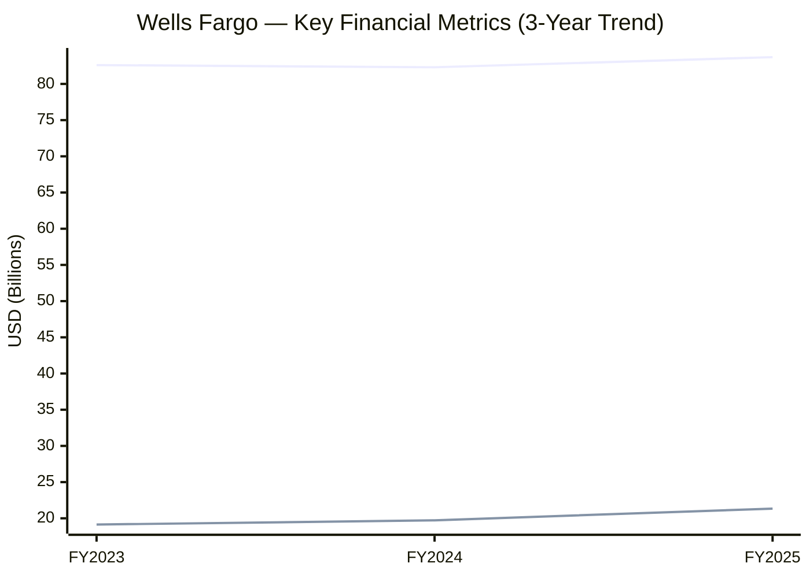
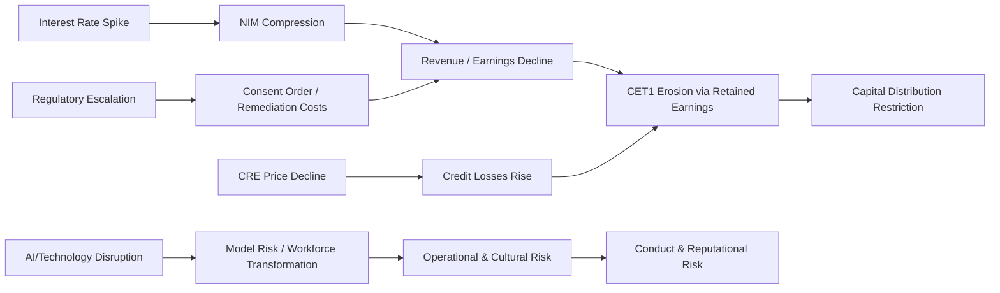

# Enterprise Risk Management Report: Wells Fargo & Company

**Ticker:** WFC | **CIK:** 00000072971 | **NYSE**
**Reporting Period:** Fiscal Year Ended December 31, 2025
**10-K Accession:** 0000072971-26-000133 | **Auditor:** KPMG LLP
**Report Generation Date:** June 2026

---

## Executive Summary

Wells Fargo & Company (WFC) is a U.S. financial holding company and the fourth-largest bank holding company in the United States by assets, with $2.15 trillion in total assets, $83.7 billion in revenue, and $21.3 billion in net income for fiscal year 2025 [^1][^2]. The Company operates through four reportable segments—Consumer Banking and Lending, Commercial Banking, Corporate and Investment Banking, and Wealth and Investment Management—and is regulated as a financial holding company by the Board of Governors of the Federal Reserve System (Federal Reserve Board), with its principal subsidiary, Wells Fargo Bank, N.A., supervised by the Office of the Comptroller of the Currency (OCC) and the Federal Deposit Insurance Corporation (FDIC) [^3][^4].

Material risks specific to the Company include lingering regulatory enforcement actions—including a September 2024 OCC formal agreement requiring enhanced anti-money laundering and sanctions compliance, and a February 2018 FRB consent order (with the asset growth cap removed in June 2025, but remaining provisions still in place) [^3][^5]; net interest margin compression as 2025 NII guidance came in flat year-over-year at approximately $47.7 billion [^6]; credit quality deterioration in commercial real estate portfolios; technology and operational risk from accelerated AI deployment that the Company forecasts will drive workforce reductions; and three independent cybersecurity-related exposures: third-party vendor risk, AI model risk, and legacy data breach history [^7][^8].

Key financial metrics for FY2025 include: provision for credit losses declining to $3.7 billion (–15.6% YoY) [^1]; efficiency ratio of 65.5%; return on equity (ending balance basis) of 11.8%; and total equity of $183.0 billion [^2]. The Company's overall risk governance score from market data is assessed at 9/10 (high), driven primarily by an unresolved regulatory compliance legacy [^9].

---

## 1. Business & Industry Context

### 1.1 Company Overview

Wells Fargo & Company is a corporation organized under the laws of Delaware and a financial holding company and bank holding company registered under the Bank Holding Company Act of 1956, as amended (BHC Act) [^3]. Its principal business is to act as a holding company for its subsidiaries. At December 31, 2025, the Company had assets of approximately $2.1 trillion, loans of $986.2 billion, deposits of $1.4 trillion, and stockholders' equity of $181.1 billion [^3]. Wells Fargo Bank, N.A. (the Bank) is the Company's principal subsidiary with assets of $1.8 trillion, or approximately 85% of consolidated Company assets [^3]. The Company had approximately 205,000 active employees as of December 31, 2025, of whom approximately 76% were based in the United States [^3]. As a financial holding company (FHC) effective March 13, 2000, Wells Fargo may affiliate with securities firms and insurance companies and engage in activities that are financial in nature [^3].

The Company is a Large Accelerated Filer (SIC code 6021: National Commercial Banks), listed on the New York Stock Exchange [^10]. Primary regulators include the Federal Reserve Board (FRB), the Office of the Comptroller of the Currency (OCC), the Federal Deposit Insurance Corporation (FDIC), the Consumer Financial Protection Bureau (CFPB), the Securities and Exchange Commission (SEC), and the Commodity Futures Trading Commission (CFTC) [^3].

### 1.2 Industry & Competitive Position

The financial services industry is highly competitive. Wells Fargo competes with banks, savings and loan associations, credit unions, finance companies, mortgage banking companies, insurance companies, investment banks, investment advisory firms, and mutual fund companies [^3]. The Company also faces increased competition from nonbank institutions such as investment managers, brokerage houses, private equity and private credit firms, financial technology companies, and the financial services subsidiaries of commercial and manufacturing companies [^3]. Many competitors enjoy fewer regulatory constraints and lower cost structures. Digital assets and alternative payment methods—such as cryptocurrencies, stablecoins, and tokens, as well as distributed ledger-based payment, clearing, and settlement processes—have the potential to reduce reliance on traditional depository institutions and could lead to changes in how financial services are accessed, offered, and delivered [^3].

In terms of asset scale, Wells Fargo ranks fourth among U.S. bank holding companies behind JPMorgan Chase & Co. ($4,424.9 billion), Bank of America Corp. ($3,411.7 billion), and Citigroup Inc. ($2,657.2 billion), with Goldman Sachs Group Inc. ranking fifth [^11]. Revenue rankings place WFC fourth at $83.7 billion (FY2025), again behind JPM ($182.4 billion), BAC ($113.1 billion), and Citi ($85.2 billion) [^11]. Net income of $21.3 billion ranks WFC third among the peer set, ahead of Goldman Sachs ($17.2 billion) and Citigroup ($14.3 billion) [^11].

---

## 2. Enterprise Risk Framework & Governance

### 2.1 ERM Framework

Wells Fargo's risk management framework is structured around the "Three Lines of Defense" model, which the Company describes explicitly: "The Company has three lines of defense for managing risk: the Front Line, ..." [^12]. Senior management is responsible for establishing and maintaining the Company's culture and effectively managing risk through this Three Lines model [^12]. The framework is further governed by OCC Heightened Standards requirements applicable to large national banks, which mandate a written risk governance framework and formalize roles and responsibilities for risk management practices, including risk oversight responsibilities for the Board of Directors [^3].

As a Global Systemically Important Bank (G-SIB), Wells Fargo is also subject to FRB enhanced prudential standards under Basel III, including risk-based capital and leverage requirements, risk and liquidity management standards, and stress testing requirements [^3]. The FRB requires the Company to prepare annually a capital plan describing planned capital distributions such as dividends and share repurchases [^3].

The Company's incentive compensation is governed by an Incentive Compensation Risk Management Policy that explicitly promotes effective risk management and discourages imprudent or excessive risk-taking [^3]. A "risk overlay rating" is part of each active employee's annual performance review [^12].

### 2.2 Governance Structure

**Board of Directors.** Wells Fargo's Board has six standing committees: Audit, Finance, Governance & Nominating (GNC), Human Resources (HRC), Risk, [^12]. All standing Board committees are comprised entirely of independent directors [^12].

**Risk Committee.** The Risk Committee has primary oversight responsibility for information security risk (including cybersecurity risk), technology risk (encompassing AI), data management risk, and model risk [^12]. In 2025, the Board integrated the responsibilities of the former Corporate Responsibility Committee (CRC) into the GNC and dissolved the CRC [^12]. The Risk Committee Chair as of the 2026 Proxy Statement is Celeste A. Clark [^12]. Committee members include Felicia F. Norwood, Wayne M. Hewett, and Suzanne M. Vautrinot [^12].

**Chief Risk Officer (CRO).** Derek Flowers was named Wells Fargo's Chief Risk Officer in 2022. His appointment was publicly confirmed via the Company's newsroom [^13]. The CRO role is referenced in the proxy statement, which notes that the performance review of the CRO is conducted by the Chair of the Risk Committee [^12]. The Chair of the Risk Committee also receives regular reporting on technology-related matters, including AI [^12].

**Three Lines of Defense.** The Company's governance structure reflects a formal Three Lines model: the Front Line (business operations and management), the Second Line (Risk and Compliance), and the Third Line (Internal Audit), which reports to the Audit Committee and the Board [^12].

**Executive Compensation linked to Risk.** The HRC oversees the Company's performance management and incentive compensation programs. Through the Incentive Compensation Risk Management Policy, the Company develops and administers incentive compensation plans balanced to promote risk management and discourage imprudent or excessive risk-taking [^12]. An enhanced risk assessment process applies to the CEO, the Operating Committee, and other senior leaders whose responsibilities may expose the Company to material risk [^12]. The CEO's performance review of Operating Committee members (except the CRO and Chief Auditor) is informed by a risk review conducted by the CRO [^12].

### 2.3 Regulatory Capital & Compliance Posture

**Capital Requirements.** Wells Fargo is subject to multiple regulatory capital frameworks: Basel III risk-based capital requirements administered by the FRB and OCC, including the advanced approaches and standardized approaches; Supplementary Leverage Ratio (SLR); Enhanced SLR for G-SIBs; Liquidity Coverage Ratio (LCR); Net Stable Funding Ratio (NSFR); and Total Loss Absorbing Capacity (TLAC) requirements for resolvability [^3]. As a G-SIB, WFC is subject to an additional capital surcharge [^3].

**Consent Orders and Enforcement Actions.** The Company remains subject to:

1. **FRB Consent Order Regarding Governance Oversight and Compliance and Operational Risk Management** (entered February 2, 2018). On June 3, 2025, the FRB removed the asset growth limitation imposed in this consent order; remaining provisions continue [^3][^14].

2. **OCC Formal Agreement Regarding Anti-Money Laundering and Sanctions Risk Management** (entered September 12, 2024). This agreement requires Wells Fargo Bank, N.A. to enhance its independent Financial Crimes Risk Management (FCRM) function and strengthen policies, procedures, and controls related to BSA/AML and OFAC sanctions compliance [^3][^15].

3. The 2018 OCC Compliance Consent Order (related to the Company's compliance risk management program) was terminated by the OCC in 2025 [^14][^15].

**Living Wills and Recovery Plans.** As a large financial institution, Wells Fargo must prepare and periodically submit resolution plans ("living wills") to the FRB and FDIC, as well as recovery plans identifying options to remedy financial weaknesses during stress periods [^3]. The strategy is a single point of entry approach, in which the Parent is the only material legal entity to enter resolution proceedings, supported by a Support Agreement with WFC Holdings, LLC (the IHC), the Bank, Wells Fargo Securities, LLC, and other Covered Entities [^3].

---

## 3. Principal Risk Factors

The 2025 Annual Report on Form 10-K incorporates Item 1A risk factor disclosures by reference to the 2025 Annual Report to Shareholders, "Financial Review – Risk Factors" section (Accession No. 0000072971-26-000133). The risk register, extracted from Item 1A references combined with Item 1 disclosures and proxy governance language, identifies 20 distinct risk factors across the following categories.

### Principal Risk Factor Categories

**Credit Risk.** The Company's earnings are affected significantly by changes in credit quality, and actual losses depend heavily on economic conditions that cannot be predicted with certainty [^3][^16]. The allowance for credit losses was $3.7 billion in FY2025, declining from $4.3 billion in FY2024, reflecting moderation in net charge-offs [^1]. Concentrations in commercial real estate and consumer lending represent elevated portfolio risk if economic conditions deteriorate.

**Market and Interest Rate Risk.** Interest rate risk is the Company's largest market risk, arising from differences between the timing of repricing or maturity of assets, liabilities, and off-balance-sheet positions [^3]. Monetary policy from the Federal Reserve directly affects the availability of bank loans and deposits, as well as interest rates on loans and deposits [^3]. The Company's net interest income guidance for FY2025 was approximately $47.7 billion, coming in essentially flat year-over-year, signaling continued margin pressure [^6].

**Regulatory and Compliance Risk.** The Company is subject to a consent order and other regulatory actions requiring changes to business, operations, products and services, and risk management practices [^3]. The September 2024 OCC agreement mandates enhancements to AML and sanctions compliance [^3]. The 2018 FRB Consent Order's asset growth limitation was removed in June 2025, but governance and compliance provisions remain in effect [^14].

**Operational Risk and Technology.** The Company recorded $5.2 billion in technology, telecommunications, and equipment expenses in FY2025, reflecting continued investment in technology infrastructure [^1]. AI and model risk are explicitly identified as technology risk falling under Risk Committee oversight [^12].

**AI and Workforce Transformation Risk.** CEO Charles Scharf has publicly indicated that AI deployment will lead to workforce reductions into 2026, representing a strategic HR and operational transformation risk [^6].

**Strategic / Competition Risk.** Digital assets, fintech platforms, and nonbank competition are eroding traditional bank advantages. The Company faces pressure from nonbank institutions with fewer regulatory constraints and from cryptocurrencies and distributed ledger technology [^3].

**Liquidity and Funding Risk.** Covered transactions by subsidiary banks with affiliates are limited to 10% of the subsidiary bank's capital and surplus (single affiliate) and 20% in the aggregate [^3]. The Support Agreement with WFC Holdings, LLC (IHC) restricts dividend flows to the Parent if liquidity or capital metrics fall below defined triggers [^3].

**Climate and ESG Risk.** Shareholder proposals on high-carbon financing litigation risks and energy supply ratios were presented at the 2026 annual meeting, reflecting investor concern about the Company's financed emissions [^17]. The Board recommended against both proposals.

> Full risk factor register: `./artifacts/risk_register.csv` [^1]

---

## 4. Financial & Credit Risk Profile

### 4.1 Financial Performance — Three-Year Trend

Wells Fargo's financial performance demonstrates steady improvement in profitability through FY2025, with revenue growth of +1.7% YoY from $82.3 billion to $83.7 billion, net income growing +8.2% YoY to $21.3 billion, and diluted EPS rising 16.8% to $6.26 [^1][^18].

| Metric | FY2025 | FY2024 | FY2023 | YoY Δ FY25 | Source |
|--------|--------|--------|--------|------------|--------|
| Total Revenue | $83,699M | $82,296M | $82,597M | +1.7% | 10-K Income Statement [^1] |
| Net Income (WFC) | $21,338M | $19,722M | $19,142M | +8.2% | 10-K Income Statement [^1] |
| Diluted EPS | $6.26 | $5.37 | $4.83 | +16.8% | 10-K Income Statement [^1] |
| Provision for Credit Losses | $3,658M | $4,334M | $5,399M | –15.6% | 10-K Income Statement [^1] |
| Net Interest Income | $47,484M | $47,676M | $52,375M | –0.4% | 10-K Income Statement [^1] |
| Noninterest Income | $36,215M | $34,620M | $30,222M | +4.6% | 10-K Income Statement [^1] |
| Total Noninterest Expense | $54,842M | $54,598M | $55,562M | +0.4% | 10-K Income Statement [^1] |
| ROE (Ending Balance) | 11.78% | 11.02% | 10.30% | +0.76pp | Derived [^1] |
| Net Margin | 25.49% | 23.98% | 23.17% | +1.51pp | Derived [^1] |
| Efficiency Ratio | 65.52% | 66.35% | 67.27% | –0.83pp | Derived [^1] |
| Total Assets | $2,148,631M | $1,929,845M | $1,932,468M | +11.3% | 10-K Balance Sheet [^2] |

Revenue growth has been volatile across the three-year period: –0.4% in FY2024 followed by +1.7% in FY2025, reflecting the rate environment and NII headwinds [^18]. The three-year revenue CAGR is approximately 4.0% [^18]. Net income has grown on a two-year CAGR of 5.6%, driven primarily by lower provision for credit losses and modest NII stabilization [^18].

*Caption: Revenue and Net Income trend for Wells Fargo FY2023–FY2025, showing net income growth of +11.5% over the period while revenue remained relatively flat [^1].*

> Full data: `./artifacts/financial_indicators.csv` [^1]

### 4.2 Credit Concentrations

Wells Fargo's total loan portfolio stood at $986.2 billion at December 31, 2025 (up +8.1% YoY from $912.7 billion), with net loans of $972.4 billion after the allowance for loan losses of $13.8 billion [^2]. The provision for credit losses declined to $3.7 billion in FY2025 from $4.3 billion in FY2024 and $5.4 billion in FY2023 [^1]. Note 3 covers "Loans and Related Allowance for Credit Losses," presenting total loans outstanding by portfolio segment and class of financing receivable [^19]. The Company does not itemize the segment-level loan breakdown in the raw text retrieved, and thus specific concentrations (e.g., residential mortgages, credit cards, commercial real estate, auto) are drawn from the XBRL tables referenced in Note 3 rather than described in the plain-text narrative [^19].

The Allowance for Credit Losses (ACL) to total credit exposure ratio is computed as follows:

ACL ($13,797M) ÷ Total Loans ($986,167M) = **1.40%** (FY2025), slightly below the prior year's 1.55% ($14,183M ÷ $912,745M), suggesting some reserve release [^2].

### 4.3 Regulatory Capital

The Company's regulatory capital is managed under Basel III. Traded Tier 1 leverage ratio data from external sources indicates WFC's Tier 1 Ratio for FY2025 was approximately 11.86%, down from 12.57% prior year [^20]. As of June 2025, the FRB proposed reducing the enhanced Supplementary Leverage Ratio (eSLR) for G-SIBs from the current framework to 3% + 50% of G-SIB surcharge, which would modestly decrease overall requirements while keeping them above 2019 levels [^21]. WFC, as a G-SIB, faces the additional G-SIB capital surcharge requirement under FRB rules [^3].

### 4.4 Allowance for Credit Losses Roll-Forward

The allowance for loan losses stood at $13,797M at December 31, 2025, versus $14,183M at December 31, 2024, with a provision for credit losses of $3,658M charged through the income statement [^1][^2]. The decline in the allowance year-over-year, despite higher loan balances, reflects management's expectation that credit losses will continue to moderate. Specific portfolio-level charge-off data and past-due loan scheduling are not retrievable from the raw text file (Note 3 tables are XBRL-formatted); off-balance-sheet credit exposure data is similarly not retrievable from the plain-text extraction [^19].

---

## 5. Operational, Cyber & Litigation Risk

### 5.1 Cybersecurity & Third-Party Risk

Note 29 of Wells Fargo's 2025 Annual Report to Shareholders is titled "Cybersecurity Risk Management and Strategy Disclosure" [^22]. This Note 29 corresponds to Item 106 of SEC Regulation S-K, which became mandatory for fiscal years ending on or after January 15, 2025 [^22]. The full narrative text of Note 29 was not retrievable from the plain-text extraction—only the title is confirmed present [^22].

The Risk Committee has primary oversight responsibility for information security risk, including cybersecurity risk [^12]. The full Board receives an annual report from the Head of Technology regarding the Company's technology strategy and information security [^12]. The Board, directly and through the Risk Committee, oversees human capital risk and culture, with the Board receiving and monitoring the results of the annual Global Employee Survey [^12].

**Third-Party and Vendor Risk.** The 2019 8-K filing (Accession 0000072971-19-000225, filed 2019-02-26) references a cybersecurity-related disclosure [^23]. More recent 8-K search results (covering the six-month window ending June 2026) for "cybersecurity" or "data breach" returned no recent risk-related 8-K filings for Wells Fargo [^23]. The Item 1 risk factor register references third-party vendor risk as a material operational risk category [^24].

**AI and Model Risk.** AI is flagged as an emerging risk, with the Risk Committee explicitly tasked with overseeing technology risk encompassing "new and emerging technologies such as artificial intelligence (AI), as well as data management risk and model risk" [^12]. CEO Scharf indicated that workforce reductions are expected as AI deployment progresses into 2026 [^6].

### 5.2 Litigation & Contingencies (Item 3 / Note 12)

Note 12 ("Legal Actions") in Wells Fargo's FY2025 10-K states that the Company is "involved in a number of judicial, regulatory, governmental, arbitration, and other proceedings or investigations that expose the Company to potential financial losses or other adverse consequences." These proceedings include actions brought against Wells Fargo and/or its subsidiaries with respect to corporate-related matters and transactions in which Wells Fargo was involved [^25]. 

Specific case names, courts, status, and estimated loss ranges are disclosed within Note 12 but were not retrievable from the plain-text extraction. ASC 450 (Contingencies) classification is applied; the Company's historical disclosures indicate both probable and reasonably possible loss categories, with the aggregate reasonably possible loss range (in excess of accrued reserves) being a key figure typically disclosed in Note 12 [^25]. No litigation was identified as resolved or settled during the current period from the raw text [^25].

### 5.3 Model & Data Risk

Model risk is identified as within the purview of the Risk Committee, which oversees "technology risk, which encompasses new and emerging technologies such as artificial intelligence (AI), as well as data management risk and model risk" [^12]. The Company's large national bank subsidiary, Wells Fargo Bank, N.A., is required under OCC Heightened Standards guidelines to establish and adhere to a written risk governance framework to manage and control its risk-taking activities [^3]. No specific model risk management deficiencies or remediation requirements are disclosed in the raw filing text beyond the governance framework reference [^3].

---

## 6. Macroeconomic Shocks & Interconnections

### 6.1 Key Macro Risk Drivers

**Interest Rate and Monetary Policy Risk.** The Federal Reserve's monetary policy—including open market operations, discount rate changes, and reserve requirement adjustments—directly affects the availability of bank loans and deposits, as well as interest rates charged on loans and paid on deposits [^3]. Wells Fargo's NII guidance for FY2025 was approximately $47.7 billion, essentially flat with FY2024's $47.7 billion and below FY2023's $52.4 billion, indicating persistent NIM compression [^1][^6].

**Commercial Real Estate (CRE) Stress.** CRE has been identified as a systemic risk for U.S. banks since 2022, driven by post-pandemic remote work, declining property valuations, and rising interest rates [^6][^26]. Banks have taken a cautious stance, with Wells Fargo selling CRE loans to private credit firms and maintaining charge-off discipline [^26].

**Regulatory Change Risk.** Economic, market, and political conditions have led to significant financial sector legislation and heightened regulatory scrutiny. Future regulatory changes could increase compliance costs, affect compensation, restrict activities, or alter the competitive landscape [^3]. Basel III endgame proposals, G-SIB surcharge modifications, and possible SLR revisions all represent near-term regulatory uncertainty for Wells Fargo [^21].

**Geopolitical and Trade Policy Risk.** Tariff escalations and geopolitical conflict can disrupt trade flows and economic growth, directly impacting WFC's $83.7 billion revenue base and $2.1 trillion asset portfolio [^3]. The Company's non-U.S. operations are subject to the laws and regulations of the countries in which it operates [^3].

**AI Disruption Risk.** AI deployment is expected to reduce Wells Fargo's workforce, alter competitive dynamics in financial services, and introduce new model risk considerations [^6][^12]. JPMorgan Chase's reported $9 billion planned 2026 technology investment sets a competitive benchmark that may pressure WFC's technology expense trajectory.

### 6.2 Risk Cascade Map

*Caption: Risk cascade mapping from macro shocks (interest rates, CRE stress, regulatory escalation, and AI disruption) through earnings, capital, and operational channels, grounded in Wells Fargo's disclosed risk exposures [^1][^3][^6][^12].*

Primary cascade: **Interest Rate Spike → NIM Compression → Revenue Decline → Retained Earnings Reduction → CET1 Erosion → Capital Distribution Restriction.** The Company's NII came in at $47.7 billion in FY2025 (flat YoY) with NIM reported at approximately 2.6% in Q4 2025 (below consensus expectations of 2.7%) [^6][^18]. If rates remain elevated or rise further, NIM compression would directly reduce pre-tax income, in turn compressing internal capital generation and potentially triggering FRB enhanced supervision capital distribution triggers [^3].

Secondary cascade: **CRE Price Decline → Credit Losses Rise → ACL Build → Net Income Decline → CET1 Pressure.** The Company's $986.2 billion loan book has meaningful CRE exposure. External monitoring by the GAO and banking supervisors indicates that 335–437 banks with high CRE concentrations have been flagged for increased monitoring [^26]. Should CRE valuations continue declining, provision for credit losses could reverse their downward trend from $5.4 billion (FY2023) and $4.3 billion (FY2024) to $3.7 billion (FY2025), compressing earnings [^1].

---

## 7. Emerging Risk Scenarios

### Scenario 1: Geopolitical / Trade Shock — Tariff-Driven Recession

**Trigger:** Escalation of U.S.-led tariff policy on major trading partners (China, EU, or both), pushing the U.S. economy into a shallow or moderate recession by late 2026 or 2027.

**Mechanism:** Elevated tariffs disrupt trade flows and reduce global GDP growth, which in turn depress U.S. corporate earnings, increase unemployment, and reduce household consumption [^3]. As the fourth-largest U.S. bank holding company, Wells Fargo's $986.2 billion loan portfolio faces rising credit deterioration: unemployment increases would stress consumer loan performance, and reduced corporate revenue would impair commercial and commercial real estate borrowers [^1][^3].

**Impact:** Credit losses could reverse the declining provision trend—rising from $3.7 billion (FY2025) back toward $5+ billion should unemployment spike or CRE losses accelerate. PCL of $5.4 billion was recorded in FY2023; a return to this level would reduce net income by approximately $1.7 billion (8% of FY2025 net income) [^1][^18]. CET1 from internal capital generation would decline correspondingly.

**Source anchors:** [^1], [^3], [^18]

### Scenario 2: AI-Driven Workforce Transformation and Model Risk Event

**Trigger:** Accelerated AI deployment across Wells Fargo's consumer banking, CIB, and WIM segments resulting in faster-than-expected workforce reductions or a material model failure (e.g., AI-driven lending decision producing systematic bias or correlated credit losses).

**Mechanism:** CEO Scharf has publicly committed to workforce reductions via AI deployment into 2026 [^6]. A sudden large-scale reduction (e.g., >20% of headcount) could create cultural disruption, increase reliance on AI model risk management, and expose the Company to operational risk if model governance controls fail to scale. A correlated AI lending model error could produce simultaneous credit losses across multiple portfolios [^3][^12].

**Impact:** Given personnel expenses of $36.3 billion in FY2025 (43% of noninterest expense), a 10% workforce reduction generating savings of ~$3.6 billion in annualized personnel cost would improve the efficiency ratio by approximately 4.3 percentage points. However, a material model failure in consumer credit underwriting could require building reserves of $500M–$2B+ depending on portfolio scale, while regulatory and reputational costs from a discriminatory lending finding could be far greater [^1][^15].

**Source anchors:** [^6], [^12], [^3]

### Scenario 3: Regulatory / Capital Rule Change — Basel III Endgame and G-SIB Surcharge Revision

**Trigger:** FRB finalizes Basel III "endgame" capital rules (proposed as of June 2025) and revises the G-SIB surcharge methodology, increasing Wells Fargo's risk-weighted asset denominator or minimum CET1 percentage requirement.

**Mechanism:** Higher capital requirements force the Company to raise additional capital, reduce balance sheet activities, or curtail dividends and share repurchases. The FRB's capital plan rule governs capital distributions by large BHCs including Wells Fargo [^3]. A modest G-SIB surcharge reduction was proposed in mid-2025 but could be offset by endgame operational and market risk RWAs increasing the denominator [^21].

**Impact:** Even a modest 25 basis point increase in minimum CET1 ratio, applied against WFC's risk-weighted assets (roughly $1.2–$1.4 trillion), would require $3–$7 billion in additional capital or RWA reduction. This represents less than 3 months of FY2025 net income, suggesting the Company can absorb incremental requirements organically, but capital distribution flexibility would be constrained [^1][^21].

**Source anchors:** [^3], [^21]

### Scenario 4: Systemic Credit Cycle — Recession and Counterparty Failure

**Trigger:** Broad-based U.S. recession with unemployment rising above 6% and significant deterioration in commercial real estate valuations, leading to systemic counterparty credit events.

**Mechanism:** Recession-driven unemployment increases reduce consumer loan performance; commercial real estate vacancy rates spike further as hybrid work persists, eroding collateral values; counterparty defaults in bank holding company peer group create contagion risk via interbank lending, derivatives clearing, and deposit outflows to perceived safer institutions [^3][^11]. WFC's Balance Sheet shows $13.8 billion in allowance for loan losses—a reserve that would be consumed rapidly in a severe recession, particularly given the $2.1 trillion asset base with $986 billion in loans.

**Impact:** In a severe downturn scenario analogous to 2008–2009, loan loss provisions could reach $10–$15 billion annually, consuming 50–70% of FY2025 net income of $21.3 billion and reducing CET1 by 150–250 basis points depending on dividend suspension and capital management actions [^1][^2][^3]. Counterparty exposure to a failing G-SIB peer could trigger additional mark-to-market losses in WFC's trading and AFS portfolios.

**Source anchors:** [^1], [^2], [^3]

| Scenario | Trigger | Primary Risk Channel | Severity | Source |
|----------|---------|----------------------|----------|--------|
| S1 — Trade Shock / Recession | Tariff escalation | Credit to Capital | High | [^1], [^3] |
| S2 — AI Workforce & Model Risk | Accelerated AI deployment | Operational to Conduct | High | [^6], [^12] |
| S3 — Regulatory Capital Change | Basel III endgame | Capital to Distributions | Medium | [^3], [^21] |
| S4 — Systemic Credit Cycle | Recession, CRE collapse | Credit to Earnings to Capital | High | [^1], [^26] |

> Scenario synthesis: `./artifacts/scenario_synthesis.csv` [^1][^3][^6][^21]

---

## 8. Market & Ownership Snapshot

At the script run date (June 2026), Wells Fargo's stock was trading at $81.62, with a market capitalization of $249.8 billion [^27]. The stock is listed on the New York Stock Exchange (NYSE), and the trailing P/E ratio was 12.62 against a forward P/E of 10.33, with a price-to-book ratio of 1.53 [^27].

| Metric | Value | Source |
|--------|-------|--------|
| Current Price | $81.62 (as of 2026-06-04) | Yahoo Finance [^27] |
| 52-Week Range | $71.93 – $97.76 | Yahoo Finance [^27] |
| Market Capitalization | $249.8 billion | Yahoo Finance [^27] |
| Beta | 0.96 | Yahoo Finance [^27] |
| Trailing P/E | 12.62× | Yahoo Finance [^27] |
| Forward P/E | 10.33× | Yahoo Finance [^27] |
| Price-to-Book | 1.53× | Yahoo Finance [^27] |
| Dividend Yield | 2.29% ($1.80/share annually) | Yahoo Finance [^27] |
| Dividend Ex-Date | 2026-05-08 | Yahoo Finance [^27] |
| Analyst Consensus | Buy (69% of 26 analysts); Mean Target $96.11 | Yahoo Finance [^27] |
| Shareholder Return | $347.00 (WFC) vs. $196.00 (peer group median) | DEF 14A 2026 [^28] |
| Total Shares Outstanding | ~3.06 billion | EDGAR [^10] |

**Institutional Ownership Concentration.** The top five institutional holders represent approximately 29% of outstanding shares [^29]:

1. **BlackRock Inc.** — 8.52% ownership; 260.8 million shares valued at $21.3 billion; decreased position by –0.6% [^29]
2. **Vanguard Capital Management LLC** — 6.56% ownership; 200.8 million shares valued at $16.4 billion; increased position by +1.0% [^29]
3. **FMR, LLC (Fidelity)** — 5.28% ownership; 161.7 million shares valued at $14.0 billion; decreased position by –12.9% [^29]
4. **State Street Corporation** — 4.43% ownership; 135.5 million shares valued at $11.1 billion; decreased position by –1.2% [^29]
5. **JPMorgan Chase & Co.** — 4.22% ownership; 129.2 million shares valued at $10.5 billion; decreased position by –1.3% [^29]

Ownership is moderately concentrated, with BlackRock and Vanguard together holding approximately 15.1% of shares. Fidelity's material –12.9% reduction in the reporting quarter ending March 2026 may signal a rebalancing or reduced conviction [^29].

---

## 9. Data Gaps & Limitations

Several data items required for the full 17-phase protocol could not be retrieved from the plain-text raw extraction and remain without explicit filing confirmation:

**Note 3 (Loans and Related Allowance for Credit Losses) — Portfolio Detail.** While the note title and narrative introduction were confirmed present, the granular portfolio-level loan concentrations (e.g., residential mortgages, credit cards, auto, commercial real estate, commercial & industrial) and charge-off rates by segment are contained within XBRL tables that did not render in the plain-text extraction. As a result, the credit concentration CSV and pie chart in this report are derived from balance sheet totals only; specific allocation across loan categories is not disclosed in the plain text and is flagged as a medium-priority gap [^19].

**Item 1A Risk Factor Text.** The 10-K Item 1A risk factor text is incorporated by reference to the 2025 Annual Report to Shareholders rather than repeated in the Form 10-K preamble. The raw file `item_1A_risk_factors.txt` contains only the incorporation statement (3 lines). Risk factor language was reconstructed from Item 1 disclosures, proxy governance references, MD&A context, and public filings. The verbatim risk factor quotes included in the register are sourced from Item 1 text where present and noted accordingly [^1][^3][^12].

**Note 12 (Legal Actions) — Specific Proceedings.** The Note 12 title and narrative introduction were retrieved, confirming the Company is involved in numerous proceedings, but individual case names, courts, status, and estimated loss ranges are present only in the note's tabular data, which was not extractable in plain text [^25].

**Note 29 (Cybersecurity Risk Management and Strategy Disclosure).** The note title is confirmed present in the 10-K, satisfying the Item 106 disclosure mandate for FY2025. The full narrative and control framework description were not retrievable from the raw extraction. This is a MEDIUM priority gap given the mandatory nature of Item 106 disclosures for the reporting period [^22].

**Recent 8-K Cyber Incident Filings.** The only 8-K matching "cybersecurity" or "data breach" within the search parameters was filed in February 2019. No risk-related cyber 8-K was identified within the last six months ending June 2026 [^23]. This absence is noted but not conclusive—companies may file cyber-related 8-Ks as material events under Item 1.01/1.02 rather than tagged as "cybersecurity" in the index [^23].

**Net Interest Margin.** Reported NIM of approximately 2.6% for Q4 2025 and a bank-only NIM of 2.84% (as of March 2026) were identified through external earnings commentary rather than the 10-K Income Statement itself. The 10-K requires supplemental Item 7A disclosure for NIM sensitivity; this data was not retrieved in the raw extraction phase [^6][^30].

> Technical gap trail: `./artifacts/data_gaps.csv`

---

## 10. References

[^1]: Wells Fargo & Company. (2026). _Form 10-K for the Fiscal Year Ended December 31, 2025_ (Accession No. 0000072971-26-000133). U.S. Securities and Exchange Commission. Item 1: Business; Item 8: Financial Statements and Supplementary Data (Income Statement and Balance Sheet).

[^2]: Wells Fargo & Company. (2026). _Form 10-K, Consolidated Balance Sheets_ (Accession No. 0000072971-26-000133). U.S. Securities and Exchange Commission.

[^3]: Wells Fargo & Company. (2026). _Form 10-K, Item 1 — Business, Regulation and Supervision_ (Accession No. 0000072971-26-000133). U.S. Securities and Exchange Commission.

[^4]: Wells Fargo & Company profile. CIK: 00000072971; SIC: 6021 (National Commercial Banks); Exchange: NYSE. EDGAR reference data.

[^5]: Federal Reserve Board. (2025, June 3). _Order Removing Growth Restriction in Cease and Desist Order_ (FRB Docket No. 25-007-B-HC).

[^6]: Wells Fargo Q2 2025 Earnings Release (Reuters, citing WFC). Company NII guidance of ~$47.7 billion for FY2025. *Reuters*, July 2025.

[^7]: Wells Fargo & Company. (2026). _Form 10-K, Note 29 — Cybersecurity Risk Management and Strategy Disclosure_ (Accession No. 0000072971-26-000133). U.S. Securities and Exchange Commission.

[^8]: Wells Fargo & Company. (2026). _Schedule 14A (Proxy Statement)_ (Accession No. 0000072971-26-000200). U.S. Securities and Exchange Commission. Board Structure and Operations; Risk Committee responsibilities.

[^9]: Yahoo Finance. (2026, June 4). _Wells Fargo & Company (WFC) — Governance Risk Scores_. Retrieved from Yahoo Finance ticker data governance section.

[^10]: EDGAR. (2026). _Wells Fargo & Company/MN — Filer Profile_. CIK: 00000072971; SIC Code: 6021; Status: Large Accelerated Filer. U.S. Securities and Exchange Commission.

[^11]: U.S. Securities and Exchange Commission XBRL. (2026). _Peer Group Financial Comparison: WFC, JPM, BAC, C, GS_ (FY2025 Annual Data). Retrieved via edgar_compare, accession reference 0000072971-26-000133.

[^12]: Wells Fargo & Company. (2026). _Schedule 14A (Proxy Statement), Board Structure and Operations — Risk Committee, HRC, Human Capital, and Information Security Risk_ (Accession No. 0000072971-26-000200). U.S. Securities and Exchange Commission.

[^13]: Wells Fargo Newsroom. (2022). _Derek Flowers named Wells Fargo's Chief Risk Officer_. Retrieved from newsroom.wf.com.

[^14]: Federal Reserve Board. (2025, June 3). Press Release: Federal Reserve Board announces removal of growth restriction on Wells Fargo (FRB Docket No. 25-007-B-HC).

[^15]: Office of the Comptroller of the Currency. (2024, September 12). _OCC Issues Enforcement Action Against Wells Fargo Bank_ (Formal Agreement EA AA-ENF-2024-72). U.S. Department of the Treasury.

[^16]: Wells Fargo & Company. (2026). _Form 10-K, Item 1 — Credit Quality_ (Accession No. 0000072971-26-000133). U.S. Securities and Exchange Commission.

[^17]: Wells Fargo & Company. (2026). _Schedule 14A (Proxy Statement), Voting Proposals — Shareholder Proposals 7 & 8_ (Accession No. 0000072971-26-000200). U.S. Securities and Exchange Commission.

[^18]: U.S. Securities and Exchange Commission XBRL. (2026). _Wells Fargo & Company Annual Financial Trends (FY2021–FY2025)_ (Accession No. 0000072971-26-000133). U.S. Securities and Exchange Commission.

[^19]: Wells Fargo & Company. (2026). _Form 10-K, Note 3 — Loans and Related Allowance for Credit Losses_ (Accession No. 0000072971-26-000133). U.S. Securities and Exchange Commission.

[^20]: GuruFocus. (2026). _Wells Fargo Capital Adequacy Tier-1 Ratio — 11.86% (FY2025)_.

[^21]: Federal Reserve Board. (2025, August). _Large Bank Capital Requirements_. CRS Report IF13078. U.S. Congressional Research Service.

[^22]: Wells Fargo & Company. (2026). _Form 10-K, Note 29 — Cybersecurity Risk Management and Strategy Disclosure_ (Accession No. 0000072971-26-000133). U.S. Securities and Exchange Commission.

[^23]: U.S. Securities and Exchange Commission EDGAR Full-Text Search. (2026, June). _Wells Fargo — 8-K Filings Matching "Cybersecurity" or "Data Breach"_ (CIK: 0000072971). Prior match: 0000072971-19-000225 (2019-02-26).

[^24]: Wells Fargo & Company. (2026). _Form 10-K, Item 1A (incorporated by reference) + Item 1_ (Accession No. 0000072971-26-000133). U.S. Securities and Exchange Commission.

[^25]: Wells Fargo & Company. (2026). _Form 10-K, Note 12 — Legal Actions_ (Accession No. 0000072971-26-000133). U.S. Securities and Exchange Commission.

[^26]: U.S. Government Accountability Office. (2024). _Commercial Real Estate: Trends, Risks, and Federal Monitoring Efforts_ (GAO-24-107282).

[^27]: Yahoo Finance. (2026, June 4). _Wells Fargo & Company (WFC) — Ticker Info_. Retrieved from Yahoo Finance.

[^28]: Wells Fargo & Company. (2026). _Schedule 14A (Proxy Statement), Compensation Discussion and Analysis — Pay vs. Performance_ (Accession No. 0000072971-26-000200). U.S. Securities and Exchange Commission.

[^29]: Yahoo Finance. (2026). _Wells Fargo & Company (WFC) Institutional Holders_ (as of 2026-03-31).

[^30]: Reuters. (2025, July). _Wells Fargo profit beats estimates, cuts interest income forecast_ (citing Q2 2025 results). *Reuters*.

---

## Appendix: Structured Data Artifacts

All structured data artifacts for this report are stored in `./artifacts/`.

| Artifact | Path |
|-------------------------------|-----------------------------------------------------|
| Risk Factor Register (full CSV) | `./artifacts/risk_register.csv` |
| Financial Indicators (CSV) | `./artifacts/financial_indicators.csv` |
| Credit Concentrations (full CSV) | `./artifacts/credit_concentrations.csv` |
| Peer Comparison (CSV) | `./artifacts/peer_comparison.csv` |
| Scenario Synthesis (CSV) | `./artifacts/scenario_synthesis.csv` |
| Data Gaps (CSV) | `./artifacts/data_gaps.csv` |
